# Changelog

All notable changes to **Aphelion** (formerly **Satisfidlery**) are recorded here, newest first. Each
completed piece of work gets an entry — with a screenshot whenever the change is
visible in-game.

**Versioning** (pre-1.0, the game is in active development):

- **MAJOR** (`X.0.0`) — a landmark: the first Steam release, or a sweeping
  overhaul of the game's systems or content.
- **MINOR** (`0.X.0`) — a new player-facing feature or system.
- **PATCH** (`0.0.X`) — improvements, fixes, and tweaks to existing features.

Screenshots live in [`docs/images/changelog/`](docs/images/changelog). History
before this file is in the git log.

## [Unreleased]

_Nothing yet._

## [0.47.5] — The ejected pod heads for the planet

On the ship-breaks-apart beat, the escaping drop pod used to shoot off toward a system in the
lower-right corner — past the prominent planet sitting directly below the ship — so it looked
like it wasn't aimed at anything. It now launches along the **vector from the ship straight down
to the current system's planet** (the one centred in the next shot, and the world it crashes on),
so it visibly heads for the planet. Measured: the pod tracks dead-centre from the ship to the
planet.

## [0.47.4] — The drop pod lands on the planet

The pod used to enter the crash shot from the side and touch down about 50px below the planet's
peak, so it read as slightly off the planet. It now falls **straight down the centre onto the
planet's apex** — no horizontal drift — so the pod, the impact and the planet's peak all line up
(measured: all three centred to the pixel). The ejected pod in the previous beat also now aims at
the lower-right system on the star chart instead of empty space.

## [0.47.3] — Intro tweaks: face the rift, arrive burning

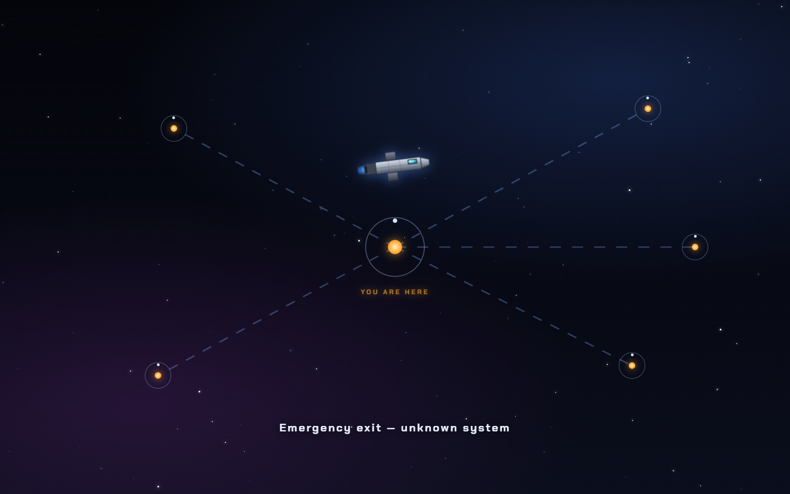

Three small fixes to the intro cinematic:

- **The rift faces you in the cockpit.** From the pilot's seat you now look straight down the
  wormhole — concentric rings dead ahead through the windshield — instead of at the sideways
  tunnel (which is still what you see from outside in the earlier beat).
- **The ship arrives already burning.** When it falls out of the rift into the new system it's
  visibly on fire — a hull flame, sparks, and a smoke plume trailing off — carried through to
  the moment it breaks apart, rather than looking pristine right up until it dislocates.
- **Removed the "YOU ARE HERE" tag** from the star chart.

## [0.47.2] — Into the cockpit, and a proper hauler

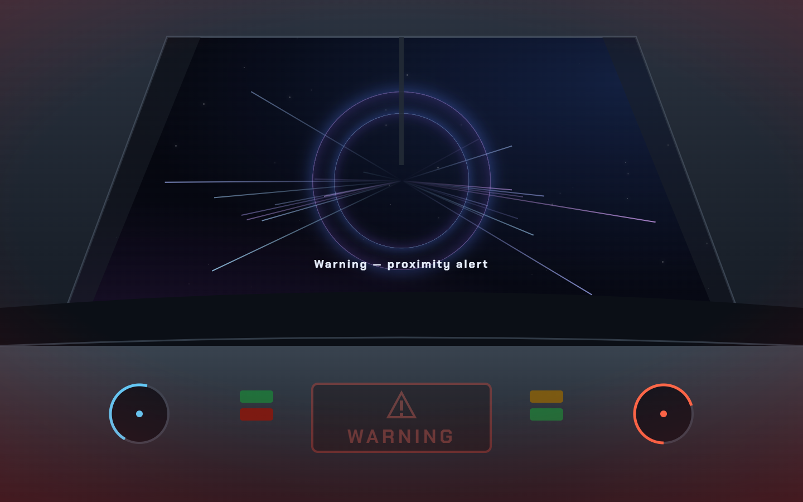

Two more passes on the intro cinematic:

- **The alarm beat is now a first-person cockpit shot.** Instead of a HUD strip over the
  exterior ship, the view moves *inside* the ship: you look out at the rift through the
  windshield while the console fills the frame — gauges, indicator banks, and a blinking
  **WARNING** MFD — with the red alert pulsing over everything.
- **The ship is a proper military hauler.** The boxy freighter is redrawn as a bulky grey
  warship after a reference: a rear cluster of engine nacelles with glowing exhausts, an
  armoured hull with a raised deck, panel lines and a stencilled hull number, a dorsal fin,
  a ventral pod, and a low cockpit greenhouse at the nose.

## [0.47.1] — Intro polish: a sideways rift, a boxier ship, a laser that lands

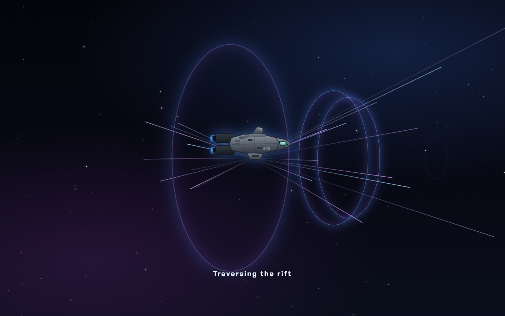

Three fixes to the new-game cinematic from 0.47.0:

- **The wormhole now runs sideways.** It used to be a bullseye of circles rushing straight at
  the camera; now it's a horizontal tunnel whose throat is off to the right, with tall
  ellipse rings that sweep leftward past the ship and light streaking horizontally — so the
  ship reads as flying *along* the rift rather than into it.
- **The ship is a boxier freighter.** The old rounded, plane-like hull is now a rectangular
  body with a flat-panelled deck, a rectangular cockpit window, and blocky fins.
- **The laser actually connects.** The beam is now anchored on the hull hit-point and sweeps in
  from off-screen to touch it, instead of passing below the ship and missing.

## [0.47.0] — A cold-open cinematic: how you got here

**The new-game intro is now a six-beat space cinematic.** It used to be a single shot — a drop
pod already burning through the atmosphere — which dropped you at the crash with no idea how you
got there. Now it tells the whole arrival:

1. **Through the rift** — a starship drifts through a wormhole, light streaking past.
2. **Alarm** — the cockpit dashboard throws a proximity warning and the screen pulses red.
3. **Hull breach** — a laser beam lances in and strikes the ship; sparks tear off the hull.
4. **Emergency exit** — the ship falls out of the rift into an unknown solar system, and a star
   chart pulls back to show the neighbouring systems with a **YOU ARE HERE** marker (pictured).
5. **Ejecting** — the crippled ship comes apart, its hull sections flung outward, and a **drop
   pod launches free** toward a planet.
6. **Crash landing** — the pod plunges through the atmosphere and slams into the surface, and the
   game begins.

Each beat carries a short caption, and the whole thing is **skippable** at any point — click or
press any key. It plays **only for a new game** (never on load), so it stays a once-per-save
cold open. Built the way the rest of the game's cutscenes are — pure CSS/SVG, no new assets or
dependencies — with a shortened calm still for players who ask for reduced motion.

Under the hood this replaces `DropPodCrash.tsx` with `IntroCinematic.tsx`, a phase-sequenced
component whose `phase-*` class drives every layer; the old single-scene crash lives on as its
final beat, rebuilt to match the new art.

## [0.46.0] — The game is now called Aphelion

**Satisfidlery is renamed to Aphelion.** The name it launched under was a portmanteau built
to advertise "a Satisfactory idle game" — and that was exactly the mindset we're now stepping
away from. **Aphelion** is the farthest point of an orbit from its star: you crash-land at the
edge, as far from home as it gets, and build your way back. The name commits to *this* game's
world rather than to being a fan tribute, which is the whole point of the new design
direction — the game is inspired by Satisfactory, not bound to mirror it.

**Every player-facing surface now reads Aphelion**: the title bar and web title, the main-menu
wordmark, the HUD brand, the Electron window title, the web manifest, and the save-file
messages and exported filenames (`aphelion-slotN.json`).

**Your saves and settings carry over automatically.** The game's `localStorage` keys moved
from the `satisfidlery:` prefix to `aphelion:`; a one-time migration runs at startup, before
anything reads storage, and copies every old key across (saves, keybinds, locale, cheat
flags). It's idempotent and never overwrites, so nothing is lost and nothing has to be
re-done.

**What deliberately kept the old name**: the private source repo, the public demo repo
(`boubou666/satisfidlery-demo`) and its live Pages URL, and the Electron `appId`. Renaming
those would break the live demo link people already have and change the app's identity for
installed builds — so they stay on the `satisfidlery` slug for now, decoupled from the
in-game rename.

**And a new standing directive** (in `CLAUDE.md`): Aphelion is inspired by Satisfactory, not a
port of it. Raw materials, buildings, recipes and mechanics are free to diverge whenever a
different choice makes a better idle game — "that's not how Satisfactory does it" is not an
argument against a design.

## [0.45.0] — Research finishes in the field, and is unlocked at the HUB

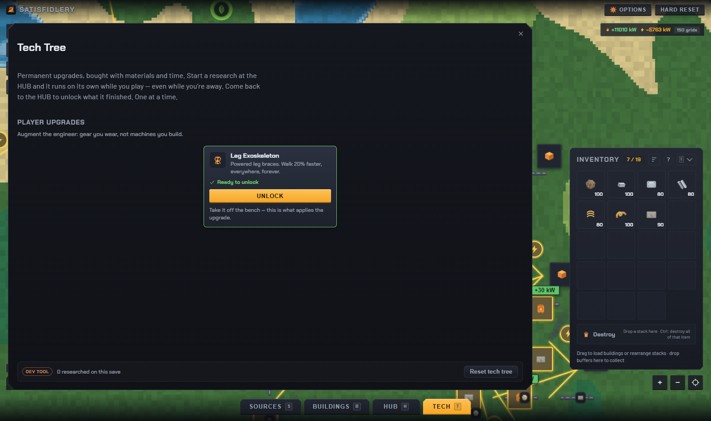

**The timer running out is no longer the unlock.** A research now fills to *ready* and stops
there: the work happened out in the world, and you come back to the HUB to take it off the
bench. That's the rule every other HUB action already follows — milestones are submitted in
person, hand-crafting happens at the bench, the burner bank is loaded by hand — and research
was the one thing that quietly applied itself while you were three valleys away.

So `simulateResearch()` no longer unlocks anything; it only ever runs a clock. `researched`
now grows in exactly one place — `claimResearch`, at the HUB — which also means a ready
research can sit on the bench for a week and still be waiting when you get back, rather than
having silently applied itself at some point you'll never know.

**The notification changed job with it.** It used to say a research was *done*; it now says
it's **ready**, and its point is to send you home: "Leg Exoskeleton is ready — unlock it at
the HUB". The Tech tab also badges while something's waiting, the same cue the HUB tab uses
for an affordable milestone — a toast you missed shouldn't be the only signal.

**Still exactly one at a time**, and now a finished-but-uncollected research keeps holding
the slot: the facility is busy until you come and clear the bench. The card says which of
the two is blocking you.

**Research time comes from depth, not from a flat number.** The first node of a branch is now
**12 s** — it was 120, which made the very first thing the tree ever asks of you a two-minute
wait to prove the tree was worth using. Each tier deeper multiplies by 1.9: **12 s → 23 s →
43 s → 82 s → 156 s**. Authoring a node sets no time at all — where you hang it in the web IS
how long it takes, and rebalancing the whole tree is one constant
(`RESEARCH_BASE_SECONDS` / `RESEARCH_DEPTH_MULT`) rather than an edit per node. Depth is the
*longest* prerequisite chain: a node you can only reach through four others is four tiers in,
whichever way you count to it.

Save is **v31**: a `progress` of exactly 1 is the ready state, and the v30 parser clamped it
below 1 — which would have quietly restarted a finished research on every load.

## [0.44.3] — A reset button for the tech tree (temporary, testing only)

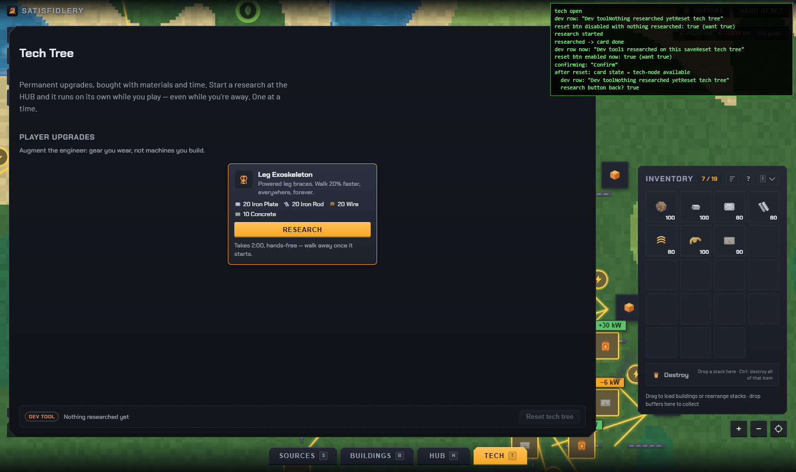

Replaying the tech tree's states meant starting a fresh save. There's now a **Reset tech
tree** button at the foot of the Tech panel: everything researched is forgotten, any running
research is dropped, and the tree is untouched again.

**It is scaffolding and it says so** — tagged `DEV TOOL`, dashed and muted, so it never
reads as a designed "respec". It refunds nothing (pair it with the infinite-resources cheat
to re-run a node) and it confirms first, since it throws away real progress on a real save.

It's **built to be deleted**: three greppable pieces marked `DEV-TECH-RESET` — the store's
`resetResearch`, `TechDevTools` in `TechView.tsx`, and the `tech.dev.*` copy. Nothing else
references them.

Resetting needs no unwinding, which is the payoff of effects being folded on read: every
gate and `moveSpeed` derive from `researched`, so clearing the list *is* the undo.

## [0.44.2] — Panels close with an X

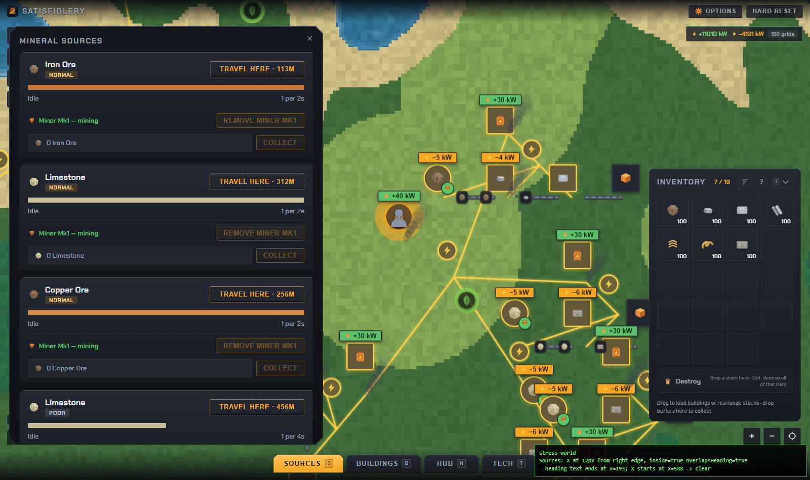

Closing an open panel was only ever its own toggle: press the bar button again, or its key.
Both work, and neither is *visible* — you have to already know. Every panel now carries an X
in its top-right corner, the same affordance the briefing, options, and slot-picker modals
already have.

It lives outside the panel's scrolling body, so it stays in the corner rather than sliding
away with the content, and it's rendered once in `App` around whichever panel is open —
Sources, Buildings, HUB, and Tech get it by construction, and so does the next one. The
toggle and the keyboard shortcut are untouched.

## [0.44.1] — The tech tree gets a board, and research says when it's done

Three things 0.44.0 got wrong, all found by playing it.

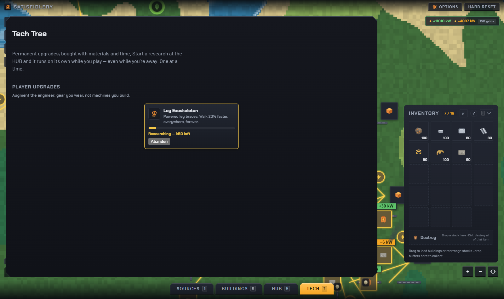

**The card was clipped.** The web laid its cards on fixed 150 px grid rows, so the very
first node — cost list, button, hint — overflowed into its own scrollbar with the Research
button cut in half. A fixed cell clips *whatever doesn't fit*, and a card's height is its
content's: a longer cost list, a progress bar, a locked note. Rows now size to content, and
**the edges are drawn from measured card centers** rather than from grid maths, so the lines
follow what actually landed instead of where a card was supposed to be. Verified with four
nodes, one deliberately taller than its row neighbour: every endpoint lands on a card
center, nothing clips.

**The tree needed room.** It's the one panel you survey rather than skim, so it's the
widest one and the only one that doesn't hug its content — the space below the first node
is the tree ahead of you. The root sits centred and the tree grows down from it, which is
the shape the thing is meant to have.

**Research finished in silence.** It completes while you're mining, walking, or away
entirely — that's the whole point of it — so nothing on screen would ever tell you. It now
announces itself with a toast carrying the tech glyph, watching `researched` rather than the
action, so a research that lands inside the offline catch-up gets the same notice. Two
toasts at once stack instead of overlapping.

**And the unlock fanfare had no words**: `tut.research.kicker`/`main` were never written, so
the Research Facility's celebration showed raw keys. Written — and then every milestone's
copy was swept the same way (88 strings across 8 tutorials, 7 milestones, and the tech tree)
to be sure this was the only one. It was.

## [0.44.0] — The last milestone: biomass, and the tech tree

The milestone chain has always dead-ended at Conveyor Logistics. **Research Facility** is
its last link, and what it unlocks is the thing that replaces it: from here, progression
is the **tech tree**.

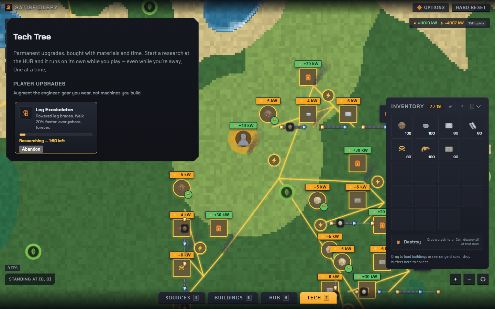

**Research is a commitment, then a background job.** Pick a node, stand at the HUB, pay
its cost once — and it works away on its own from then on. Live, offline, while you mine
or walk or craft: `simulateResearch()` never touches the inventory (the cost was already
taken), so it's automation, not a manual action, and it runs in the same catch-up path a
miner does. One at a time, and abandoning refunds nothing — which is what makes choosing
an order mean anything.

The first node is the **Leg Exoskeleton**: +20% walk speed, everywhere, forever. Effects
are declarative (`moveSpeedMult`) and folded from `researched` on read, so a save can't
drift from what it has unlocked, and the next upgrade is an object in `content.ts` rather
than a switch on tech ids. `findPath` now takes the speed to bake its times at — a walk
already under way keeps its pace, and the next one is quicker.

**It's a web, not a ladder.** A node's `requires` is a *list* and its `pos` is a grid
slot, so the panel draws prerequisite edges under the cards and lights each one as its
source lands. Both are load-bearing from the first node: a tree whose structure only
appears at the second node is a tree nobody designed. One tab today (**Player Upgrades**);
the strip is there because the content shape has always been "trees".

**Fuel became a property of the item.**

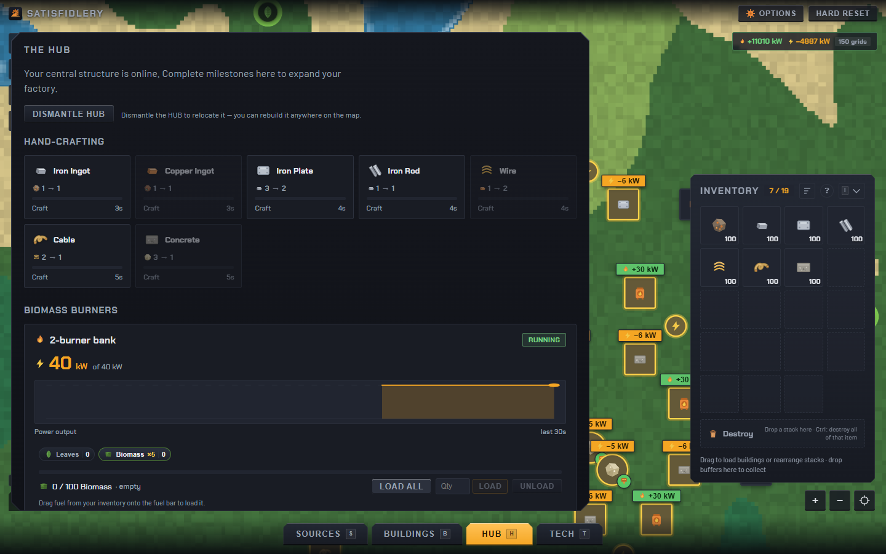

The other half of the milestone is **Biomass** — 4 Leaves → 1 Biomass, a **Constructor
recipe only**, so refining fuel is something your factory does rather than something you
do by hand. It carries 5× a leaf's energy but is pressed from 4, so the press pays for
itself, and a full 100-unit burner load runs **10 000 s instead of 2 000**.

That needed the burner economy to stop being hardcoded to leaves. Energy now lives on the
item (`fuelJoules`), a burner records *which* fuel is loaded, and the burn rate reads it —
so "biomass is better" is a number in `content.ts`, not a branch anywhere. A store holds
**one type at a time** (a mixed store has no single rate to burn at); it's locked to what's
inside until it runs dry, and the HUB bank and the placed Biomass Burner both say so with
the same picker. Every burn stays whole-unit: a half-burnt leaf lives in `burnProgress`,
never in `fuel`.

Save is **v30** — it carries `researched`/`research` and each store's `fuelItem`. Older
saves read as leaves-loaded with nothing researched, which is exactly what they were.

Also: **Conveyor Logistics' briefing copy was missing entirely** — its card had been
rendering the raw `hub.logistics.stakes` key since 0.42.0. Written, along with the new
milestone's.

## [0.43.1] — One belt per port, on both ends

A storage in the stress world was visibly taking four belts at once. It has one input
port, so that should never have been drawable — and the fault wasn't the rig. `planBelt`
capped the **source** side (`beltSourceMaxOut` — one belt per output port) and never
checked the destination at all. Outputs were enforced, inputs were decorative. Any
player could hand-draw the same pile-up onto any machine's single input.

A port is the physical place a belt lands; if the count isn't enforced, drawing it is a
lie. `planBelt` now refuses a belt whose destination has no free input port
(`dest-full`), with the mirror of the message the output side already had. Merging
several lines into one machine is a merger's job, and the game doesn't have one yet.

Belts already built are left alone — the check gates new ones, so nobody's existing
factory tears itself up on load.

**The stress world lost its shared storage**, which was only possible *because* of the
missing check: it was building something no player could. Each chain now ends in its own
storage, and the block's interconnect is what it should always have been — the **power
grid**, with four burners and a dozen consumers on one network (106 of the 150 grids tie
more than one burner). Every belt in the generated world now respects both port counts,
verified rather than assumed: max belts into any one node is 1.

Giving every chain its own storage put the counts *up*, not down:

| | 0.43.0 | now |
| --- | --- | --- |
| Miners | 366 | 367 |
| Buildings | 1281 | 1514 |
| Belts | 1139 | 1147 |
| Powerlines | 2095 | 2088 |

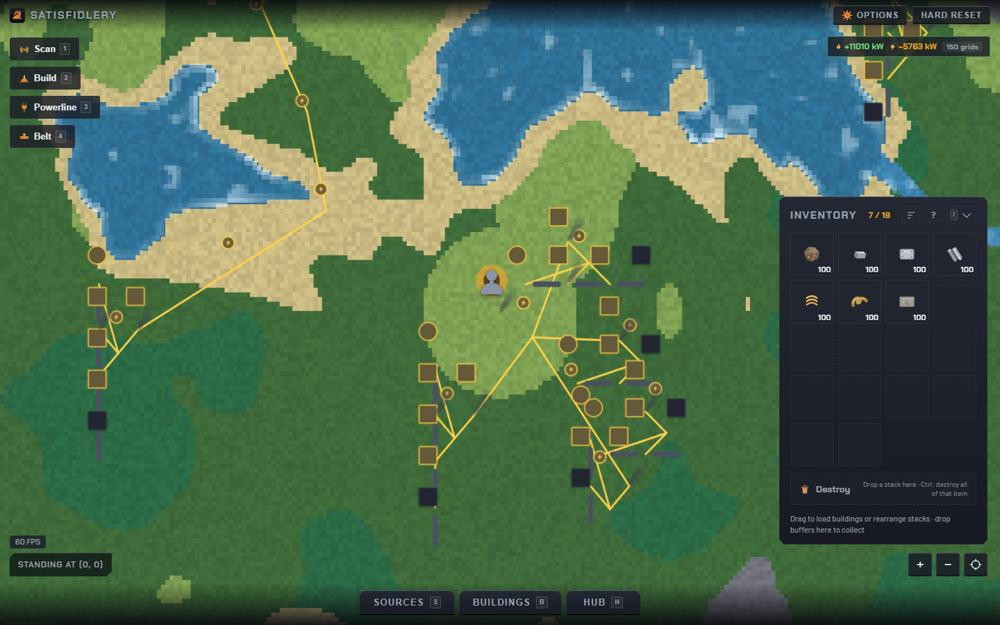

## [0.43.0] — The stress world builds the whole map, in blocks

The old rig was 150 lone chains — miner → smelter → constructor → its own storage,
each on its own island. That's a mid-game save, and worse, it was 150 copies of the
same isolated thing: nothing in it exercised what actually gets expensive when a
factory grows, because nothing in it was ever connected to anything else.

It now builds **blocks**. A block is up to four neighbouring deposits whose chains all
belt into **one shared storage** and all hang off **one shared power grid** (each
chain's burner ties to a block pole). So the load is the shape a real factory has:
`beltComponents` merges a block into a single bubble at survey zoom, `powerNetwork`
walks a graph with four generators and a dozen consumers on it, and a storage takes
four belts at once.

The chains got deeper and stopped being all the same. Copper now runs its full line —
ingot → wire → cable, three machines — iron runs ingot → plate, and limestone joins
the field on the concrete recipe it always had. Every chain is laid at whichever of
the four quarter-turns fits its neighbours, so a crowded deposit gets turned rather
than dropped.

And the rig stopped inventing a rule the game doesn't have. It held ore nodes to its
own 70-unit spacing, but the world puts deposits in clusters 30–85 units apart and a
player may put a Miner Mk1 on every one of them — that check alone was throwing away a
third of the field. Nodes now need only real ground; machines still clear everything.

The result covers **366 of the world's 389 ore nodes** — the map essentially built out,
which is the ceiling the deposit field allows:

| | before | now |
| --- | --- | --- |
| Miners | 150 | 366 |
| Buildings | 600 | 1281 |
| Belts | 450 | 1139 |
| Powerlines | 600 | 2095 |

Still a save, not a mode: every belt goes through `planBelt` and every wire through
`planPowerRoute`, and anything the planners refuse is dropped rather than fabricated.
The save is 1.03 MB and 147 grids come up powered, none overloaded.

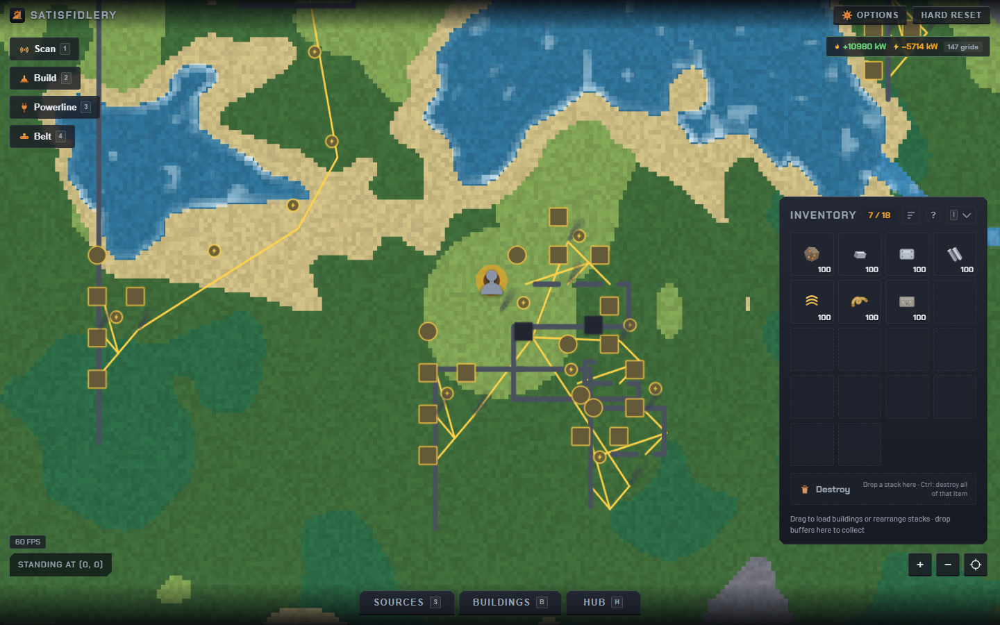

## [0.42.2] — Land on the map, and a power readout that means the whole network

Two things the stress world made obvious.

**A load lands on the world, not on a panel.** Opening Sources for anyone who owned
a deposit was left over from the tab bar, where "no tab" wasn't a state you could be
in. With panels you toggle, it just meant every load dropped a list of ore over the
factory you came back to look at. The map is the game; a panel is something you ask
for.

**The power badge covers every grid you own.** It used to report the HUB's grid — or,
with no HUB on a grid, whichever generator grid happened to come first — and print that
one number as though it were the world. Fine until you build a second grid, and a lie
after that: a map with 150 independent factories was quietly showing one of them. It
now sums generation and draw across every live grid and says how many there are when
there's more than one, plus a count of anything tripped or overloaded. Reset stays tied
to the HUB's bank, because that's the only breaker it clears — a burner out in the field
is still reset at the burner.

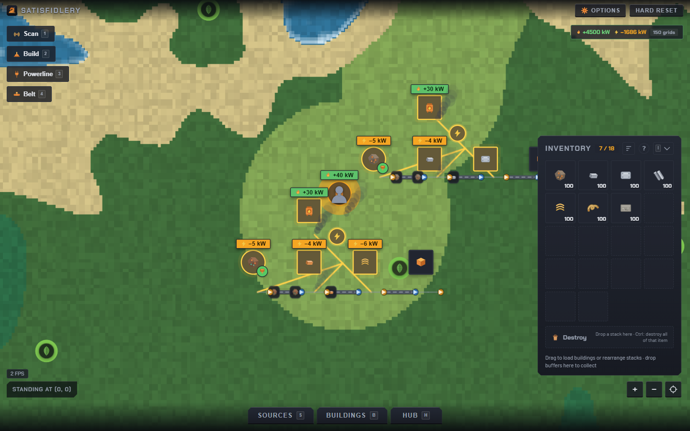

## [0.42.1] — 2026-07-17

### Changed

- **The belts go with their bubble.** Once a factory draws as one marker
  (`MARKER_CLUSTER_SPAN`), its belts are *inside* it — and every belt is, because a belt is
  what defines the group. Drawing them was scribbling the wiring of something the map had
  already reduced to a dot.

  Which empties the flow layer entirely up there: ports at 900, items at 1600, wires and
  poles at 2500, belts at 3000, and smoke fades itself out. So the layer now **clears its
  canvases once and stops touching them** — a canvas is re-uploaded whole whenever it's
  written, so re-clearing a blank one costs exactly what drawing on it does. Verified by
  sampling the pixels: both flow canvases read empty at a survey zoom.

- **The water pass gives up at 8% strength, not 1%.** A survey zoom sits at ~6% — invisible,
  but the pass didn't know: it walked every cell, and the field behind it cost a GPU pass and
  a readback stall, to render nothing anyone can see. The fade runs 1 → 0 across a wide band,
  so ending it at 8% moves the visible cutoff by a few world-units-per-pixel and switches the
  whole apparatus off at altitude instead of idling at 6%.

- **Clouds repaint at 4fps once they're alone** (`CLOUD_ONLY_FPS`). The overlay is a
  viewport-sized canvas, so 20fps of it costs the same whether it's painting a shimmering
  coastline or a shadow that moved a fraction of a pixel — and at a survey zoom a cloud
  drifts **0.7 screen px per second**. 20fps was redrawing the whole screen to move a shadow
  by three hundredths of a pixel. A camera move still repaints in its own frame, so a pan
  never shows stale weather.

  Stress world at a survey zoom (real GPU, real frames): **50ms → 33ms/frame (20 → 30fps)**.
  Play zoom is untouched — the water still runs at full rate where you can see it.

### Known

- **In this dev environment each full-screen canvas layer costs ~16ms/frame just to
  composite**, written or not: hiding the ambient canvas at a survey zoom takes the frame
  from 50ms to 16.7ms even with the flow canvases already blank. That's WSLg compositing in
  software and almost certainly doesn't happen on a native GPU — it's why the numbers above
  move less than the work removed would suggest. The work removed is real either way.

## [0.42.0] — 2026-07-17

### Added

- **The power grid stops being drawn from altitude** (`POWERLINE_SHOW_SPAN`, 2500 — the same
  line at which your avatar collapses to a dot). The belt band is a factory's *shape* and
  survives being read from height; the wiring is plumbing, and a few hundred hair-thin lines
  over a whole island are a yellow haze across everything else. **The poles go with them** —
  a pole is the grid and nothing else, so once its wires aren't drawn a pole disc is a dot
  marking nothing.

- **A factory draws as one marker** (`MARKER_CLUSTER_SPAN`, 3000). Everything a belt connects
  is one group — miner → smelter → constructor → storage — because a belt is the game's own
  definition of "one thing the player built". Past the span each group collapses to a single
  bubble with a count, and clicking it fans the machines out (the map's cluster machinery,
  inert since it was disabled, finally has a job). Grouping by *connectivity* rather than
  screen distance is what makes it read right: two factories built side by side stay two
  bubbles, and a chain strung across a valley stays one.

  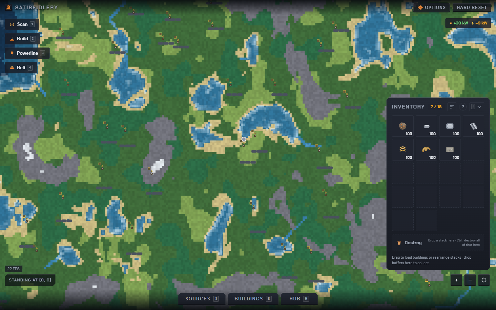

  Measured on the stress world at a survey zoom, real GPU, real frames:

  | | markers | still | dragging |
  |---|---|---|---|
  | before | 849 | 67ms (15fps) | 83ms (12fps) |
  | after | **284** | **50ms (20fps)** | **67ms (15fps)** |

  `beltComponents` is a union-find over the belts, cached on the belts array's identity —
  belts change only when the player lays or pulls one, and the map asks every render.

### Known

- **Biomass burners don't join their factory's bubble**, because they're wired to it rather
  than belted, and the rule is belts. They're ~half the markers left at a survey zoom (144
  bubbles vs 146 loose dots on the stress world). Folding in power connectivity as well
  would merge each burner into the factory it feeds — one line, and it would roughly halve
  the remaining markers — but that's a change to what the map *means*, so it's a call worth
  making deliberately rather than as a perf tweak.

## [0.41.9] — 2026-07-17

### Fixed

- **The flow layer redraws at 30fps, not 60.** Two viewport-sized, dpr-scaled canvases, and
  a canvas that changes is re-uploaded whole — so the layer's cost is its *area*, not its
  contents. Measured in a real renderer on the stress world: the JS inside `drawFlowLayer`
  is ~1ms, yet drawing it every frame took a still camera from 60fps to 20fps. Halving the
  rate gives back a third of that for nothing anyone can see — a belt moves 60 items a
  minute and its texture scrolls at the same crawl. This is cargo, not a crosshair.

- **The ambient overlay was painted twice per frame while dragging.** A camera move repaints
  the overlay in the terrain's own frame (so the layers can't desync), and the 20fps loop
  repainted it again in that same frame — 398 paints across 200 frames, ~5ms of pure
  duplication each. The camera path now skips when the loop has already painted on this
  exact rAF timestamp.

### Known — the real numbers, at last

Electron with a real GPU and real rAF (headless can do neither: `--virtual-time-budget`
fakes the clock so every in-page timing reads 0ms, and without it rAF never runs). On the
**stress world** — 150 factories, which is the point of it:

| | still | dragging |
|---|---|---|
| baseline | 50ms (20fps) | 67ms (15fps) |
| flow layer not drawn | **17ms (60fps)** | 50ms |
| markers not rendered | 33ms (30fps) | 50ms |
| ambient not painted | 50ms | 67ms |

Instrumented, the JS is *not* the problem: flow ~1ms, ambient ~4.5ms, terrain+field
0.06ms, React ~2ms — **~14ms of a 67ms frame**. The rest is paint and composite. And the
flow layer costs ~16ms/frame even when redrawn at **5fps**, which means it isn't the
drawing at all: it's compositing two full-screen layers that have content in them.

That last part is likely a WSLg artifact (software compositing) and may not transfer to a
native Windows GPU — but it's consistent with the profile from Task Manager: **CPU ~18%
with the GPU at 5%**, i.e. one core pinned while the card idles. If it holds on native, the
lever is the canvases themselves: fewer full-screen layers, or a smaller backing store than
`dpr` for art that's mostly flat colour.

## [0.41.8] — 2026-07-17

### Changed

- **The ambient field is world-anchored and survives a pan.** It was rebuilt from scratch on
  every camera move — a second GPU pass, a synchronous `readPixels`, a copy and the
  shoreline dilation — despite being a pure function of the world. Panning doesn't change
  the ground; it changes which part of it you're looking at.

  It's now built with `FIELD_PAD_PX` (320px) of slack on every side and kept until the
  camera outruns it, at which point one rebuild refills the patch. `renderField` on the GPU
  painter is the field pass **without** the colour draw, so the patch can be bigger than the
  viewport while the terrain still paints exactly the viewport. And because the field knows
  where it lives in the world, the overlay paints at an offset rather than at 0,0 — which is
  also why it can't desync: a world-anchored field is never stale against the world, no
  matter how fast the camera moves.

  **400-frame drag at play zoom, on a real GPU: 5.2s → 4.5s.**

  Verified where it counts: the same drag, before and after, lands the lake, its shore and
  its foam in exactly the same place. Getting the offset wrong slides foam off the coastline
  — the precise failure the same-frame repaint was built to prevent — so that comparison was
  the point of the exercise, not the timing.

### Known

- **Every headless number reported before this entry ran on the CPU painter.** `--disable-gpu`
  was inherited from a note about `--headless=new` crashing the GPU process — but plain
  `--headless` *without* that flag has WebGL2 through ANGLE on the real card, and always did.
  So the earlier figures (a survey zoom "at 60fps", a 400-frame drag at 27–37s) were a
  software renderer's, ~6× slower than the real path, and every ratio drawn from them
  understated how much of a frame the JS costs relative to the paint. The deltas still hold —
  JS is JS — but the absolute numbers were the wrong machine. Measurements from here on use
  the GPU.

## [0.41.7] — 2026-07-17

### Fixed

- **Clicking somewhere far away froze the game for a fifth of a second.** `findPath` runs
  synchronously on the click, and a cell costs **25 terrain samples** (a 5×5 footprint, each
  a noise evaluation). A haul across the world expanded enough of them to burn **194ms — a
  twelve-frame freeze**, right at the moment the player asked for something.

  Two fixes, both measured on the stress seed:

  - **The cell-cost cache outlives the call.** It was built inside `findPath` and thrown
    away, so every walk re-measured ground it had already measured — including *the same
    walk twice*. It's now module-level and keyed on the seed (the ground doesn't change
    between walks), bounded so a long session can't grow it without limit.
  - **The heuristic stops under-selling the walk.** `g` is distance × the terrain
    multiplier (up to 3× through a ford); `h` was plain distance, i.e. "the rest is open
    plains". Admissible, so A* found the true cheapest route — and proved it by expanding a
    huge bowl of cells. `HEUR_WEIGHT` (1.6) points it at the goal instead.

  | path length | before | after | repeat |
  |---|---|---|---|
  | 1 500u | 6.9ms | **4.8ms** | — |
  | 3 000u | 16.6ms | **10.1ms** | — |
  | 6 000u | 35.7ms | **19.8ms** | — |
  | 12 000u | 194.6ms | **86.1ms** | **31.9ms** |

  The weight is 1.6 because that's what the numbers said. At 2.2 the long haul drops to
  28ms — but a 3 000u walk grows from 57s to 63s, which trades six seconds of the player's
  time for fifty milliseconds of ours. At 1.6 the walk stays within 1% of optimal
  (254s → 257s).

### Known

- **A fast drag is now death by a thousand cuts, with no single dominant term.** Measured
  per camera move (i.e. per frame of a drag): the terrain repaint ~0.3ms on the GPU, the
  ambient field build 0.84ms *plus* its readback stall (play zoom only — 0.41.5 removed it
  at altitude), and the water pass 0.4–2.3ms depending on how much sea is in view. A cloud
  re-bake is 3.6ms but only every ~96px of pan, and enlarging its slack doesn't help: the
  cost per pixel panned is flat, so a bigger tile just buys rarer, bigger hitches.

  The remaining structural idea is to tile the ambient field in world space and cache it
  across pans, the way the clouds now are — the field is the last thing rebuilt from
  scratch on every camera move.

## [0.41.6] — 2026-07-17

### Fixed

- **Turning marker clustering off made it the most expensive thing on the map.**
  `clusterNodes` walks the clusters built so far for each node, looking for one close
  enough to join. With `CLUSTER_SCREEN_PX = 0` nothing ever merges — so every node becomes
  its own cluster, and each new node scans *all of them*. **O(n²) to produce n groups of
  one**: 3.80ms per render on the stress world's 751 markers, against 0.27ms with
  clustering actually enabled. Off was the worst case, by a factor of fourteen.

  And it ran in MapView's render body, which is upstream of everything: on every tick, and
  on every frame of every pan. Off now means off — each node is handed back as its own
  group, O(n).

  | stress world, survey zoom | before | after |
  |---|---|---|
  | 20s idle (factory running) | 10.0s | **5.8s** |
  | 400-frame drag | 36.4s | **27.3s** |

  This is also what 0.41.4's note was missing. The marker memo showed no idle win because
  the cost wasn't downstream in the marker subtree at all — it was this, in the body, before
  the memo could skip anything.

- **`.map-world` is promoted to its own compositor layer** (`will-change: transform`). Every
  pan rewrites that one element's transform and nothing else — markers are positioned in
  layer space — so a drag should composite a layer that's already on the GPU rather than
  repaint what's inside it. (Bundled into the numbers above; the usual "don't leave
  `will-change` on things that never move" caveat doesn't apply to the element the camera
  lives on.)

### Known

- **Clustering itself is still off, and that stays a look decision** — but it's no longer a
  performance one. Enabling it would collapse the stress world's 751 markers into ~33 count
  bubbles (and, amusingly, make `clusterNodes` 14× *cheaper* than the disabled path used to
  be); leaving it off now costs almost nothing.

## [0.41.5] — 2026-07-17

### Fixed

- **Every camera move stalled the GPU to build data nothing was reading.** The terrain
  painter's `renderWithField` does a second, cell-resolution pass and then a **synchronous
  `gl.readPixels`** — 563KB at 1440×900 — to hand back which cells are wet, which way each
  river runs, and how far each is from shore. A readback like that stalls the pipeline: the
  CPU waits for the GPU to catch up. MapView called it on *every camera move*, which during
  a pan means every frame.

  But that field is the **water pass's input and nothing else's** — the clouds sample world
  positions, not cells — and the water fades out as the camera climbs. So above the fade,
  the whole apparatus was producing data no one looked at: the extra GPU pass, the stall,
  four typed arrays, and the shoreline dilation (**0.84ms** of CPU per camera move,
  measured in Node) — all discarded.

  MapView now asks the water pass's own gate (`needsSurfaceField`) and, above it, calls the
  plain `render()` and hands the clouds a `shellAmbientField` — the shape and the camera,
  no per-cell arrays. Producer and consumer ask the **same function**, so they can't drift
  apart; if they did, the sea would go flat rather than merely slow. The shell's arrays are
  empty rather than zero-filled, so anything reading them without checking fails loudly
  instead of quietly drawing a world with no water in it.

  Verified: the terrain still paints through the `render()` path at altitude, zooming back
  in restores the field, and the gate lines up exactly — the field is skipped only from
  25 world-units/px, where the water pass already returns (detail ≤ 0.006 against its own
  0.01 floor).

  **Not measurable here**: the headless renderer has no GPU, so it takes the CPU fallback
  and never runs this path at all. The 0.84ms is the CPU half only; the stall and the second
  pass are on top, and they land exactly where the complaint was — panning, at altitude,
  where nothing else is culled.

## [0.41.4] — 2026-07-17

### Fixed

- **Panning re-rendered every marker to produce identical DOM.** Markers are positioned in
  *layer* space and `.map-world`'s transform is what moves them, so a pan's only real work
  is that transform — yet `setView` fires per pointer event, re-rendering all of MapView
  and reconciling hundreds of marker subtrees back to exactly where they were.

  The marker layer now renders through a `MarkerLayer` memo, skipped whole on an unchanged
  **signature** — a string of everything the markers draw *and* everything their handlers
  read (the second half matters: a skipped render keeps the previous closures, so `onNode`'s
  `placing`, `placeOrient` and the player's position are all in there). The cull window is
  **quantized to a 400px chunk** for the same reason: an exact window would change the
  visible set — and so the signature — on every pointer event, which is the one thing this
  is here to avoid.

  A 400-frame drag on the stress world: **37.4s → 33.8s**. That's a floor, not a ceiling —
  the headless renderer has no GPU, so the CPU terrain painter (~25ms/frame) dominates the
  measurement and dilutes the ratio. On real hardware the terrain is ~0.3ms and React's
  share is proportionally far bigger.

  Verified honestly, because a stale marker is a worse bug than a slow one: pressing `3`
  still lights 11 nodes `.pickable`; and cutting the grid (Options → free fuel off) takes
  powered markers 10 → 0 and kW badges 5 → 0, so live network state still flows through
  the memo.

### Known

- **Idle gains nothing from this** (measured: 8.8s vs 8.7s over 20s of survey-zoom idle),
  which corrects an earlier claim. The 0.41.2 note attributed ~1.4s of a survey-zoom frame
  to reconciliation on the strength of a tick-on/tick-off A/B — but stopping the game loop
  also stops smoke, item movement and every machine's working state, so that number was
  never purely React's. The per-tick cost that remains is MapView's own render body (the
  node list, the clustering pass, the signature itself), not the marker subtree.

## [0.41.3] — 2026-07-17

### Fixed

- **Panning re-baked the clouds every frame** — a regression from 0.41.1, which keyed the
  cache on the camera's world origin. But a pan doesn't change the cloud field any more
  than time does: it changes *which part of it you're looking at*, which is an offset, not
  a re-bake. The tile is a world-space patch, so the draw now offsets by what the camera
  has panned since the bake (on top of the wind's own drift), and only re-bakes once the
  viewport would run off the tile's slack. Keying on `ox`/`oy` made every frame of every
  drag re-derive ~110k noise samples — worse, at altitude, than the per-frame version it
  replaced.

## [0.41.2] — 2026-07-17

### Fixed

- **The flow layer draws flat from altitude — no glow, no lift, no scrolling dash.** Every
  energized wire was setting `shadowBlur`, and every belt band a drop shadow. **A canvas
  shadow is a blur pass per draw call**, so a survey zoom — where all 600 wires and 450
  bands are on screen at once — was over a thousand blur passes per frame. `mapDraw` already
  knew: its item chips are pre-baked bitmaps precisely because *"setting shadowBlur per item
  would put a blur pass in the hot loop"*. The wires and bands never got the memo.

  Past `FLOW_GLOW_SPAN` (1600 — deliberately the same line as the items and the marker
  detail) the layer draws flat: the glow, the lift shadow, the belt's scrolling centerline
  and its bend dots all go. All four are close-up cues — "this wire is live", "this band
  sits above the ground", "stuff moves this way" — and none survives being seen from height;
  the scrolling dash is sub-pixel long before it. Survey-zoom wall clock on the stress
  world: **7.9s → 7.0s**.

- **Smoke stopped walking the map to draw nothing.** The plume pass fades out with zoom
  (correctly), but it still built its stack list first — a world position and a working-state
  lookup for all 600 machines, 60 times a second, to then skip every one. It now leaves as
  soon as the fade hits zero.

### Known

- **The remaining survey-zoom cost is React, not the canvas.** Measured by stopping the game
  loop outright: 7.0s → 5.5s. The engine itself is ~1ms/tick, so that ~1.4s is reconciliation
  — the map rebuilding its marker layer ten times a second because `simulate()` hands it new
  `sources`/`buildings` arrays every tick, even when nothing a marker draws has changed. The
  fix is to memoize the layer on a signature of what it actually renders; the catch is that
  such a signature has to mirror `renderNode` exactly or a marker goes quietly stale, so it
  wants doing deliberately rather than in passing.

## [0.41.1] — 2026-07-17

### Fixed

- **Clouds are baked and scrolled, not re-derived every frame.** Look at what the cloud
  pass samples: `fbm(worldPos − wind × speed × t)`. That's *one static pattern in world
  space, sliding downwind* — two consecutive frames aren't two fields, they're the same
  field translated. It was re-deriving three octaves of noise for ~80,000 cells, 20 times
  a second, to redraw a picture it had already drawn.

  It now bakes once per camera into a tile with slack around the edges, then **scrolls** it
  — a re-bake only when the camera moves or the drift runs past the slack (at the zooms
  where clouds exist at all, that's minutes, not frames). The zoom fade rides as a
  `globalAlpha` at draw time rather than being baked in, so climbing through the band never
  re-bakes. The bake itself also writes one `ImageData` instead of a **`fillRect` per
  pixel**.

  Measured after the camera settles at a survey zoom: **32 cloud passes, 0 re-derivations,
  ~0ms** — against a full re-derivation on every one of them before.

  This was the zoom-out drop's own private cost: clouds fade in *as you climb*, which is
  precisely where everything else peaks too (nothing off-screen to cull). Stubbing the pass
  out entirely accounted for ~38% of a survey-zoom frame; it's now ~0 without stubbing
  anything — the clouds look and drift exactly as before.

- **Markers are discs at altitude, not badges.** A marker carried its icon, its kW pill and
  its tooltip — **8.3 DOM elements each**, laid out and reconciled every tick for every
  machine on screen. All of it is unreadable long before a survey zoom, so past
  `MARKER_DETAIL_SPAN` a marker is just its disc: **3.2 elements**, and the map still says
  "something of mine is here", which is all a map at that height claims.

  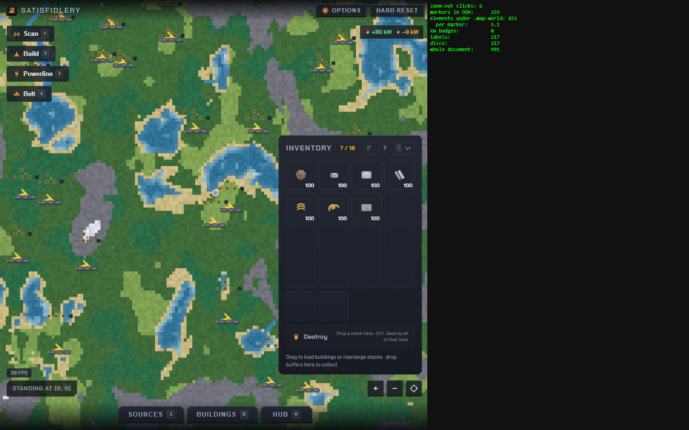

  | stress world, survey zoom | before | after |
  |---|---|---|
  | elements under `.map-world` | 2161 | **821** |
  | per marker | 8.3 | **3.2** |
  | kW badges | 86 | 0 |

  Labels stay: they're `display: none` at that zoom (no layout, no paint — only
  reconciliation), and `.labels-hidden` reveals the hovered one, which is how a dot stays
  identifiable. That was a deliberate feature and not worth trading for the last 10%.

## [0.41.0] — 2026-07-17

### Added

- **Detail bands on the flow layer: zoom reads as altitude here too.** The belt band and
  the wires are the factory's roads — they're its *shape*, and they draw at any zoom. What
  rides on them doesn't: **riding items fade out past `BELT_ITEM_SHOW_SPAN`** (1600 world
  units across the short edge) and **port nubs past `BELT_PORT_SHOW_SPAN`** (900).

  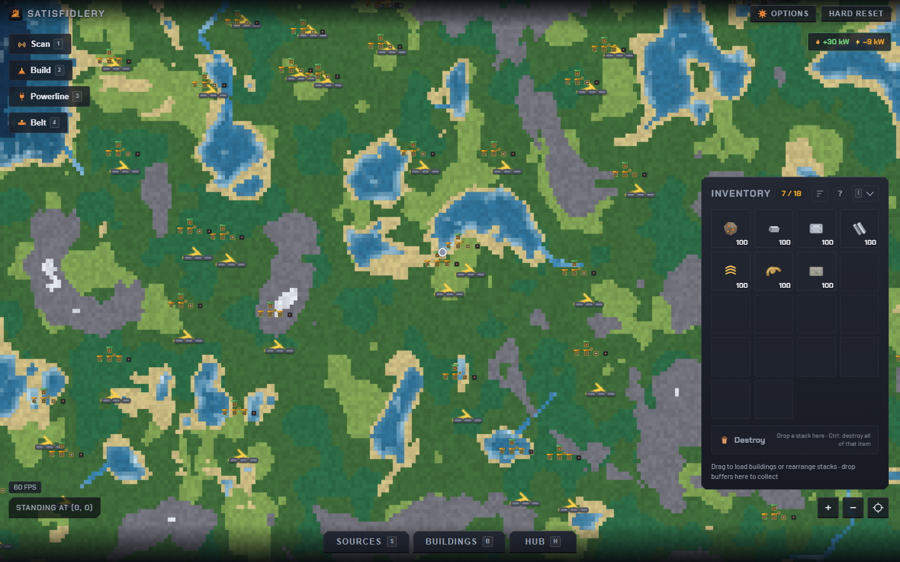

  This is a look decision first. Items and nubs are painted at a **fixed screen size** —
  they're read, not measured — so pulling the camera back doesn't shrink them, it packs
  more of them into the same pixels until a belt is a smear and every machine wears lint.
  Exactly the argument `LABEL_HIDE_SPAN` already makes for labels, and the leaves, the
  avatar and the smoke each have their own band.

  It's also the entire cost. At a survey zoom nothing is off-screen, so culling saves
  nothing and every item on every belt gets drawn. Nubs aren't clickable (`hitTestFlow`
  only tests belts and wires), so hiding them costs no interaction. Up close, everything
  is exactly as it was:

  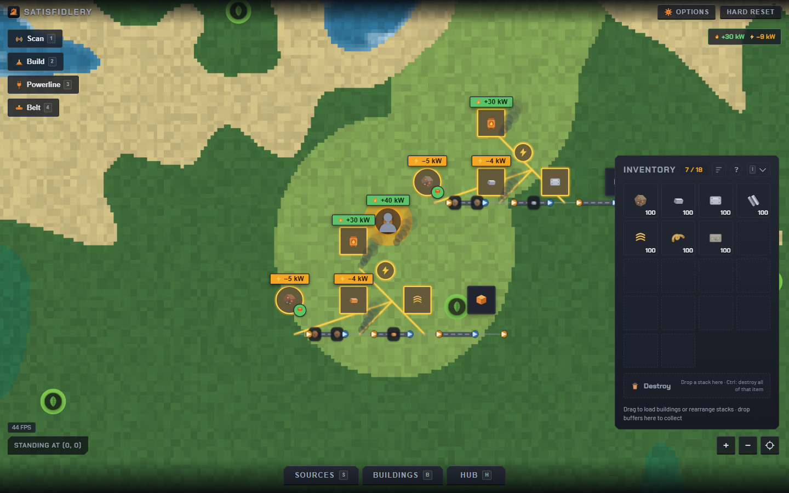

### Fixed

- **Belts are culled to the camera**, by the AABB of their anchors — padded by a quarter of
  the belt's own span, since a curved route can bow outside its anchors and a false skip
  would blink a belt out of existence while a false keep costs only what we paid before.
  This skips the expensive half (baking and allocating the styled route), which ran for
  every belt in the world on **every frame**, twice — once for the band, once for the
  items. Wires already had a segment reject; markers were culled in 0.40.2.

  On the stress world, a full survey zoom went from **never finishing a frame in 80
  seconds** to **60fps** — on a headless renderer with no GPU at all. Play zoom reads 44fps
  there, with every item, nub, badge and plume still drawn.

## [0.40.2] — 2026-07-17

### Fixed

- **The map rendered every marker in the world, on screen or not.** Every source,
  building, pole and reveal got a DOM node — ~900 of them on the stress world — and since
  the store hands MapView new `sources`/`buildings` arrays each tick, React reconciled the
  lot ten times a second, for markers nobody could see. Markers are now culled to the
  camera (plus a 140px margin so nothing pops in while panning). The cull is on position
  only: `nodes` itself stays whole, so clustering, selection and the node popover still
  see every node, and panning away from an open popover doesn't yank it shut.

- **Id lookups were `Array.find`, in per-frame loops.** `endpointPos` for both ends of
  every powerline, `beltEndpointPos`/`beltPorts`/`endpointOrientation` for every belt —
  each scanning all 600 buildings. That's fine with a dozen machines and quadratic with
  six hundred: ~1.4M id comparisons per frame on the flow canvas's rAF loop. There's now
  one id→entity index (`lookup.ts`), built once per state object and shared by every
  caller looking at it — engine, map and panels alike. Keyed on the state (not the
  arrays), because a tick hands back a new `buildings` array holding the same ids.

  | per frame, stress world | before | after |
  |---|---|---|
  | `endpointPos` × 2 per wire | 0.68ms | 0.06ms |
  | `beltEndpointPos` × 2 per belt | 2.06ms | 0.04ms |
  | `endpointOrientation` per belt | 1.03ms | 0.02ms |
  | **total lookups** | **~3.8ms** | **~0.1ms** |

  End to end: the stress world at a zoomed-out camera couldn't finish a single frame in
  70 seconds on the headless CPU renderer before; it now draws in 6.4s and the in-game
  counter reads 42fps *without* a GPU. Verified the indexed lookups against linear scans
  on every wire and belt end, that moving a building re-indexes, and that a dismantled one
  resolves to null rather than a ghost.

### Known

- **A full survey zoom still renders all ~900 markers**, because that's when they're all
  genuinely on screen and marker clustering is off by design (`CLUSTER_SCREEN_PX = 0`).
  Culling can't help there; re-enabling clustering is the lever, and that's a look
  decision, not a perf one.
- **The flow canvas still draws every belt, wire and item** regardless of the camera —
  cheap now that the lookups are O(1), but it's per-frame work for geometry that's often
  off screen.

## [0.40.1] — 2026-07-17

### Fixed

- **The engine was spending 21ms of every 100ms tick rebuilding a graph that hadn't
  changed.** The stress world found it on its first outing, which is what it's for.

  `powerComponents()` — the BFS that partitions the grid into its separate wirings — was
  **9.4ms a call** on that world, and `powerNetwork()` calls it, and *everything* calls
  `powerNetwork()`: `simulate()`, `simulateBurners()`, the map on every render, and each
  open panel. Four-plus full rebuilds per tick, ten ticks a second, of a partition that
  only changes when you wire something. Each one lands as a single block of main thread
  well over a 60fps frame's entire 16.7ms budget, so it wasn't 20% slower — it was a
  guaranteed dropped frame, ten times a second.

  Two fixes, both in `powerComponents`:

  - **It's cached on the `powerLines` array's identity.** Sound because the partition
    reads that array and nothing else — it's pure topology — and the engine never
    rebuilds the array, so the cache holds across ticks and not just within one. The
    same trick `terrain.ts` already uses for its model.
  - **Lines are bucketed into their component in one pass** instead of re-filtering every
    line for every component. That was O(components × lines) — on a map with 150 separate
    grids and 600 wires, most of the 9.4ms.

  Measured on the stress world (150 chains, 600 buildings, 450 belts, 600 wires), via a
  throwaway Node benchmark of the pure engine:

  | | before | after |
  |---|---|---|
  | full tick | 21.18ms | **1.03ms** |
  | `powerNetwork()` | 10.41ms | 0.37ms |
  | `powerComponents()` | 9.44ms | ~0ms |

  Verified against the old implementation rather than trusted: identical partitions on the
  stress world, on a cut grid, and on an empty one; the cache re-computes when the wires
  change and is skipped when they don't; and the factory still runs exactly as before
  (450 items riding belts, 300 machines mid-cycle after the same warmup).

## [0.40.0] — 2026-07-17

### Added

- **Stress test** on the main menu: a generated world with the map running flat out —
  **150 production chains**, each an ore node with a Miner Mk1 belted through a Smelter,
  a Constructor and into a Storage, on its own Biomass Burner and pole. That's 150 miners,
  600 buildings, 450 belts, 600 powerlines and 150 poles, all working at once.

  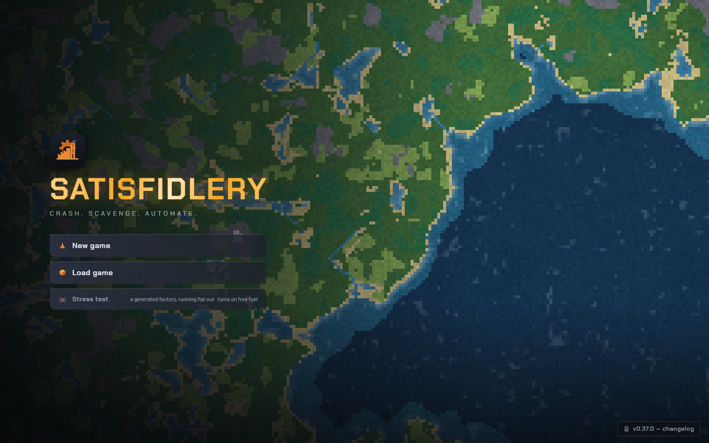

  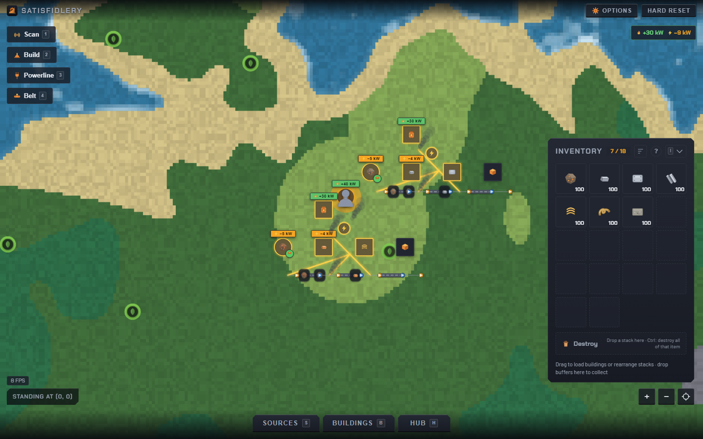

  **It's a save, not a mode.** Every entity is ordinary state a player could have built,
  so nothing downstream needs a special case — and the numbers it produces are about the
  game rather than about a rig. The layout is authored, but every belt goes through
  `planBelt` and every wire through `planPowerRoute`, the same planners the player's own
  clicks use: a cluster the planners refuse (too long a run, a full intake, a taken port)
  is **dropped rather than fabricated**. A generator that hand-rolled its own `Belt`
  objects would happily mint impossible ones, and every bug they caused would be a bug in
  the test rig.

  Each cluster is sized to run itself: a 30 kW burner against 15 kW of draw (miner 5 +
  smelter 4 + constructor 6), wired burner → pole → miner/smelter/constructor, which is
  exactly the pole's four intakes — a building only has two, which is why the burner
  doesn't wire direct. The menu turns the **free-fuel cheat** on with it so the burners
  never drain; the button says so, because that setting outlives the session.

  The world is a **fixed seed**, so two runs compare. It lands in its own slot, outside
  the three the board shows, and deliberately leaves `lastSlot` alone: it can neither
  overwrite a real save nor hijack Continue. It's regenerated on each click rather than
  read back, so it always reflects the code as it is now.

### Fixed

- **A generated world's inventory grid was short six slots** until its first reload. The
  slot count is earned per milestone and grown by `build()`, which a generated save never
  calls — so the rail showed the starting capacity, and `deserializeInventory` silently
  corrected it on load. Found by the stress world, which is the point of it.

## [0.39.3] — 2026-07-17

### Fixed

- **The inventory's help card opened in the wrong place, with its left half shorn off.**

  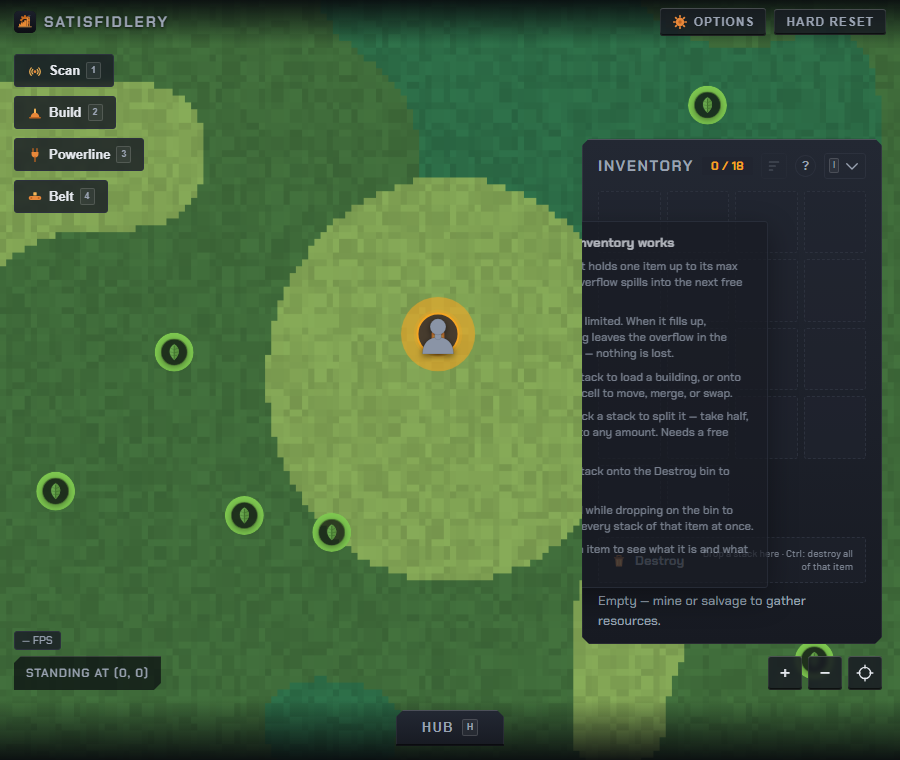

  It was already doing the right thing — computing viewport coordinates from the `?`
  button's rect and using `position: fixed` "so it escapes the sidebar's clipping", as
  its own comment said. **The rail's drop shadow silently took that away.** A `filter`
  makes an element the containing block for its fixed-position descendants, so `right`
  and `top` quietly stopped meaning the viewport and started meaning the rail; the
  chamfer's `clip-path` then sliced off whatever hung over the edge. Measured: the `?`
  button at x=995, the card at x=711–971 — anchored to nothing at all.

  And the shadow can't just go back to `box-shadow`: it's a filter *because* filters
  apply after clipping, which is what lets the shadow follow the chamfer instead of being
  cropped square with it. So the popovers move out instead — they now render through a
  `Portal` into `<body>`, where `fixed` means the viewport again and nothing clips them.

  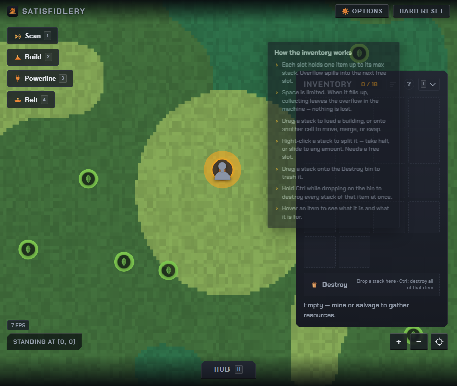

  **The hovered-item card and the split-stack popover had it too** — same rail, same
  filter, and the split one is interactive, so landing off-target was worse than ugly.
  All three are portalled. Anything anchored to a rect that must escape its panel wants
  the same treatment; `Portal.tsx` carries the explanation.

## [0.39.2] — 2026-07-17

### Fixed

- **The map tool shortcuts did nothing on an AZERTY keyboard.** They matched
  `KeyboardEvent.key` — the *character* — and AZERTY's digit row is shifted, so pressing
  the `1` key reports `&` and a binding of `'1'` never fired. (It would have broken every
  non-Latin layout too, where `key` is a letter no binding mentions.)

  **Bindings are physical keys now (`KeyboardEvent.code`), not characters** — `Digit1`,
  `KeyS`: the *place* on the keyboard, independent of what that place types. One build
  works on QWERTY, AZERTY and QWERTZ with **no layout setting to get wrong**, which is
  why there's no toggle in Options: binding the position is the fix a layout option would
  only ever approximate. (It's also why AZERTY players get ZQSD from a WASD binding for
  free, if movement keys ever land.)

  The labels are the other half: `keyLabel` asks the Keyboard Map API what a physical key
  actually types on the player's layout, so rebinding to the key labelled `A` on AZERTY
  shows "A" and not the "Q" that sits in that spot on QWERTY. Chromium-only — the Electron
  build and the demo — and elsewhere it falls back to the code's own letter, which is only
  ever cosmetically wrong. A key printed with the wrong letter is a nuisance; a key that
  doesn't fire is a bug, so binding is exact and labelling is best-effort, never the
  reverse. Digits stay printed as digits: AZERTY's `1` types `&`, but the keycap says 1
  and "&" for a toolbar's first slot reads like a typo.

  Shift no longer blocks a shortcut, since AZERTY needs it to type those digits at all.
  Ctrl/Alt/Meta still bow out — those combos belong to the OS and the browser.

  Overrides saved by 0.39.0–0.39.1 (stored as characters) are upgraded to codes on read,
  so a rebind you'd already made keeps working.

## [0.39.1] — 2026-07-17

### Added

- **The map tools have shortcuts too**: `1` Scan, `2` Build, `3` Powerline, `4` Belt,
  each printed on its own button.

  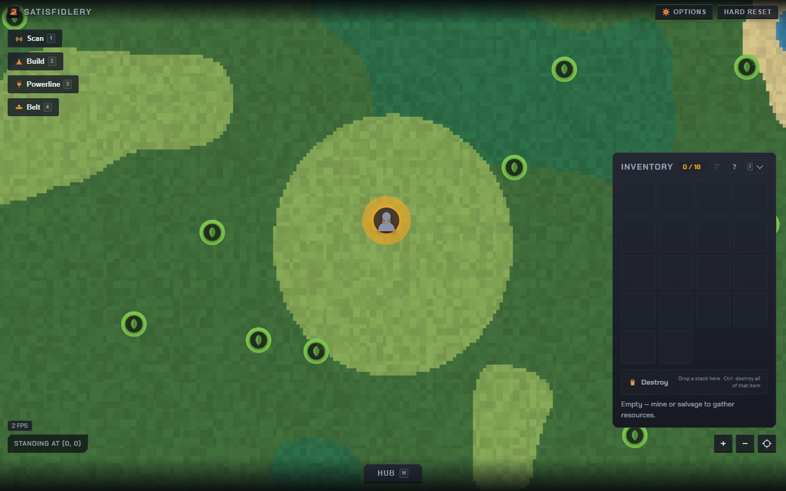

  **Numbers, not initials** — the obvious letters are already spoken for (`S` is Sources,
  `B` is Buildings), and the tools are a positional toolbar, so they're numbered
  top-to-bottom the way they're stacked. Rebind them to taste once Options can: the badge
  renders whatever the action is bound to.

  Each key fires the same toggle its button does — Scan and Build got named callbacks
  instead of inline `onClick` lambdas so there's one path, not two that can drift — and
  is bound only while its button is on screen, so an unbuilt tool has no key. Pressing
  one closes the other tools, exactly as clicking does: the map runs one tool at a time.

## [0.39.0] — 2026-07-17

### Added

- **Keyboard shortcuts, printed on the buttons they fire.** `S` Sources, `B` Buildings,
  `H` HUB, `I` collapses the inventory rail. Each key is shown as a badge on its own
  control, so the shortcut is discoverable without a manual.

  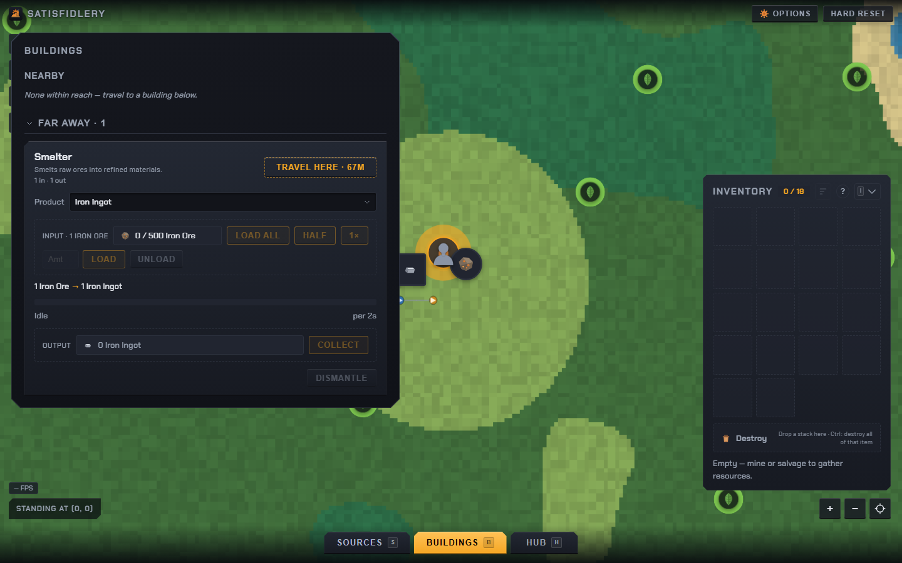

  **Shortcuts are data, not inline key checks** (`src/keybinds.ts`): a `KEY_ACTIONS` table
  of id + default key + label, and a store of overrides persisted to localStorage. Nothing
  binds a key at the call site — a control asks for its action by id (`useKeyAction`) and
  renders its current key (`useActionKey`), so the key shown and the key that fires are the
  same value by construction. **The planned "assign actions to keys" Options page is a view
  over that table**: list `KEY_ACTIONS`, write with `setBind` (which unbinds whoever else
  held the key, since two actions on one press is not a state a rebinding UI should be able
  to produce), and every handler and badge follows immediately.

  Shortcuts stay out of the way: ignored while typing, with a modifier held (Ctrl+S is
  Save, not Sources), on auto-repeat, and while a modal owns the screen. A key is only
  bound while its control is actually offered, so no shortcut ever does nothing.

### Changed

- **The World button is gone; the panel buttons toggle instead.** The world was never a
  peer of Sources/Buildings/HUB — it's the base layer they float over, so "show me the
  world" was only ever "close the panel", which the open panel's own button (or its key)
  now does. `App`'s state is `panel: Panel | null` rather than a tab that included the map
  and the drop pod, which also retires the pod's pointless button during the intro.

### Fixed

- **The inventory count wrapped mid-count** ("0 /" then "18") once the collapse control
  grew a key badge and took the slack out of the rail's header.

## [0.38.2] — 2026-07-17

### Fixed

- **The map node popover hid behind the inventory rail.** Tap a node on a narrow window
  and the card's right-hand half — Build Miner Mk1, Collect — was simply gone.

  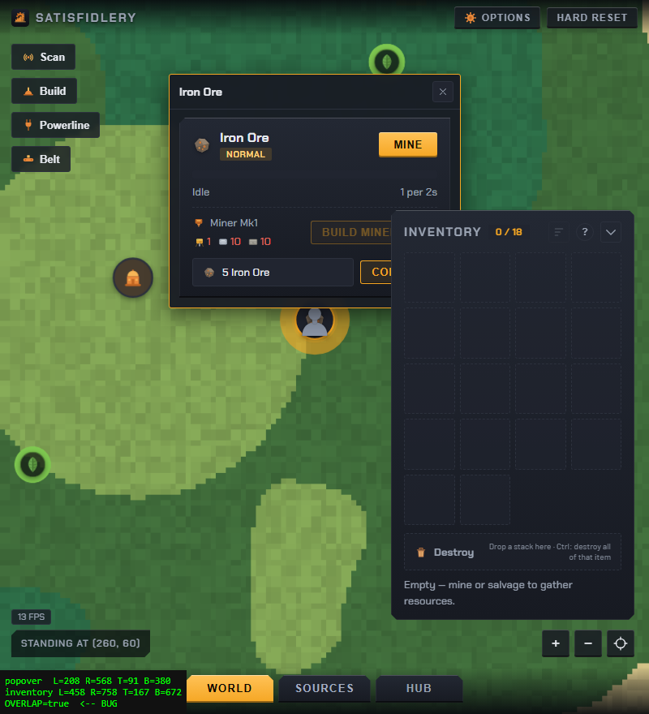

  It clamped itself to the *viewport*, but the viewport isn't the free space: the
  inventory rail and an open side panel float over the map at z 30, while the whole map
  stack sits at z 0. The card can't out-z-index them — and it shouldn't cover them
  anyway, because the card takes drag-and-drop from the inventory, so both have to be on
  screen at once. It now measures those boxes and clamps into the space they leave.

  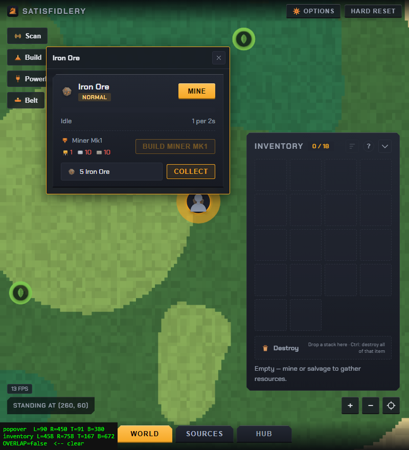

  Only a box the card actually overlaps *vertically* constrains it, so a node up in a
  corner still centres on itself while the rail sits lower down; which side a box pushes
  the card toward comes from which half of the viewport that box occupies (the rail
  pushes left, an open Sources/Buildings/HUB panel pushes right). The rects are measured
  rather than derived from `--inv-rail`, since the rail's height changes when it's
  minimized and only a real rect knows whether the card collides at all. If the two
  lanes leave no room — a narrow window with a panel open, where the map is fully covered
  anyway — it falls back to the old viewport clamp: half-covered beats mostly off-screen.

## [0.38.1] — 2026-07-17

### Fixed

- **The tutorial claimed the scan runs from the HUB. It doesn't.** `toggleScan` centres the
  sweep on `playerPos` — you can prospect from wherever you've walked to, which is the whole
  point of carrying a sensor. The copy now says so, and the demo sweeps from the **pioneer**
  instead of a structure, so the picture can't teach the wrong thing either.
- **The last milestone never mentioned Storage**, which is exactly what Conveyor Logistics
  unlocks alongside the belts (`requires: 'logistics'`). Added a third step for it, with a
  demo of items belting in, stacks piling up, and items belting back out.

  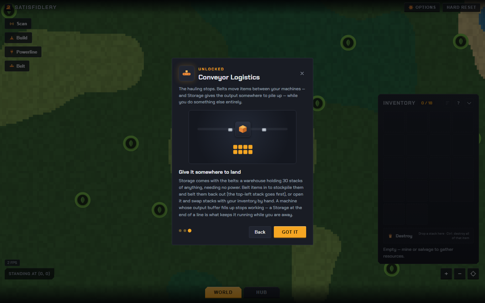

### Changed

- **A HUB milestone is now submitted at the HUB.** It always read that way — you "submit"
  materials, and hand-crafting, the burner bank, and dismantling all require standing there —
  but `build()` only ever checked affordability, so you could unlock a milestone from across
  the map. It now goes through `engine.canSubmit`, which adds the `isAtHub` check that every
  other HUB action already makes.

  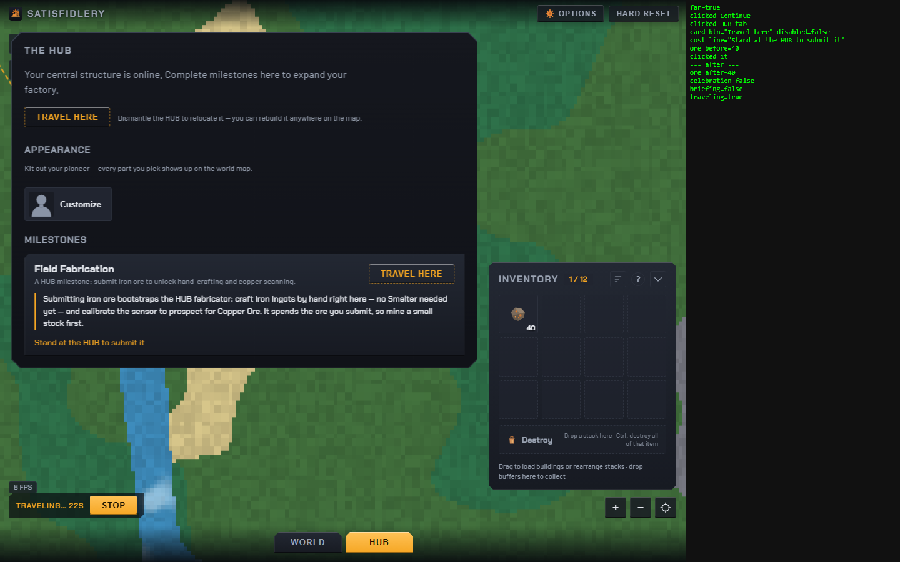

  Away from the HUB, an affordable milestone offers **Travel here** rather than a disabled
  button, and the cost line says why — the same move the HUB header already makes. The
  attention cue on the HUB tab deliberately stays affordability-only (`canBuild`), so it still
  lights up while you're out in the field: that's the cue to walk home, and gating it on
  proximity would mean it only ever told you what you could already see.

## [0.38.0] — 2026-07-17

### Added

- **Every milestone now celebrates itself and then teaches you what it gave you.** The
  "banger" that used to fire once, for the HUB, now fires for **every** milestone —
  Field Fabrication, Assembly Line, Equipment Workshop, Power Grid, Mining Automation,
  Conveyor Logistics — carrying that milestone's own glyph and name.

  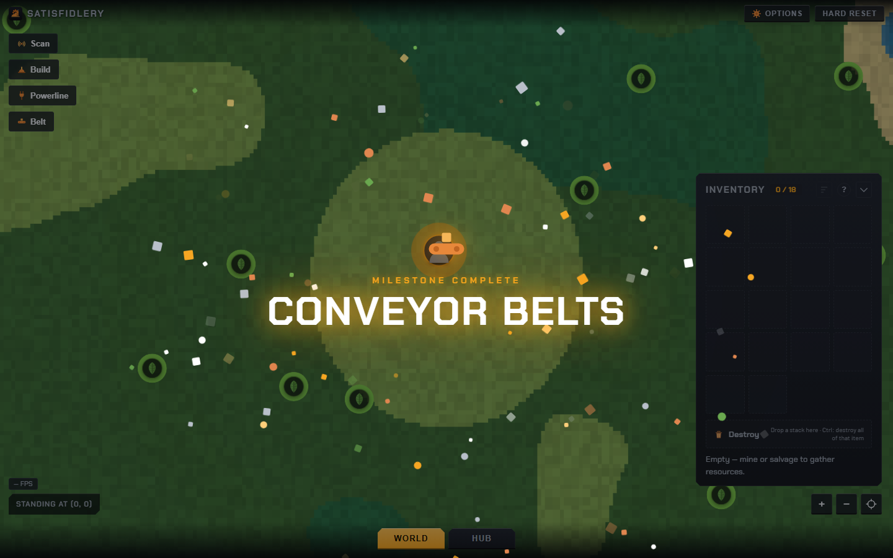

  Behind the confetti comes the part that was actually missing: an **unlock briefing**
  that explains the new toys and how to use them. This is the "unlock tutorials" item off
  the roadmap, and it earns its keep — a milestone that hands you three systems at once
  (Power Grid: foraging, burners, powerlines) used to hand you three systems and a
  paragraph of cost text.

  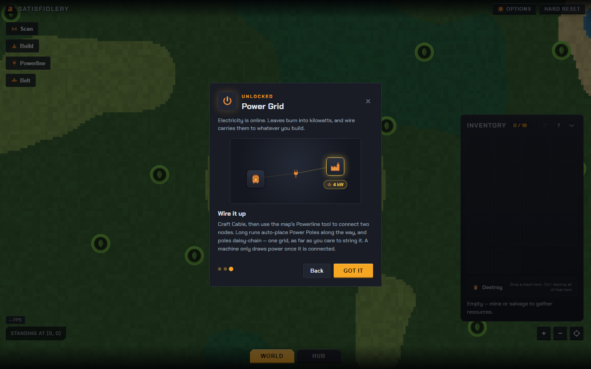

  **Multiple unlocks are paged, not stacked.** One demo and one paragraph per step, with
  dots to skip around — so the briefing scales from the HUB's two steps to Power Grid's
  three without ever landing as a wall of text.

- **The demos are animated, not illustrated.** Each step loops a little mock of the
  interaction it teaches: the sensor sweeping up blips, a ghost snapping onto the grid,
  leaves flying into a burner, a wire drawing itself to a machine that lights up, ore
  riding a belt end to end. Ten scenes, hand-placed on a fixed 320×160 stage and animated
  entirely in CSS — no game state, no rAF loop, and they keep running while the game ticks
  underneath.

  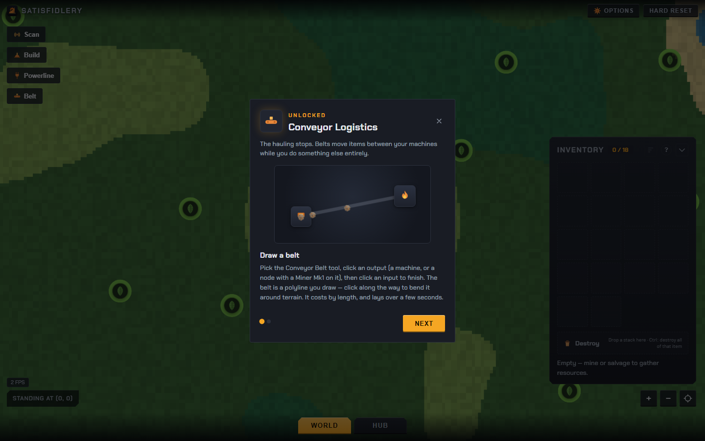

  They are deliberately **not** the real renderer. MapView needs a world and a camera that
  don't exist behind a modal, and a real world would show whatever you happen to have built
  instead of the thing being taught.

### Changed

- **A milestone is now content, not code.** A `TUTORIALS` table in `content.ts` names the
  glyph, the steps, and which demo + items each step shows; the briefing and the celebration
  read it generically. Adding a milestone's tutorial is one object plus its i18n copy —
  there is no per-milestone component anywhere.
- **Briefings fire once per save, and the queue is derived** — `built` minus the new
  `seenTutorials` (save **v29**), rather than fired off a transition. So quitting mid-briefing
  leaves it waiting on the next load, and several pending unlocks play in order instead of
  racing. Existing saves are backfilled as already-seen: a mid-game player is not ambushed
  with the whole backlog on load.
- **Completed milestones keep a "How it works" link** in the HUB rail, so the demos stay a
  reference you can come back to rather than a one-shot cutscene.

## [0.37.3] — 2026-07-17

### Added

- **Load another save from the pause menu.** Escape now offers **Load game** between Save
  and Options: it opens the same slot board the main menu uses, and picking a slot swaps
  the running game for that one — no round trip out to the title screen and back in.

  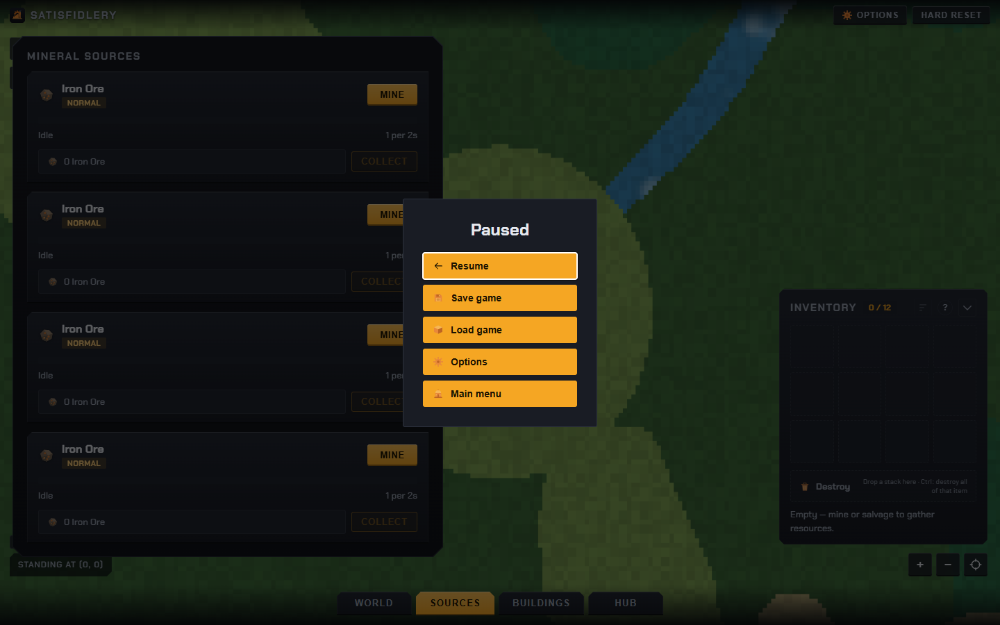

  **Switching saves the game you're leaving first, and the order is the entire feature.**
  `loadGame` moves `activeSlot` to the target, and every save path in the app reads that
  field to decide where to write — so loading first would leave the outgoing game's
  unmount-save pointed at the *incoming* slot. The session you walked away from would never
  be written at all, and the last thing anyone would think to check is whether "load"
  quietly discarded the world it loaded over. So the save-then-load lives in `store.switchSlot`,
  not in a component where it's one refactor away from being reordered by someone who
  didn't know.

  The board is opened from inside a game here, so it **badges the slot you're playing** —
  otherwise "load" means picking blind between rows that all look equally like somewhere
  else. Picking that slot is a no-op rather than a pointless save-and-reload. No confirm:
  the board *is* the deliberate step, and since the switch saves first there's nothing to
  lose either way.

  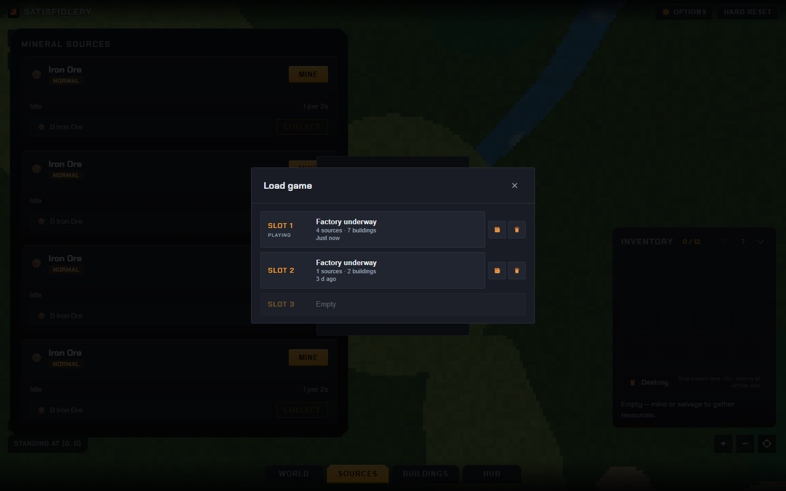

  Escape still backs out one layer at a time — the board closes, the pause menu stays.

## [0.37.2] — 2026-07-17

### Changed

- **The main menu is down to three entries**: Continue, New game, Load game (plus Quit in
  the Electron build). **Load save file** and **Options** are pulled for now. Nothing is
  lost by it — Options is still reachable in-game from the HUD strip and the pause menu,
  which is where it's wanted anyway; the title screen was a second door to a dialog whose
  cheats and language switch only mean anything once you're in a world.

  Both are a button and an overlay branch away from returning. The machinery underneath is
  untouched and still exercised: `parseSaveFile` (which gates on the `v` stamp) and
  `store.loadStateInto` (which takes an imported state and asks the slot board where to put
  it) are intact, and their translated copy stays in all three locales — the wording is the
  expensive part of putting a button back, and an unused key costs nothing but its bytes.
  The dead CSS went, since that isn't worth keeping around to look at.

  A note for whoever restores it: the slot board's per-slot **Export** is now a one-way
  door. It still writes a `.json`, which is a fine backup, but with no import in the menu
  there's nowhere to feed it back in.

## [0.37.1] — 2026-07-17

### Added

- **Pods fall on the main menu.** Every so often another drop pod comes down out there on
  the flyover: a fireball burning in on a shallow entry, a flash, a shockwave ring, dirt
  thrown out radially, then a crater smouldering downwind for a quarter of a minute. The
  game opens with a pod crash — the title screen is the same planet a few moments earlier.

  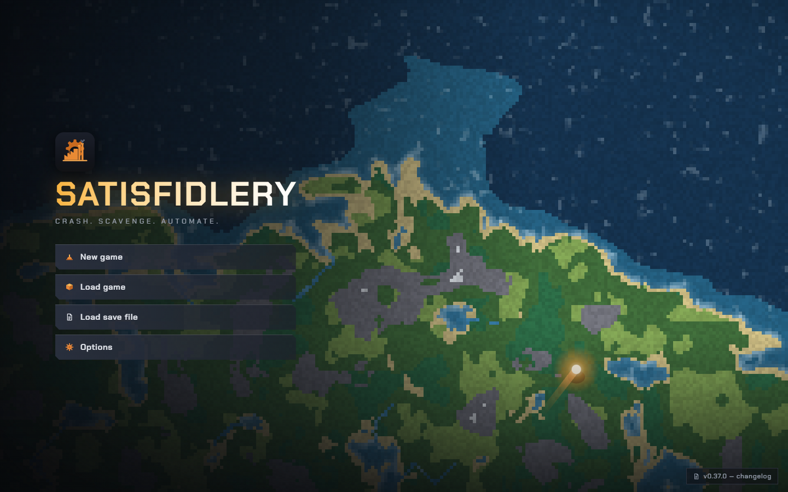

  It's staged, but staged into a **real world**: the impact point is chosen off the
  terrain's own ambient field, so a pod only ever lands on land, and the smoke drifts along
  the same `windOf` vector as the clouds and every machine plume — the same weather as
  everything around it. All of it is world-anchored; the camera never stops moving, and a
  crash placed in screen space would slide over the ground like a smear on the lens.

  **Altitude is the whole trick.** Top-down, a falling object and a distant one look
  identical. So the pod's *ground* position slides along its entry line to the impact point
  while the pod is drawn offset from it and its shadow is drawn on it — the two converge as
  it falls, which is the one cue that reads unambiguously as height. The intro's
  `DropPodCrash` couldn't help: it's a side-view DOM cinematic, and this is a map.

  Sized against a real viewport, not a test canvas. At this altitude the whole event spans
  a few dozen px on a 1440x900 screen, and the first pass — tuned in a thumbnail — vanished
  entirely at the size anyone actually sees. Two other things only measurement caught: a
  fade running the full 15s smoulder is down to a third by the 10s mark (technically still
  there, invisible in practice), so the wreck now holds at full strength and fades over the
  tail; and a scorch with a hot ember in it reads as a glowing eye staring out of the map
  rather than as burnt ground.

  A crash is on screen ~70–80% of a menu session, worst quiet gap ~11s. Over **open ocean
  it never fires**, which is correct — there's nothing to hit. But a view that's sea through
  the middle with coastline down one edge used to be silent too, with land plainly in frame:
  the spawn only sampled the middle 60% and, worse, a failed pick burned the whole 12–28s
  gap. It now falls back to the full frame and retries in 2s. That case measured 0%
  visibility before the fix and ~75% after.

## [0.37.0] — 2026-07-17

### Added

- **A main menu.** The game had no front door. Importing the store read `localStorage` at
  module scope, so you were simply *in* whatever save existed — there was one save, you
  could never have a second, and the only way to start over was a Hard reset that wiped
  the first. The menu makes that a decision instead of a side effect: **Continue** (the
  slot you were last in), **New game**, **Load game**, **Load save file**, **Options**, and
  **Quit**. `activeSlot === null` is the whole condition for being here.

  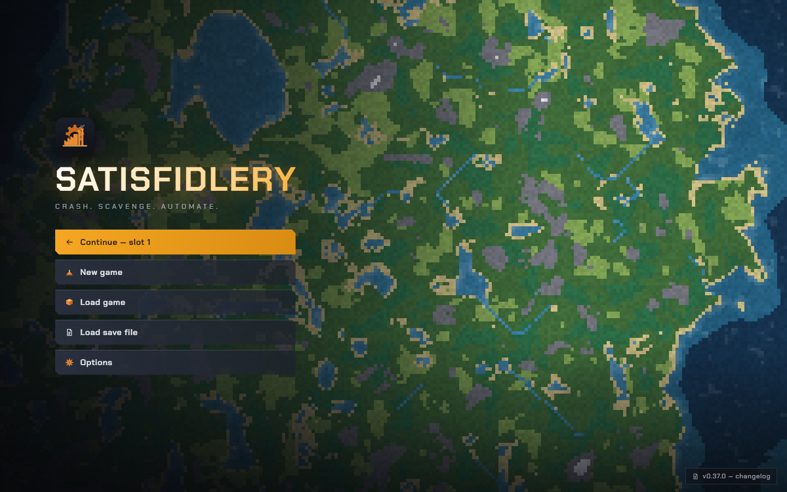

  **The background is not a background.** It's the actual game renderer: the same
  `terrainGpu` shader that paints the map, over a world from the same seeded terrain, with
  rivers flowing down the same D8 network and cloud shadows drifting on the same shared
  `wind.ts` vector. A fresh seed every launch means the title screen is a different planet
  every time, and every one of them is somewhere you could land. The camera traces a slow
  Lissajous path — two pans at coprime periods, so it never retraces and never needs a
  keyframe — and breathes through a zoom band chosen on purpose: `ambientfx` fades surface
  detail *out* from worldPerPx 4→26 and cloud shadows *in* from 9→34, so the flyover sits in
  the one place both are on screen at once, glinting water under moving weather.

  It's affordable for the same reason dragging the map is: the GPU pass is ~0.3ms per
  viewport, so a camera that never stops costs about what a drag already costs (capped at
  30fps — the flyover is slow enough that it reads as smooth). Terrain and ambience repaint
  in the *same* frame, as MapView does it; the field carries its own camera, so painting
  them on separate clocks slides the foam off the coastline. Reduced motion keeps the
  world and stops the flight: one still frame of a real place, which was the shot anyway.

- **Three save slots, and saves as files.** Picking a slot for a new game warns before
  overwriting one that's occupied — the single most destructive click on the screen. Each
  slot summarizes itself (stage, sources, buildings, and how long ago it was saved) without
  deserializing: reading a full state allocates a Decimal per resource and rebuilds every
  belt, far too much to do three times just to draw a list, so the summary comes off the
  raw JSON. Slots can be **exported** to a `.json` file and loaded back — export is what
  makes "Load save file" worth having, since without a way to get a save *out* there is
  never a file to put back in.

  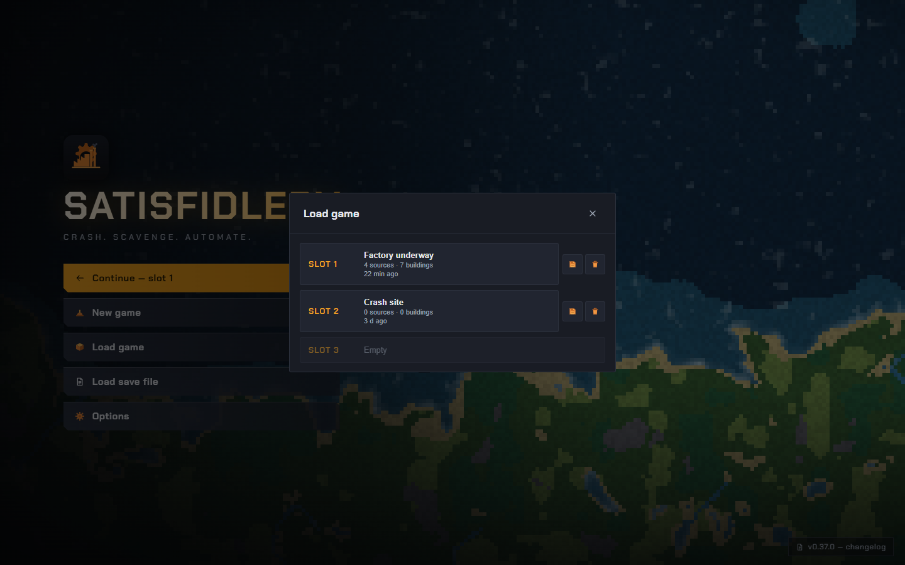

  An existing game is **migrated into slot 1** on first launch, so a player mid-factory finds
  it waiting rather than an empty board. The save *shape* didn't change — this is purely
  which key it lives under (`save.ts` still owns the shape, `saveSlots.ts` now owns the
  storage), so **the save version stays v28** and no one's game is touched.

  Importing a file gates on the `v` stamp. `deserialize` is deliberately forward-tolerant —
  anything it can't read falls back to the new-game value — which is right for a save from an
  older build and exactly wrong for a file picked by mistake: without the check, *any* JSON
  would "load" as a pristine world and read as a wiped save.

### Changed

- **The pause menu can leave the game**, not just the app: **Main menu** saves and backs out
  to the title screen. Quit is Electron-only (a browser can't close a tab it didn't open),
  which left the browser build with no way out of a save at all — now it has one.
- **The changelog is in the game, for everyone.** It was demo-only when the DevBanner was its
  only door; the menu's version button now opens the full history in every build. It stays a
  lazy `?raw` import in its own chunk, so no build pays for it until someone opens it.

## [0.36.0] — 2026-07-17

### Added

- **Escape opens a pause menu.** Escape is the one key every player already knows means
  "let me out", and until now it did nothing at the top level. It now opens a menu with
  **Resume**, **Save game**, **Options**, and **Quit game** — which also gives the game a
  discoverable home for the actions that were only reachable from the HUD strip.

  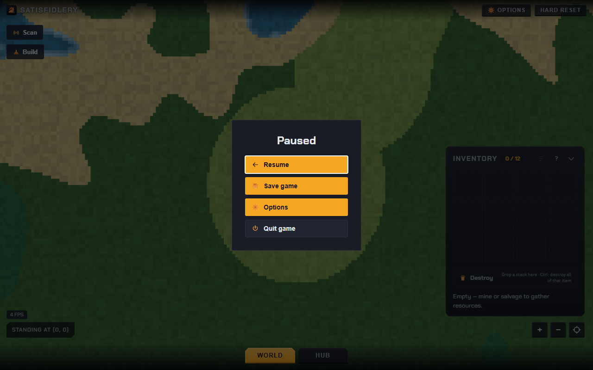

  Escape is a **stack**, not a single hook: it backs out of the innermost thing first, and
  only reaches the menu once there's nothing left to back out of. A map popover, a placement
  ghost, a confirm prompt, or the Options dialog each swallow the key while they're up. The
  wiring is `preventDefault` + `defaultPrevented`, with everything that claims the key
  listening on `document` so it always resolves before the window-level menu handler —
  ordering that can't be left to which effect happened to mount first.

  **Quit** saves before it exits, so its prompt is about the surprise of ending the session,
  not about losing progress. It appears **only in the Electron build**, feature-detected off
  a new `nativeApp.quit` bridge (`electron/preload.cjs` → an `app:quit` handler in
  `electron/main.cjs`) — the browser and demo builds have nothing to quit *to*, since
  `window.close()` only works on a script-opened window, so they show the other three.

  Note that the game keeps ticking while the menu is up: "Paused" names the screen, not a
  halted simulation. An idle game that stops paying out because a menu is open would be
  both a bug and, offline progress being what it is, unenforceable.

## [0.35.8] — 2026-07-17

### Fixed

- **The demo deploy's link scanner couldn't tell a link from a code span.** 0.35.7's own entry
  quotes `](docs/…)` in backticks to explain the fix, and the scanner dutifully treated that as
  a path to publish. Harmless in itself (it warned), but the same blindness meant an entry that
  merely *mentioned* a denylisted doc inside backticks would have aborted every deploy — a guard
  that fires on prose is worse than no guard. Fenced blocks and inline code are now stripped
  before links are read. Re-checked both directions: a real link to `docs/anti-cheat.md` still
  aborts the deploy; a backticked mention no longer does.

## [0.35.7] — 2026-07-17

### Fixed

- **The demo's changelog links were all dead.** The public repo holds only the build and a copy
  of `CHANGELOG.md`, so every `](docs/…)` in it pointed at a path that exists solely in the
  private repo — 99 of them, dead the moment GitHub renders the file. `deploy:demo` now reads
  the changelog's own links and copies exactly what they point at, so the list maintains itself
  rather than needing a hand-kept manifest. 99/99 resolve now (97 screenshots + the two
  technical docs it references).

  Because that follows links automatically, the script carries a **`NEVER_PUBLISH` denylist**
  and **aborts before building** if the changelog ever links `docs/anti-cheat.md` (publishing it
  would help cheaters) or `docs/hostile-life.md` (unreleased content). Verified by injecting a
  link to the former and confirming the deploy refuses. Add to that list before writing a doc
  that must stay private.

### Changed

- **Stale docs corrected.** An audit against the code rather than a read-through:
  - `CLAUDE.md` said the save was **v27**; it is **v28**.
  - `CLAUDE.md` didn't know `terrainGpu.ts` / `terrainGpuShader.ts` existed, still described
    `.map-terrain` as a plain 2D canvas, and hadn't caught up with the full-bleed shell. It now
    also records the two rules that are easy to get wrong: the CPU model stays the source of
    truth for gameplay, and bottom-anchored map chrome must clear `--hud-bottom` because it
    cannot win on z-index.
  - `render-plan.md` claimed "step 1 in progress" while its own body said step 1 was complete,
    and its Step 2 is now **superseded** — it planned to move *water* to the GPU while leaving
    the terrain pass on the CPU, which measurement showed was exactly backwards. Marked as kept
    for its reasoning, not as a plan, and its "noise translates almost verbatim" claim is struck
    through as disproved.
  - `render-plan.md` also references `waterfx.ts` / `renderWater` four times — **renamed to
    `ambientfx.ts` / `renderAmbient` in 0.32.0**, before that document was even written. Noted
    rather than silently rewritten, since the section is superseded.
  - `map-generation.md`'s rendering section described the CPU painter as the only one.

## [0.35.6] — 2026-07-17

### Fixed

- **The reach ring around the avatar rendered as a radiation symbol when zoomed in.** Four fat
  gold wedges with gaps on the diagonals, instead of a ring. Reported as demo-only; it was not —
  it reproduces everywhere, and only looked demo-specific because it takes zoom to become
  visible.

  `.map-reach` is laid out at its true world size: `INTERACT_RADIUS (15) × 2 × L`, and
  `L = LAYER_PX / WORLD_SPAN = 4000 / 100000 = 0.04`, so the box is **1.2 layout px** — narrower
  than its own 2px border. Chromium fits a dash pattern to that degenerate circle (about four
  dashes go round it) and the camera transform then magnifies them. The border is now `solid`:
  a solid border has no pattern to degenerate, so it reads the same at every zoom, and the ring
  keeps the exact look it has always had.

  Isolating it took two wrong theories first — CSS minification (the built rule is byte-identical
  to source) and dash-scaling-with-zoom (a transform scales dashes *with* the element, so the
  ratio is fixed). What settled it was rendering the rule on its own across a spread of layout
  sizes and scales: at layout 15px / scale 8 the wedges appear exactly as reported.

### Known issue (pre-existing, not addressed here)

- **The reach ring is several times larger than the reach it depicts.** It is ~96% border: the
  true circle is `1.2 × zoom ≈ 11px` on screen at play zoom, while its 2px border renders
  `2 × zoom ≈ 18px` *per side*. What reads as the gold disc IS the magnified border, so it
  overstates the interaction radius by roughly 4.7×. Fixing that is a design decision about what
  the indicator should be, not a rendering fix, so it is deliberately left alone — see the note
  on `.map-reach`.

## [0.35.5] — 2026-07-17

### Fixed

- **The action bar covered the map's mode panels.** Entering belt mode put its panel — style
  picker and all, including **Done** — underneath the WORLD/SOURCES/BUILDINGS/HUB keys, so the
  mode was awkward to leave. A 0.35.0 regression: four map panels are anchored
  `position: absolute; left: 50%; bottom: 12px`, which is precisely where the new bottom bar
  landed. All four now clear it via `--hud-bottom`: belt mode, power mode, the power confirm,
  and the claim button.

  Not fixable with z-index, which is worth writing down: those panels live inside
  `.map-viewport`, inside `.stage` at `z-index: 0`, so the action bar at `z-index: 35` is above
  *every* layer the map owns no matter what they ask for. Bottom-anchored map chrome has to
  subtract `--hud-bottom`, and the token now says so.

  This was a gap in 0.35.0's z-index audit: the same class of bug was found and fixed for the
  save toast and countdown (both `bottom: 24px; left: 50%`), but the audit went looking at
  `z-index` values and never asked what else was parked at the bottom centre.

## [0.35.4] — 2026-07-17

### Changed

- **The terrain is drawn on the GPU. Panning costs 25.70ms → 0.30ms at 1440×900 (~86×).**
  The map looks *exactly* as it did — that is the whole point, and it's gated.
  [`docs/gpu-terrain.md`](docs/gpu-terrain.md).

  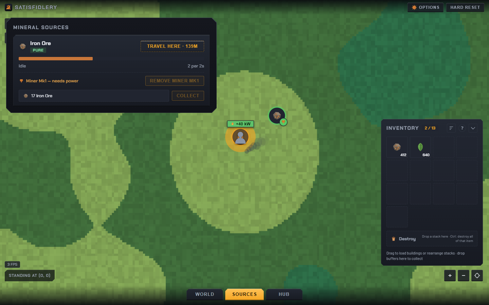

  | viewport | CPU | GPU | terrain-only pan ceiling |
  | --- | --- | --- | --- |
  | 1440×900 | 25.70 ms | 0.30 ms | 39fps → far above 60 |
  | 1920×1080 | 43.20 ms | 0.30 ms | 23fps → far above 60 |
  | 2560×1440 | 77.70 ms | 0.40 ms | 13fps → far above 60 |

  **Stage 3 turned out not to be the job this plan described.** The plan said "port
  `renderAmbient` to a shader and delete `AmbientField`". Reading `ambientfx.ts` properly showed
  that was wrong on both counts: the shore term is an iterative BFS dilation that is
  deliberately *view-dependent*, and — more to the point — **the animation was never the cost**.
  `renderAmbient` already skips every dry cell. The 25.70ms was `biomeOf` per cell inside
  `renderTerrainView`, which produced the field as a side effect of painting.

  So the overlay doesn't move at all. The GPU produces the **field** in a second pass at one
  texel per terrain cell (~36× smaller than the viewport) and reads it back in **0.20ms**;
  `ambientFieldFromGpu` hands that to the untouched CPU `renderAmbient`. The water is still
  drawn by the same code, so ambient parity is free instead of being something to gate.

  **What holds it honest.** The gate diffs CPU vs GPU over 11 views — every one of the ten
  biomes, whole-island zoom to deep zoom, rivers included, nothing stubbed — plus the ambient
  field cell-for-cell. **0 differing pixels, 0 differing cells**, on a real NVIDIA RTX 5070 Ti
  as well as the software rasteriser. `renderTerrainView` stays as the WebGL2-less fallback and
  as the source of truth for gameplay: `pathfind`/`deposits`/`leaves` are untouched, which is
  exactly why parity is enforced — a pixel that renders as land but paths as water is the
  failure this must never produce.

  Save shape unchanged (still v28).

## [0.35.3] — 2026-07-17

### Added

- **GPU terrain: the payoff, measured on real hardware — 62× to 194×.** Still groundwork (the
  painter is unwired until stage 3), but the premise is no longer taken on faith.
  `scripts/gpu-bench.html`, and [`docs/gpu-terrain.md`](docs/gpu-terrain.md).

  | viewport | CPU (fp64) | GPU (df + 1px sync) | speedup |
  | --- | --- | --- | --- |
  | 1440×620 | 18.60 ms | 0.300 ms | **62×** |
  | 1440×900 | 25.70 ms | 0.300 ms | **86×** |
  | 1920×1080 | 43.20 ms | 0.300 ms | **144×** |
  | 2560×1440 | 77.70 ms | 0.400 ms | **194×** |

  **The parity gate also passes on a real NVIDIA RTX 5070 Ti**, not just the software
  rasteriser it had been running on — which is the check that mattered, because the
  double-float coordinates use Dekker's algorithms and those *require* the compiler not to
  reassociate or contract to FMA. NVIDIA's compiler is far more aggressive than WARP's; the
  shader survives both, with zero differing pixels on each.

  **Correction to 0.35.1's numbers.** Those were measured in Node against a stubbed 2D context,
  which charges nothing for `fillStyle` parsing or 36,000 `fillRect` calls — they were a floor,
  and the real browser cost is ~50% higher: 25.70 ms at 1440×900 (not 16.78), 77.70 ms at 1440p
  (not 45.58). So panning was **already over the 16.7 ms frame budget before 0.35.0** — 18.60 ms
  in the old 620px box — and terrain alone caps the pan at ~39fps at 1440×900, ~23fps at 1080p,
  ~13fps at 1440p.

  Two measurement traps are documented in the bench, having caught both: `--virtual-time-budget`
  freezes the clock during synchronous work (every timing reads 0.0 ms), and `gl.finish()` does
  **not** force the render — Chrome elides work for a canvas that is never displayed or read,
  which first reported an impossible 0.001 ms/frame (3.7 Tpixel/s, ~18× the card's theoretical
  fillrate). `readPixels` forces it, at the cost of a stall that makes the GPU column an upper
  bound.

## [0.35.2] — 2026-07-17

### Added

- **GPU terrain, stage 2: rivers in the shader.** Still groundwork — the painter remains
  unwired from `MapView`, and panning is exactly as slow as before (see below for why).
  [`docs/gpu-terrain.md`](docs/gpu-terrain.md).

  Rivers were the one part of the model that isn't noise: `riverAt` warps the query point by
  fbm and then does a spatial-hash lookup against D8 line segments. It also can't be faked by
  stroking segments onto a canvas afterwards, because the warp is **per-pixel** — the river's
  shape *is* the segment set warped by a noise field. So the flow network now uploads as
  textures: 695 segments as RGBA32F (2 texels each), the bucket map flattened to an RG32UI
  (offset, count) grid over an R32UI index list, with per-bucket order preserved (`riverAt`
  returns the *first* hit, and stage 3 will advect water along that segment's direction).

  Two things rivers taught about precision, on top of stage 1's:

  - Segment **endpoints** upload as plain fp32 and that's safe, unlike everything else at world
    scale — they come off the D8 grid as `(i+0.5) * (2*WORLD_RADIUS/N) - WORLD_RADIUS`, needing
    ~20 significand bits. It's the *query* point that can't be held in fp32.
  - `distToSeg` must **not** subtract in fp32: `q` is ~50,000 and so is `ax`, but their
    difference is tens of units, so an fp32 subtraction cancels catastrophically and leaves
    ~0.006 of noise on a test whose threshold is a river half-width. The shader subtracts in
    double-float, then collapses.

  The gate now runs the **full model with nothing stubbed** — 11 views × 144,000 px, all ten
  biomes, whole-island to deep zoom, **0 differing pixels**. The rivers-off stub that stage 1
  needed is gone.

  **Why this still isn't faster.** `renderTerrainView` doesn't only paint — it *produces* the
  `AmbientField` that `renderAmbient` consumes, collected during the same per-cell pass. Wiring
  the shader in now would leave the CPU running the identical `elevation` math to build that
  field, for zero gain. The payoff needs stage 3 (the ambient overlay onto the same context),
  which is the coupling this plan flagged from the start.

## [0.35.1] — 2026-07-17

### Added

- **GPU terrain, stage 1: the WebGL2 painter and its parity gate.** Groundwork only — nothing
  in the shipped render path changed, and the shader is deliberately **not** wired into
  `MapView` (without rivers it isn't the same picture). Plan and measurements in
  [`docs/gpu-terrain.md`](docs/gpu-terrain.md).

  Panning re-renders the whole viewport on the CPU every camera move, and 95% of that is
  `model.elevation` — ~9 octaves of domain-warped fbm per 6px cell. Measured: 12.75ms in the
  old 620px box, 16.78ms at 1440×900, 26.21ms at 1080p, 45.58ms at 1440p, against a 16.7ms
  frame. So the pan was already at ~76% of budget before 0.35.0 went full-bleed; the shell
  pushed it over. Micro-optimising the loop is worth ~1ms of ~17ms and was not done.

  `terrainGpuShader.ts` + `terrainGpu.ts` now render everything but rivers in WebGL2,
  **pixel-for-pixel identical to `renderTerrainView`** across all ten biomes and from
  whole-island zoom to deep zoom — 0 differing pixels in 9 views × 144,000 px. Run the gate
  with `npm run dev` → `/scripts/parity-gate.html`.

  The interesting part is *why the shader can't mirror the JS*. JS computes in fp64, GLSL in
  fp32, and the world is ±50,000 units across — where an fp32 ulp is ~0.006 world units, so a
  shader doing `wx = ox + px*worldPerPx` cannot even address a position accurately enough.
  That is invisible in the noise (which is continuous, so its 9e-7 error self-heals at cell
  boundaries) but brutal in `hash2(floor(wx/11), …)`, a discontinuous per-cell hash: measured,
  a naive port flickers a **full-width band on ~13% of panned frames**. Coordinates are
  therefore carried as double-float hi/lo pairs (the Cesium/deck.gl trick) and only collapse to
  fp32 where the value feeds something continuous. `render-plan.md`'s claim that `noise.ts`
  "translates almost verbatim" is wrong, and is now corrected.

  `terrain.ts` gains `POIS`/`POI_RADIUS` exports and raw `oceanGrid`/`carveGrid` on the model
  (the two parts that are a flood fill, not noise, and so must be uploaded as textures). The
  CPU model stays the source of truth for gameplay — `pathfind`/`deposits`/`leaves` are
  untouched — which is exactly why parity is gated rather than eyeballed: a pixel that renders
  as land but paths as water is the failure this must never produce.

## [0.35.0] — 2026-07-17

### Changed

- **The game looks like a game now, not a website.** The world was a 620px box parked in a
  centred 1180px document column, under a site header and a row of underlined tabs, and the
  whole app ran on `system-ui` — the player's OS font. `docs/render-plan.md` called this
  correctly when the renderer work finished: HUD/world cohesion is an *art-direction*
  problem, not a rendering one. This is that pass. No engine, store, or save change — the
  save version is untouched at v28.

  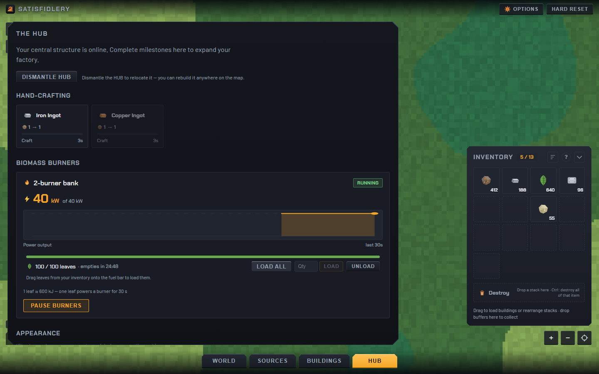

  **The world is the screen.** `.app` is `position: fixed; inset: 0`; the map fills the
  window edge to edge. The HUD strip and the action bar *overlay* it rather than taking
  layout rows, so the terrain runs under them to the glass. Sources, Buildings and the HUB
  are now panels floating over the live world; the tabs became a bottom bar of chunky
  chamfered console keys. MapView already measured itself with a `ResizeObserver`, so it
  adapted to all of this for free.

  **The camera survives now.** Because the map stays mounted for the whole session instead
  of being swapped out per tab, the world no longer jumps back to the avatar every time you
  glance at Sources — its `view` was local state that re-centred on mount. Verified by
  comparing `.map-world`'s transform matrix across a tab switch: byte-identical. The
  animated layers take a `covered` flag and stop painting behind an opaque panel, extending
  the `document.hidden` guard the rAF loops already had.

  **Typography.** Chakra Petch for the HUD voice (headings, keys, and every number, with
  tabular numerals so live counters stop jittering) and Barlow for prose. Both self-hosted
  via `@fontsource` and bundled — a Google Fonts link would silently fall back to the OS
  font in the shipped Electron build, which has no network. Latin-only subsets: our locales
  are en/fr/mando and every French accent is in `latin`, which took the font payload from
  608 kB to 132 kB.

  **Material.** Panels are plates, not cards: chamfered corners via `clip-path` (rounded
  rectangles are what every website already looks like), lit from above, with a hard base
  edge and a real cast shadow. Panel bodies are recessed *darker* than the cards inside them
  so the plates read. All 21 `border-radius: 999px` pills became hard tags, every card and
  button radius dropped to 3px, buttons gained a bevel and travel on press, and the iOS
  toggle in Options became a rocker sliding in a cut slot.

### Fixed

- **Options and the offline summary opened *behind* the HUD.** `.modal-backdrop` sat at
  `z-index: 10` — above the old document flow, but below the new floating panels (30) and
  action bar (35). Modals now sit at 80, and the z-index scale for the whole shell is
  written down at that rule. The save toast and countdown had the same class of bug: both
  are `position: fixed; bottom: 24px; left: 50%`, which is exactly where the action bar now
  lives, and both were behind it.

- **A building's input row printed its buffer text over its own buttons in French.**
  `.io-slot-body` had `flex-basis: 120px` with `white-space: nowrap` and no `overflow`, so
  it shrank below its own text and the excess painted across the neighbouring key —
  measured at 126px wide holding 172px of text. Latent for as long as the rule existed;
  English "35 / 500 Iron Ore" fits where French "35 / 500 Minerai de fer" does not, and
  uppercasing the buttons in this pass was what finally pushed it over. Basis is `auto` now,
  so the row wraps instead of squeezing, with `overflow: hidden` as a backstop.

## [0.34.1] — 2026-07-16

### Fixed

- **Build-radial labels no longer crowd the core.** A node's label and cost floated below
  its disc no matter where on the ring it sat — so for a node on the ring's *top*, the text
  grew back toward the middle. The Miner Mk1 is the worst case and the one you actually hit:
  it sits alone at the top of the Extraction ring, and its three-line cost (1 Portable Miner,
  10 Iron Plate, 10 Concrete) landed straight across the back button.

  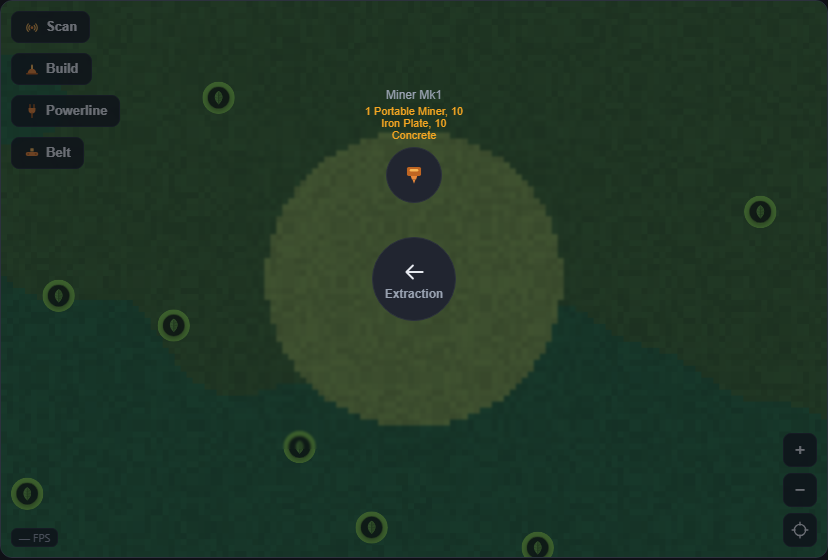

  The text now floats on the node's **outward** side — below the disc on the lower half of
  the ring, above it on the upper half — so it always grows away from the centre. That's a
  property of the geometry rather than a nudge: it holds for any node count and any cost
  length, instead of being tuned until the labels we have today happen to fit. The HUB's cost
  line, which was also grazing the core at the top of the categories ring, is fixed by the
  same rule.

  Reading order stays name-then-cost on both halves; up top the cost simply ends up as the
  line nearest its disc.

## [0.34.0] — 2026-07-16

### Changed

- **The build radial has submenus.** The top level is now four categories — Extraction,
  Production, Power, Logistics — and picking one swaps the ring to that category's buildings.
  The core becomes the way back out.

  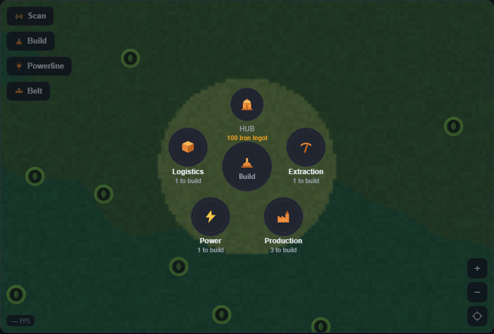

  This is a fix for a problem the game doesn't have yet. One flat ring worked at five
  buildings and would have kept working at six; at a dozen it becomes a wall of discs with
  labels colliding, and the failure is gradual enough that there's never an obvious day to
  fix it. The ring's node count is now flat no matter how much content lands on it — adding
  a building means picking a category in `content.ts`, and the menu absorbs it.

  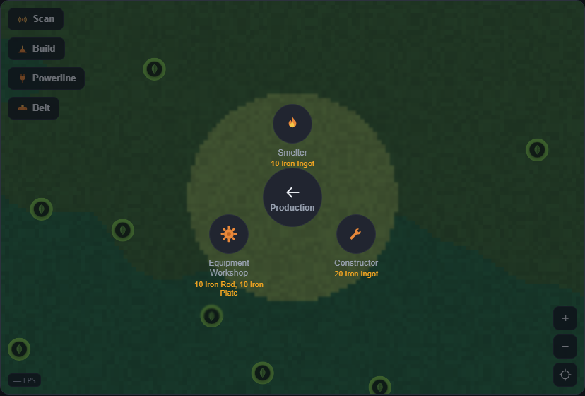

  **Categories are a player-facing answer to "what am I trying to do?", not an engine
  concept** — nothing in `simulate()` reads `category`. That's deliberate: the taxonomy is
  free to be re-cut whenever the content says it should be, without touching game logic.

  The honest cost, today: only Production holds more than one building, so Extraction, Power,
  and Logistics each wrap a single item and cost a click they don't yet earn. That's accepted
  on purpose. **Category positions stay put as content unlocks** — a node that moves once its
  category grows would trade a permanent muscle-memory tax for a temporary click, and the
  categories fill out as buildings land. Only unlocked categories get a node, so the early
  game shows one, not four dead ends.

  The HUB stays a top-level node rather than living in a category: it's a one-off relocation
  of a building you already own, not a thing you build, and it only appears at all while it's
  dismantled.

## [0.33.0] — 2026-07-16

### Added

- **Working machines smoke.** Furnaces and burners now trail a plume downwind while they're
  actually doing something — and go quiet the moment they aren't.

  This is the effect the canopy shimmer wanted to be and couldn't: it has a **subject**. Nobody
  has to be told what a plume trailing off a furnace is, so the map can say "combustion happens
  here" without drawing a single chimney. It drifts along the same `wind.ts` vector the clouds
  use, so the world has one weather system rather than two opinions about the wind.

  It's cosmetic, but it's cosmetics carrying real information: **a plume means that machine is
  turning a cycle right now.** A smelter whose input buffer ran dry, a burner out of leaves, a
  grid that tripped — each stops smoking, so you can read your factory's health from across the
  map without opening a panel. That honesty is structural, not a promise: the plume asks the
  engine's own `buildingWorking` / `buildingGenerating` — the very predicates that decide whether
  a machine draws power — so the smoke and the kW readout cannot drift apart.

  Which machines have a stack is one flag in `content.ts` (`smokes`), set on the Smelter and the
  Biomass Burner, plus the HUB's own burner bank — the first thing in the game that burns, so the
  first thing that smokes. Not the Constructor, not a Storage: only machines that plausibly burn
  something, or the map starts lying.

  Puffs are sized in the same design px as the machine discs and scaled with them, so a plume
  stays pinned to its stack at every zoom and inherits the discs' own sanity — no repeat of the
  canopy's grow-without-bound trap. They fade out when a machine shrinks to a dot, and the
  throttle eases over ~a second so a stopping machine's plume thins and dies instead of blinking
  out mid-frame.

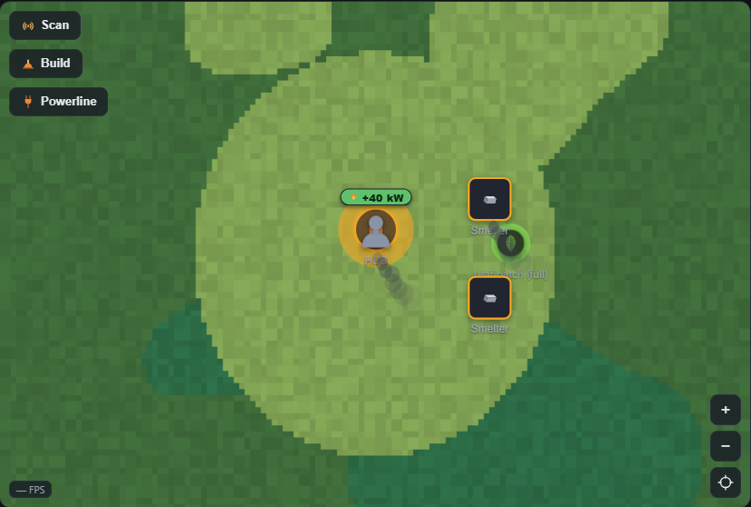

## [0.32.3] — 2026-07-16

### Removed

- **The canopy shimmer is gone.** It never read as wind in trees. It read as clouds — to
  everyone who looked at it, including while knowing a wind feature had just shipped.

  That isn't a tuning failure, which is why 0.32.2's clamp made it smaller without making it
  *right*. The map draws no trees: forest and jungle are flat darker-green fills, with no
  crowns or silhouettes that could plausibly sway. Modulate the brightness of a flat fill with
  a soft drifting field and there is exactly one thing a viewer can read it as — light and
  shade moving over the ground. A cloud. The effect worked perfectly; the job was wrong. Worse,
  it spoke the same visual language as the real cloud layer, so the map had two things saying
  "cloud" and only one of them was.

  The water is the contrast that proves it: water genuinely *is* reflective, the biome colour
  already says "water", and rivers carry real direction from the D8 flow field, so a glint on
  blue reads as a glint. There's a signifier for the effect to attach to. The land had none.

  Kept: the wind (`wind.ts`) still drives the clouds and is what burner smoke will want; the
  clouds themselves were innocent throughout and are unchanged. The "floor is not a ceiling"
  lesson from 0.32.2 stays as a note in `ambientfx.ts` — it's a real trap for the next effect
  sized in world units. Dropping the land pass also restores the overlay's cheapest property:
  it skips every cell that isn't wet, which is most of the screen.

  If living forests come back, they start with canopy *art* — seeded, static, stippled tree
  crowns in the terrain pass — and only then does wind get to move them.

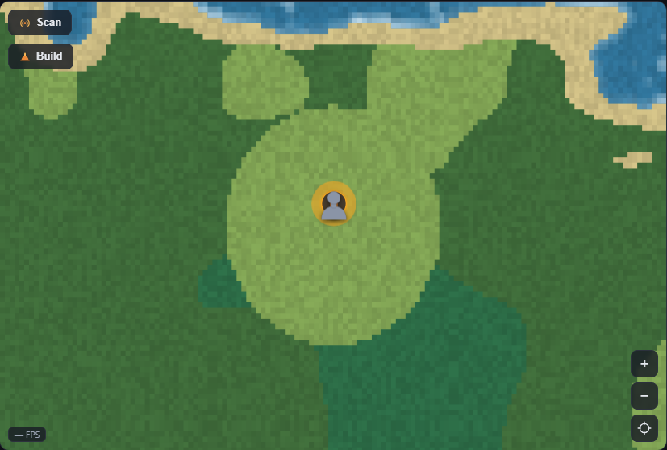

## [0.32.2] — 2026-07-16

### Fixed

- **The "clouds" you could see from the ground were never clouds.** They were the canopy
  shimmer, and the fix in 0.32.1 moved the wrong layer.

  Nothing bounded these effects in *screen* space. A feature sized purely in world units
  grows without limit as the camera drops: the gust field, at 1400 world units, was **965px
  at play zoom** — wider than the map itself. So instead of gusts travelling across the trees
  you got one slow, soft, screen-sized swell of brightness drifting over everything, which is
  an extremely good impression of a cloud shadow. The canopy wave did the same thing more
  quietly, reaching 372px at the closest zoom — a third of the screen for something meant to
  read as leaves.

  Both are now clamped at **both** ends in screen px, not just floored: never finer than the
  floor when you pull back, never coarser than the ceiling when you push in. Gust cells cap
  at 260px and canopy waves at 70px, so close to the ground you get fine leaf texture rustling
  in gusts you can actually watch travel, instead of a mass of brightness sitting on the
  factory you're trying to look at. Gust drift is now expressed in feature-lengths per second
  like every other speed here, so gusts cross the screen at the same apparent rate at any zoom.

  Clouds themselves were innocent and are unchanged — they remain an altitude effect, and were
  measured to contribute a maximum of 1/255 per channel at play zoom.

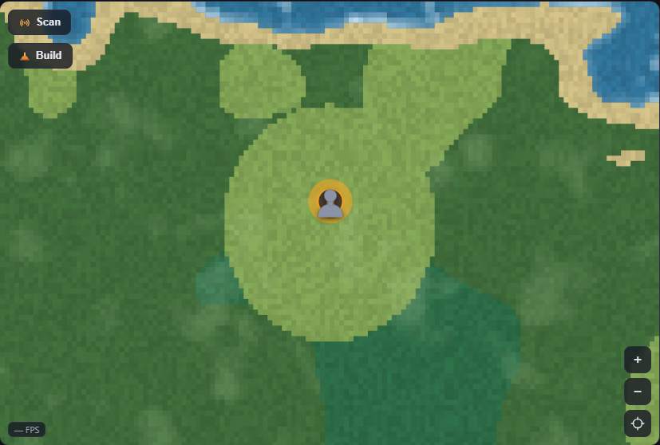

## [0.32.1] — 2026-07-16

### Changed

- **Clouds are a thing you see from altitude.** Zoom now reads as height. Down at the working
  zoom you're on the ground among the machines — under the weather rather than looking down on
  it — and a shadow sliding over the belt you're routing is clutter on top of the thing you're
  actually trying to see. So the clouds are gone down there. Pull back and they arrive, which
  is where you'd see them from anyway.

  This inverts the fade they shipped with yesterday. It also means the two halves of the
  overlay now hand off cleanly: close in you get the texture of the ground (canopy shimmer,
  glints, foam), far out that dissolves and you get the weather over it instead. Neither ever
  competes with the other for the same pixels. Clouds now cost nothing at all at play zoom —
  the pass early-returns before touching a cell.

  Since altitude is the only place clouds live now, they had to actually read there, and at
  the old strength they didn't. Shadows are darker (0.2 → 0.35) and bigger (a 70px floor on
  screen → 120px). They're unmistakable over open sea; over land they stay subtler, because
  the terrain's own per-cell jitter is sub-pixel speckle at that zoom and a soft shadow hides
  in noise. Still 60 FPS.

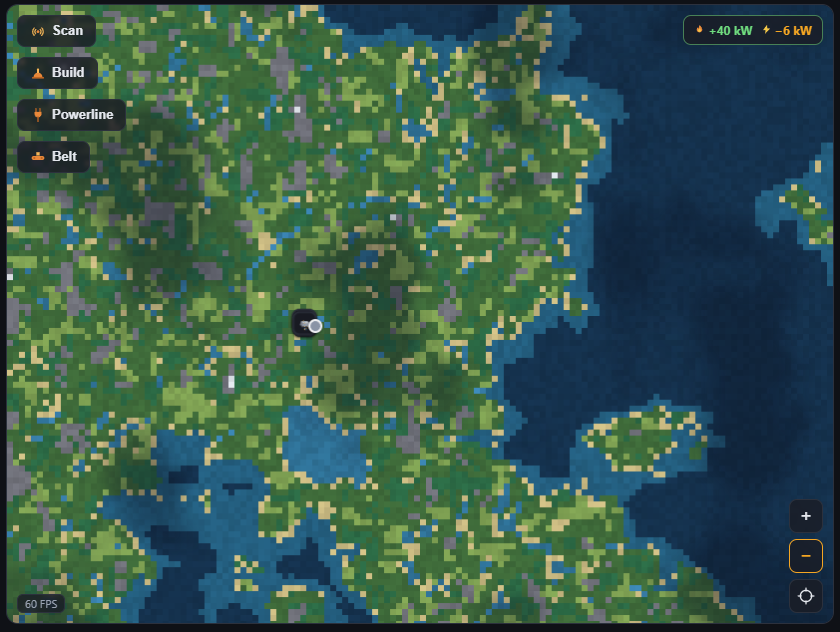

## [0.32.0] — 2026-07-16

### Added

- **The world has weather: wind blows the land, clouds cross the map.** Rivers already ran
  downhill and the sea already shimmered, but everything that wasn't water sat perfectly
  still — which made the water look less like life and more like the one animated thing.
  Now the land moves too, and a passing cloud dims it all.

  Every world gets a **wind** (`wind.ts`): one global vector, fixed per seed, plus a gust
  field drifting downwind. Everything ambient shares it, which is what makes it read as one
  weather system rather than three animations playing at once:

  - **Canopy shimmer** — the river-flow treatment aimed along the wind instead of downhill.
    Jungle catches the most light, then forest, then grass, then sand. Gusts arrive in waves
    that cross the map, so the trees don't rustle at one uniform rate forever. Bare rock and
    snow stay still — nothing up there to blow around.
  - **Cloud shadows** — low-frequency blobs drifting downwind over land *and* sea, painted
    last so a cloud dims the glints underneath it. They hold on at zoom levels where surface
    detail has already faded, though they're subtle from the far island overview.

  Two constraints shaped this. **The wind can't turn**: with no state to integrate into, a
  stateless effect offsets by `direction × speed × t`, so a direction that drifts even
  slightly swings a lever that grows without bound — an hour in, a 0.01rad turn would lurch
  the whole pattern a thousand world units sideways. Direction and speed are constant per
  seed and all the variation lives in the gusts, which is what you perceive as wind anyway.
  And **clouds cover every cell**, unlike water, which skips most of the screen — so they
  render to a quarter-scale buffer and get scaled back up. At ~900 world units a cloud is so
  low-frequency that the bilinear blur is indistinguishable from the real thing, at 1/16 the
  samples. The map still holds 60 FPS.

  `waterfx.ts` is now `ambientfx.ts` and its `WaterField` an `AmbientField` (the terrain pass
  now tags wind-catching land in the same sweep it already made), and the overlay canvas is
  `.map-ambient`. The layer stopped being about water.

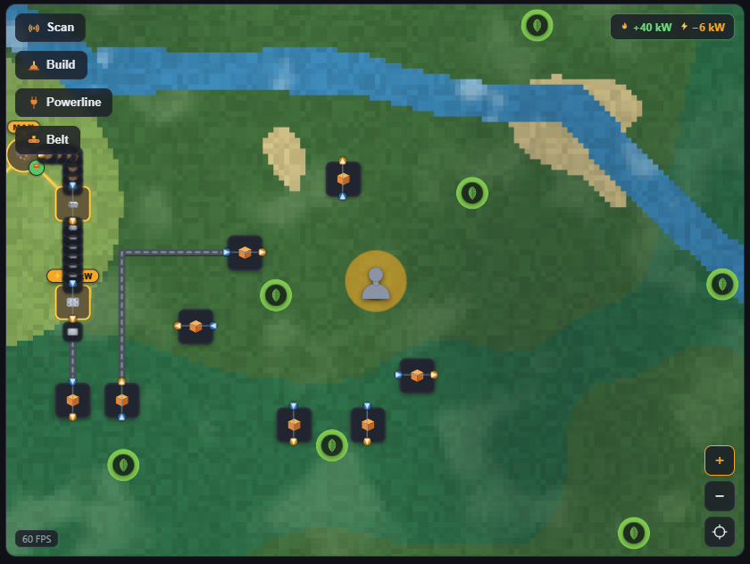

## [0.31.4] — 2026-07-16

### Added

- **FPS counter in the map's bottom-left corner.** The map now runs several things per frame —
  the terrain repaint, the animated water overlay, the belt-item canvas — and there was no way
  to see what that costs while playing. A small readout, pinned opposite the zoom controls,
  samples the frame rate twice a second.

  It counts `requestAnimationFrame` callbacks and writes the number straight into its own DOM
  node rather than going through React state, so watching the frame rate can't itself re-render
  the map and skew what it's measuring. It's inert to pointers, so it never eats a map click.

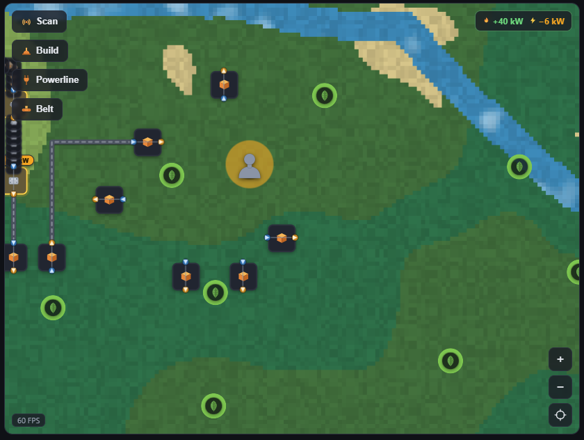

## [0.31.3] — 2026-07-16

### Fixed

- **90° belts take one corner instead of three.** A run between two machines whose ports face
  different axes — say an east-facing output feeding a north-facing input — used to turn out of
  the output almost immediately, run the long way along the other axis, then turn back into the
  input. Three corners where the shape only needs one.

  Each leg of an angled route picked its corner by whichever delta was larger, in isolation, with
  no idea which way the belt was already travelling: if the drop happened to be longer than the
  reach, it turned south first and had to turn back. A leg now leaves along the axis it *arrived*
  on and lands on the axis the next leg *leaves* on, so the turn falls where the two runs
  actually cross and the corners at the joins disappear. The port leads are what carry the
  facings in. Where both ports face the same axis an L genuinely can't honour both (that needs a
  Z), so those fall back to the old rule and are unchanged.

  Both shapes are the same **length** — `|Δx| + |Δy|` whichever way an L turns — so cost, transit
  time and the stored route are untouched, and existing belts simply redraw with the better
  corner.

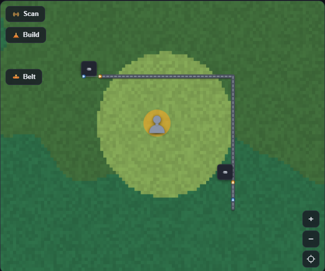

## [0.31.2] — 2026-07-16

### Changed

- **The map's belts, wires and ports now draw on canvas instead of the DOM.** Nothing looks or
  behaves differently — that was the whole point — but the map no longer builds a DOM node per
  item riding a belt. Each item used to cost **three** nodes (`.map-marker-pos` >
  `.belt-item-inner` > ``), each with its own transform and CSS transition. At a
  genre-normal endgame (~100 belts × ~20 items) that is ~6,000 nodes reconciled and composited
  every frame — a wall the game would have hit well before factories got as big as it's designed
  to support. Each item is now a single `drawImage` from a pre-baked sprite.

  Moved: powerline wires, belt bands, the scrolling belt surface, bend discs, ports, and the
  riding items. **Deliberately not moved:** every labelled, clickable node (HUB, sources,
  buildings, deposits, poles, leaves). They carry i18n text, `title=` tooltips, keyboard focus
  and ~30 aria roles between them, their count scales with buildings placed rather than with
  throughput, and they only change on a state change — so canvas would cost all of that to fix a
  bottleneck they don't have.

  It takes two canvases, because the layer straddles the markers and the old z-order had to
  survive exactly: wires and tracks pass *under* the machines, ports and items *over* them. The
  avatar moved to its own layer above both, keeping it on top of the items as before. Things the
  DOM was doing for free are now done by hand: the 10fps→60fps tween between tick positions (the
  compositor's `transition: transform`), the belt surface's scroll (a CSS keyframe, re-derived
  from the clock so it still matches item speed exactly), the "this one goes" red highlight and
  pointer cursor on hover (CSS `:hover` + a sibling selector), and click-to-remove for belts and
  wires (fat transparent SVG hit-strokes → mode-gated point-to-polyline hit tests).

  No save change, no engine change — `src/game/` is untouched. Design notes and the full
  rationale (including why *not* Unity) are in [`docs/render-plan.md`](docs/render-plan.md).

## [0.31.1] — 2026-07-16

### Fixed

- **Water no longer desyncs from the terrain when you pan fast.** The two map canvases were
  painted on different clocks: terrain repainted every frame as the camera moved, while the
  water overlay animated on its own slower ambient loop (20fps) using the field from whichever
  camera it last saw. Panning slowly hid it, but a fast flick left the overlay a frame or two
  behind — long enough to drag shoreline foam and river streaks off the water and onto the
  land. A camera move now repaints the water in the **same frame** as the terrain it belongs
  to; the ambient loop only supplies motion between camera moves. Measured over a fast drag,
  lit water pixels landing on land went from **89% average (100% worst) to 0%**.

### Added

- **Living water.** The map's water is no longer a flat fill — it moves. **Rivers flow**:
  highlight streaks drift *downstream*, following the real per-seed D8 flow network the
  terrain already routes downhill, so every watercourse visibly runs toward the sea. **Seas
  and lakes shimmer**: two fine noise fields drift at different rates and are multiplied
  together, so a glint appears only where both peak — the surface twinkles in place instead
  of sliding as one sheet. **Coastlines foam**: a pulse rolls along the land edge, brightest
  on the cells that touch shore and fading out over the next two.

  The effect **fades out as you zoom out**. Surface detail is a close-up cue: held at full
  strength on the map overview it stopped reading as water and turned the ocean to grey fog
  with a glowing halo around every coast, so it now fades to clean flat water by the time the
  island fits on screen. It also honours `prefers-reduced-motion` (overlay off, no frames
  burned), and pauses on a hidden tab.

  Cosmetic only — no game state, no save change. It rides on its own `.map-water` canvas over
  the terrain, so ambient motion never triggers a terrain repaint; the terrain pass hands it
  the visible water cells (kind, flow direction, distance to shore) as it paints, and the
  overlay animates just those at 20fps.

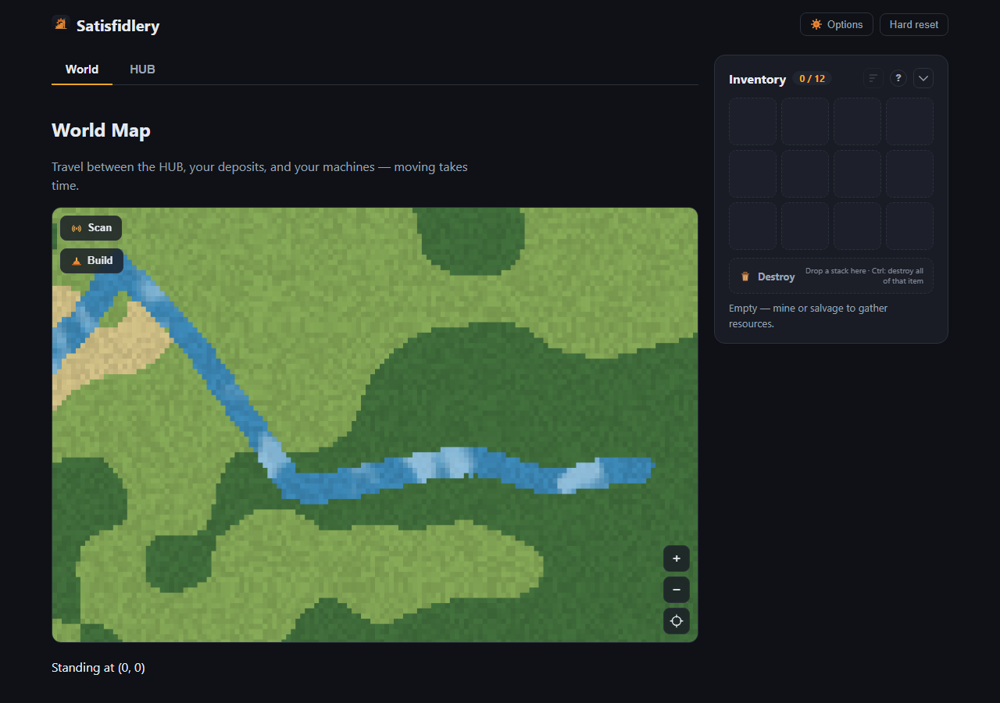

## [0.30.0] — 2026-07-16

### Added

- **Split a stack — in any inventory.** Right-click a stack in the player inventory or a
  Storage grid to open a split popover: a slider picks any amount from 1 up to the full
  stack, a **Half** button jumps straight to half (the default), and **Split** moves the
  chosen amount into the grid's first empty slot as its own pile. A split never merges into
  other stacks of the same item (that's what drag-merge is for) and never destroys anything:
  with no free slot the popover says so and the Split button is disabled. Storage splits are
  reach-gated like every other Storage interaction, the slider clamps live if the stack
  shrinks underneath it (belt-drained, crafted from), and Escape / clicking elsewhere cancels.
  The engine side is a pure `splitSlot` helper next to the existing grid math, exercised by
  both new store actions.

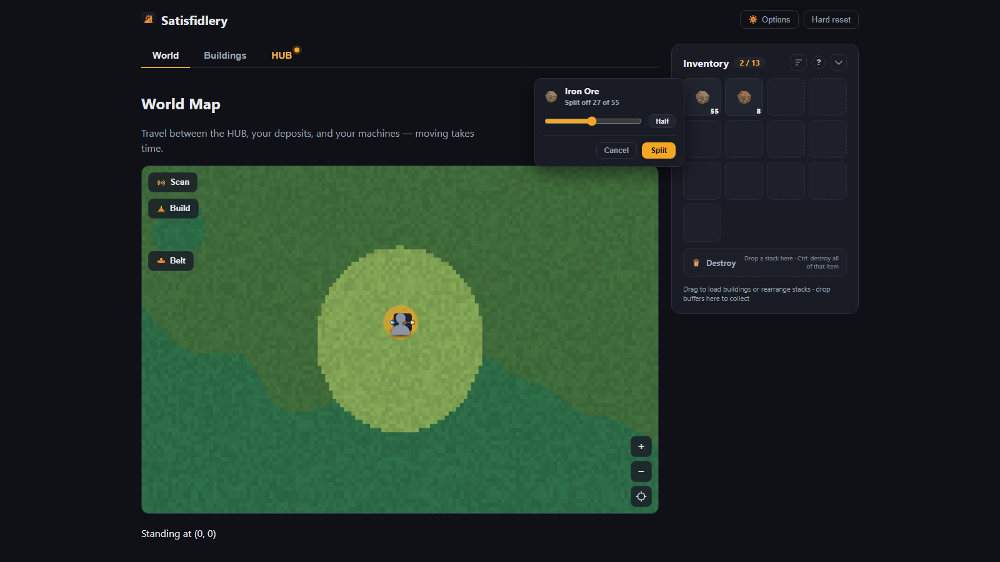

## [0.29.1] — 2026-07-16

### Changed

- **Powerlines and belts now have a maximum run length (2 500 m).** Neither had any distance
  check at all: two clicks could string a wire — or run a belt — clear across the world
  (100 km), auto-raising ~140 power poles from wherever you happened to be standing. A single
  run is now capped, measured along the **routed** path, so a wire that detours around a
  mountain and a belt drawn with bends are both judged on the length they actually are, not
  their straight-line gap. The cap is deliberately loose (~10× build reach, ~2.8× the default
  view span), so everyday factory wiring never touches it — a full-length belt is a ~31 s ride
  costing ~21 iron plates. To cross a longer gap, chain runs: end a powerline on a pole and
  start the next from it, or hop a belt through a machine or a Storage. Hand-routed powerlines
  are capped on the **sum** of their hops, so dropping a waypoint every 2 500 m can't walk a
  wire across the map one legal hop at a time. Over-long runs are refused with a "Too far" note
  in the confirm popover and cost nothing.

### Fixed

- **Storage now shows its crate icon on the map instead of a generic gear.** The map node
  picked its icon by the building's current recipe output, falling back to a gear when there
  wasn't one — so Storage, whose whole point is that it runs no recipe, was guaranteed to hit
  the fallback. The crate icon and its mapping already existed and were simply never consulted
  for non-generator buildings. Also fixes Smelters and Constructors showing the same gear
  before a recipe is picked.

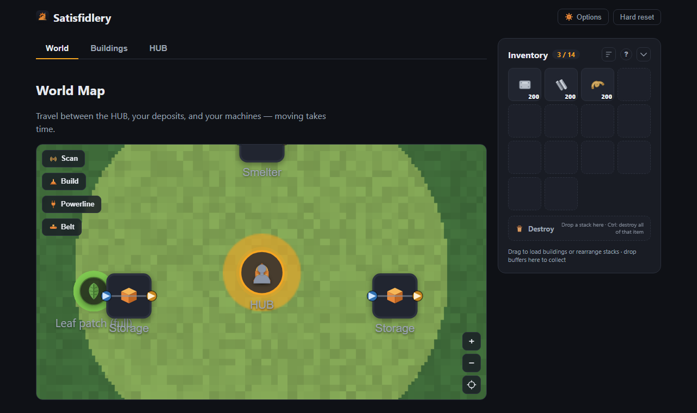

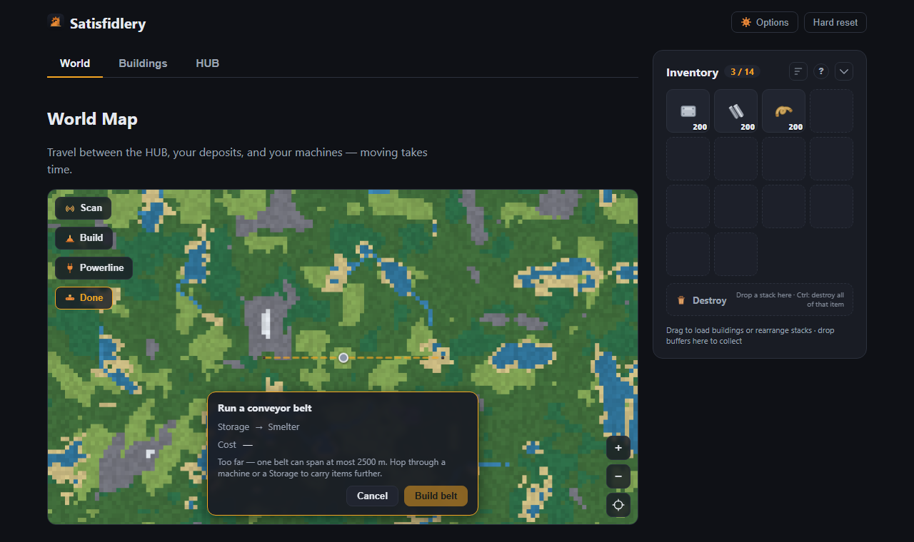

## [0.29.0] — 2026-07-16

### Added

- **Storage buildings — a 30-stack warehouse.** A new placeable building (unlocked with the
  Conveyor Logistics milestone, built from 10 iron plate + 10 iron rod) that holds up to **30
  stacks of any items** in its own slot grid. Open it — from the map node popover when you're
  standing close enough, or the Buildings tab — to swap items with your inventory by
  **drag-and-drop** (a stack in, a stack out). **Belts** feed and drain it automatically: an
  incoming belt first-fits any item into the grid; an outgoing belt delivers the **most
  top-left stack** first, and backs up when the warehouse is full. It needs **no power** (so
  it's never a powerline endpoint), runs no recipe, and refunds its whole stockpile when
  dismantled.
- **Quick Sort.** A one-click button that merges every stack of the same item, orders them
  (ores first, then products), and packs them top-left — on **both** the Storage grid and the
  **player inventory** (a new sort button in the inventory header).

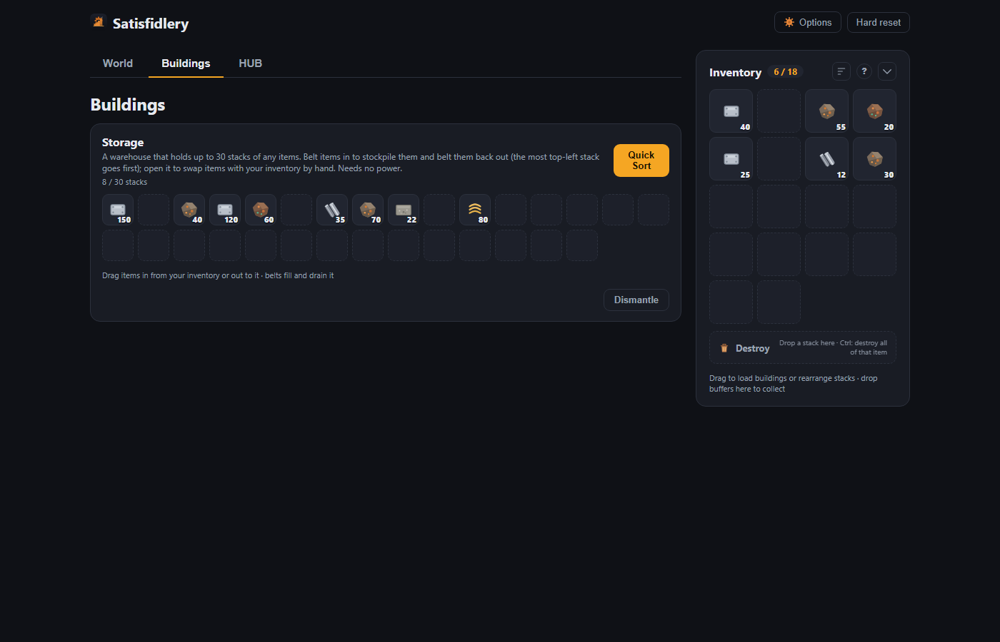

## [0.28.1] — 2026-07-16

### Added

- **An "Entity Codex" wiki that documents every entity in the game.** A standalone,
  game-styled reference page at `docs/wiki/index.html` — a self-contained HTML file (all
  CSS and item art inlined) that opens on its own in a browser and is **not** part of the
  game bundle or the Vite build. It catalogs every content entity (items, source qualities,
  mining specs, buildings, all machine recipes, HUB hand-crafts, miners, the power grid,
  conveyor belts, the milestone chain, the drop pod, deposits/scanning, avatar parts) with
  all of its data, plus a field-by-field reference for every runtime state shape in
  `types.ts` (`GameState`, `Source`, `Building`, the belt/power entities, `BurnerBank`, the
  sensor, player/leaves, and the rest) and the `config.ts` tunables they cite. Styled with
  the game's own palette (Satisfactory orange on the dark panel theme), the real item SVG
  icons, and the poor/normal/pure quality pills. It's a hand-maintained snapshot of v0.28.0
  content — the TS modules stay the source of truth.

  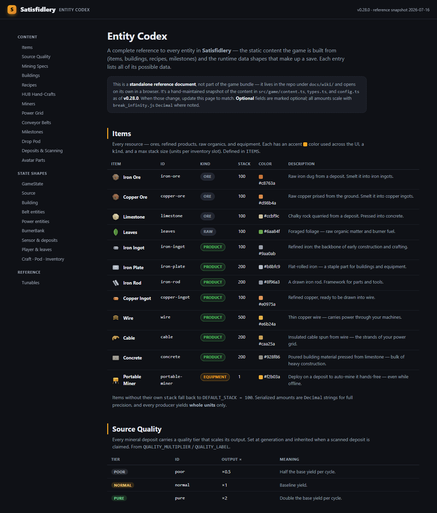

## [0.28.0] — 2026-07-16

### Added

- **Snap buildings to an invisible world grid for clean factories.** While placing a building or
  the HUB, press **G** (or tap the new **Grid** toggle in the placement coach bar) to snap the ghost
  — and the spot it commits to — onto a hidden lattice; press again to go back to free positioning.
  When snapping is on, the lattice shows as faint dots inside the build ring so you can see exactly
  where the ghost can land. Free placement is still the default, so nothing changes unless you ask
  for the grid.
- **Every ore node now lands on that same grid.** The procedural deposit field (and the early
  hand-placed anchors) snap to the world lattice — origin at the HUB — so a Miner Mk1 built onto a
  node and a grid-snapped Smelter beside it line up on the same rows and columns, and belts run
  clean between them. Nodes still scatter naturally (they jitter across a wide cell before snapping);
  they just always settle on a grid point now, and two nodes never share one. A node-mounted Miner
  Mk1 ignores the toggle — it always rides its node, which is already on the grid.

  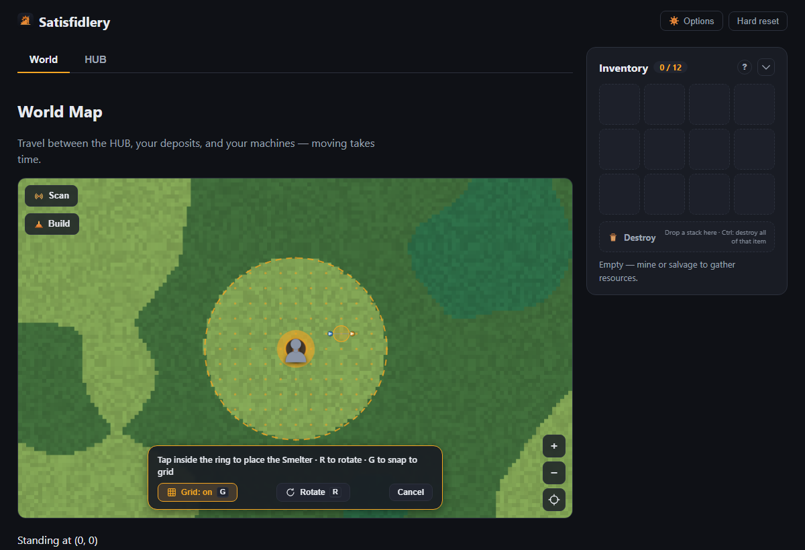

## [0.27.2] — 2026-07-16

### Changed

- **Map POIs are world-sized and no longer cluster.** Buildings, deposits, miners and the HUB used
  to hold a constant on-screen size and collapse into a "count bubble" when zoomed out. Now each is
  a physical map object with a fixed WORLD size: it grows as you zoom in and shrinks as you zoom
  out, and there's no clustering — every POI always draws at its own spot. Calibrated so the spawn
  framing looks as it did before (see `MARKER_REF_ZOOM`); the player avatar still holds a constant
  size so you can always find yourself.

  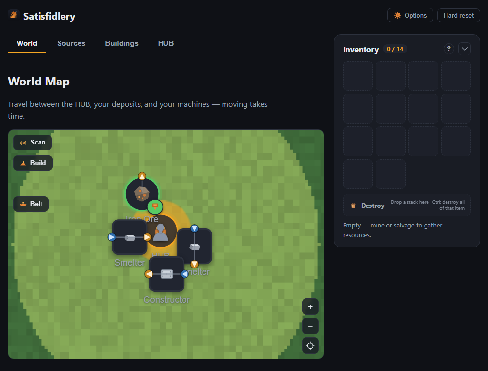

### Fixed

- **Belt ports stay glued to their machine at every zoom.** Zoomed out, a machine's input/output
  port nubs flew far off the disc (constant-size nubs scattered around a collapsed cluster badge).
  Ports are now world-sized like the machine they sit on — and the belt geometry (nub anchors +
  leads) matches — so they stay pinned to the disc and belts still plug in cleanly at any zoom.
  (`portLayer` / `beltNubWorld` / `beltRenderAnchors` in `MapView.tsx` now size off `MARKER_REF_ZOOM`.)

## [0.27.1] — 2026-07-16

### Fixed

- **Placement commits on the node you tap — no detour walk.** While placing (a Miner Mk1
  especially), tapping a node ran the node's own tap handler, which just walked the player over to
  it; you then had to tap empty ground for the ghost to actually commit. Now a node tap during
  placement commits right there: a Miner Mk1 mounts onto the tapped ore node (when eligible), and a
  building/HUB drops at the tapped node's spot — both gated to the build ring, and neither walks
  you anywhere. (Placement branch added at the top of `onNode` in `MapView.tsx`.)

## [0.27.0] — 2026-07-16

### Added

- **Build a Miner Mk1 from the map's build radial — and rotate it.** The Miner Mk1 (once Mining
  Automation is built) now appears in the build menu alongside buildings. It isn't dropped on open
  ground: in placement mode its ghost **snaps onto the eligible ore node nearest the cursor** (a
  node with no miner yet, inside the build ring), and the coach line reads _"Tap an ore node…"_. As
  with buildings, **R** (or the Rotate button) turns it before you commit, so its belt **output
  port faces the direction you want**. `Source` gains an `orientation` (mirroring `Building`;
  `endpointOrientation` now reads it, so belts leave a rotated miner cleanly), and
  `buildMinerMk1(sourceId, orientation)` is gated to the build radius so it can be placed from afar
  (the on-node Sources-tab button still works too).

  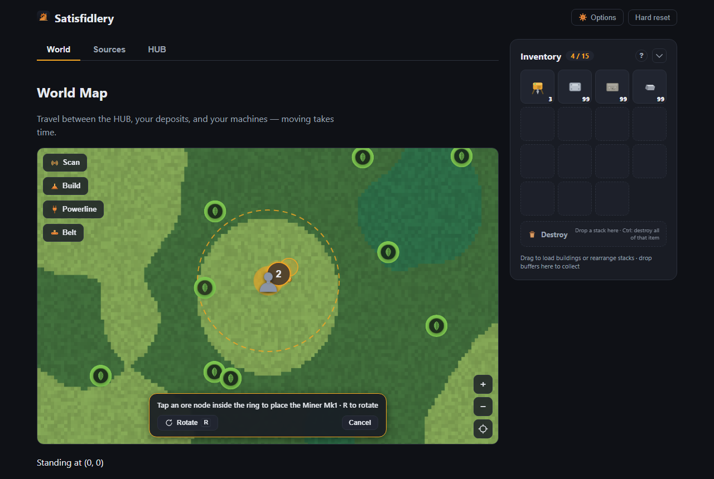

### Changed

- **Tripled the placement reach.** `BUILD_RADIUS` went from 80 m to **240 m**, so the build ring
  covers far more ground and you can drop machines (and miners) across a wider area without walking.

## [0.26.0] — 2026-07-16

### Added

- **Place buildings where you want, and rotate them.** Picking a building (or the HUB) from the
  build radial no longer drops it at your feet — it arms **placement mode**: a translucent ghost
  follows the cursor inside a **build-radius ring** drawn around you (`BUILD_RADIUS`, ~80 m), and a
  tap inside the ring drops it there. Beyond the ring the ghost reads invalid (red) and the tap is
  inert; right-click or **Esc** cancels. Before dropping, press **R** (or the on-screen **Rotate**
  button) to turn the building — its belt input/output ports swing round with it (E→S→W→N), so you
  can face a machine's intake at the belt feeding it. Placed buildings keep their facing.

  Under the hood: `Building` gains an `orientation` (0–3 quarter-turns; save **v27**, older saves
  default to 0). A new `portGeom(orientation, role)` in `belts.ts` is the single source of truth for
  which way a port faces, consumed by the nub geometry, the belt leads/wrap routing, and the port
  chevrons in `MapView.tsx` — so belts still plug cleanly into a rotated machine. Store placement is
  now `placeBuilding(type, pos, orientation)` / `placeHubAt(pos)`, both gated to the build radius.

  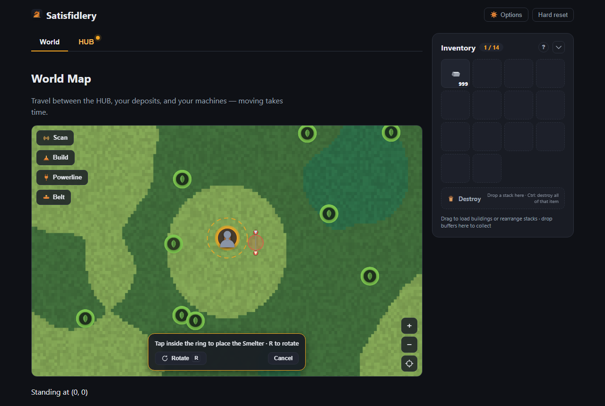

## [0.25.8] — 2026-07-15

### Fixed

- **The belt-laying animation follows the real route.** The build (lay) overlay drew along the
  belt's stored center-to-center path, while the draw ghost and the finished belt use the routed
  path (port leads + wrap-around junctions). So while a belt was being laid it traced a different
  line — e.g. straight through a machine — then snapped to the wrapped route the instant it
  finished. The lay now renders along that same routed path, mapping its per-segment progress to a
  fraction of the route, so the ghost, the laying belt, and the built belt all show one consistent
  line. (Belt-build overlay in `MapView.tsx`.)

## [0.25.7] — 2026-07-15

### Changed

- **Curved belts leave and enter their ports straight.** A curved belt used to start bending the
  instant it left the output (its spline ran through a single port lead), so the connection at the
  machine looked slightly skewed. Curved belts now get a **pair of collinear leads** off each
  port, giving the spline a genuinely straight run out of the output and into the input — along
  the line from the machine's center through the port — before it eases into the curve. Straight
  and 90° belts were already straight at the ports; this brings curved into line, in the built
  belt, the draw preview, and the wrap-around routes.

  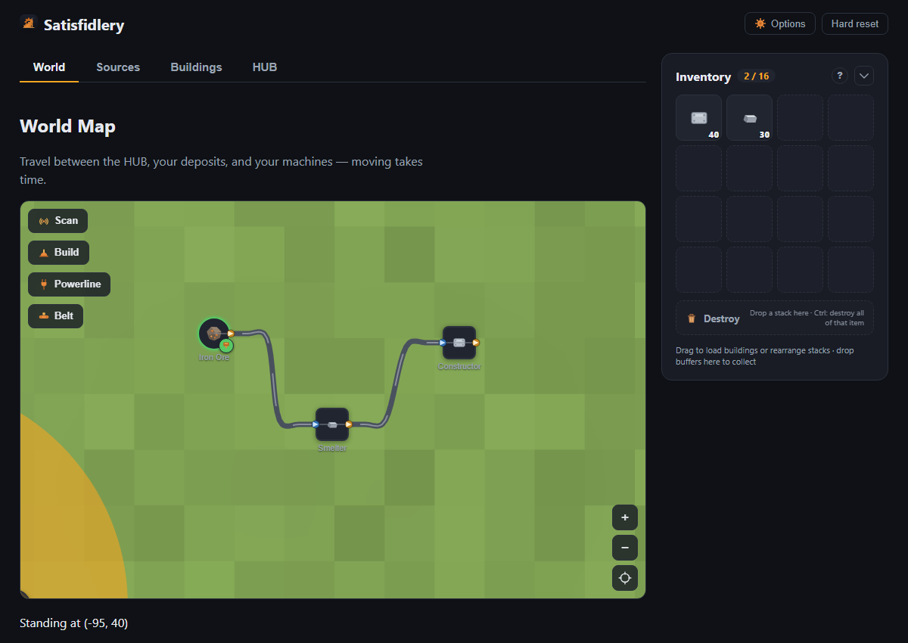

## [0.25.6] — 2026-07-15

### Fixed

- **The belt draw ghost follows the cursor again.** A regression in 0.25.5's routing rework
  dropped the cursor point from the ghost when the far end wasn't a machine — so after you armed a
  source, the preview was just a stub at the output and never trailed to your pointer, making belt
  drawing feel broken (you could still connect by hovering a destination, but free-drawing showed
  nothing). The free-cursor case now correctly trails the ghost out to the pointer again.
  (One-line fix in `beltRenderAnchors`, `MapView.tsx`.)

## [0.25.5] — 2026-07-15

### Changed

- **Belts wrap around a machine with junctions instead of skimming its edge.** 0.25.4's simple
  port lead still dragged the connecting leg across the destination's disc when a source sat
  directly above (or behind) it. Now, when the two ports face away from each other, the router
  inserts **junction points** and routes the belt properly around: it exits the output to the
  right, drops into a clear corridor **between** the two machines (their vertical midpoint, or
  just past them when they sit level), crosses the gap there, then comes back to enter the input
  from the left. The result is a tidy rectangular wrap (a smooth rounded one for curved belts)
  that never crosses a disc — in the built belt, the items riding it, and the live draw ghost.
  Machines whose ports already face each other still get a clean direct belt. (`beltRenderAnchors`
  in `MapView.tsx`.)

  

## [0.25.4] — 2026-07-15

### Fixed

- **Belts route around a machine instead of through it.** When a source sat directly above (or
  otherwise opposite) its destination, the straight line from the output nub (right side) to the
  input nub (left side) cut across the destination's disc — the belt appeared to run *through*
  the building. Belts now leave and enter along the machine face like Satisfactory: every belt
  exits its output to the right and approaches its input from the left (a short horizontal lead
  off each port, extended in 0.25.3 for curves to *all* styles). So a stacked belt makes a tidy
  Z/loop around the disc to reach the far-side port instead of slicing through it — in the built
  belt and the live draw ghost alike. The lead is capped to a fraction of the run, so machines
  sitting side-by-side still get a clean straight belt with no zig-zag.

  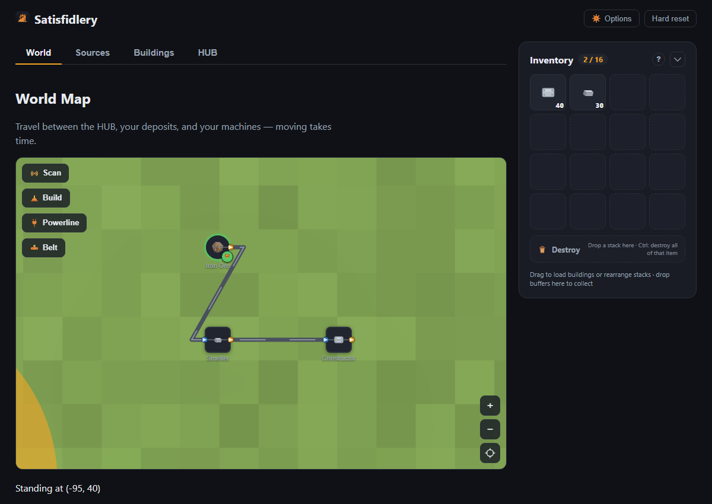

## [0.25.3] — 2026-07-15

### Added

- **The belt ghost snaps onto a nearby input.** While routing, when the cursor comes within
  reach of a valid destination machine the ghost's end locks onto that machine's **input nub**
  (the tip turns a bright green "locked-on" dot) and a tap there connects the belt — no more
  hunting for a pixel-perfect click on the node. Nearest machine wins; the armed source is
  excluded. (`nearestBeltDest` in `MapView.tsx`.)

### Changed

- **Curved belts now ease in and out of the machine faces.** A curved belt used to yank toward
  its target the instant it left the output; it now runs a short straight lead out of the
  **output** (and into the **input**) along the port's facing direction before it bends, so it
  leaves and arrives flat against the machine — a smooth S instead of a kink at the port. Done
  by injecting a lead anchor off each port into the spline (`curveLead`/`beltRenderAnchors`), so
  built belts, the draw preview, and the riding items all follow the eased curve.

  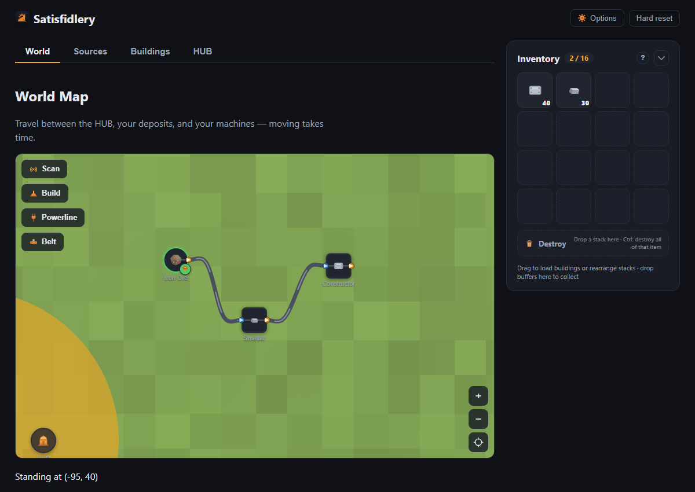

## [0.25.2] — 2026-07-15

### Fixed

- **90° (and curved) belts keep true right-angles when plugged into the ports.** The 0.25.1 nub
  re-seating moved a belt's endpoints *after* the route was styled, which knocked an angled
  belt's corners off-axis (a "90°" belt drew a skewed dogleg) and kinked curved belts. The map
  now feeds the port nubs in as the route's *anchors* and styles from there
  (`beltStyledPath`/`beltNubWorld` in `MapView.tsx`), so Straight / Curved / 90° all route
  cleanly from the source's output nub to the destination's input nub — built belts, the live
  draw preview, and the items riding them all follow the same corrected path.

  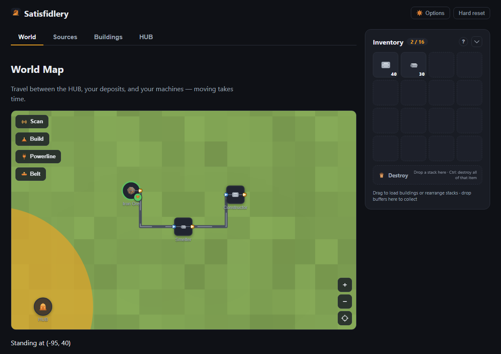

## [0.25.1] — 2026-07-15

### Fixed

- **Belt ports now hug the machine disc at every zoom.** In 0.25.0 the input/output nubs sat a
  fixed *world* distance off the node, but a machine's disc is a fixed *on-screen* size — so
  zooming in flung the ports far off the disc (and dragged the belt endpoints with them). Ports
  are now placed a constant *on-screen* distance off the disc center (`portLayer` in
  `MapView.tsx`, ÷zoom), so they stay pinned to the disc's left/right edge at any zoom. Belts
  store a plain center-to-center route again (zoom-independent length/cost) and the map re-seats
  their drawn endpoints onto the nubs — so built belts *and* the live draw preview visibly plug
  into the ports whether you're zoomed all the way in or out.

  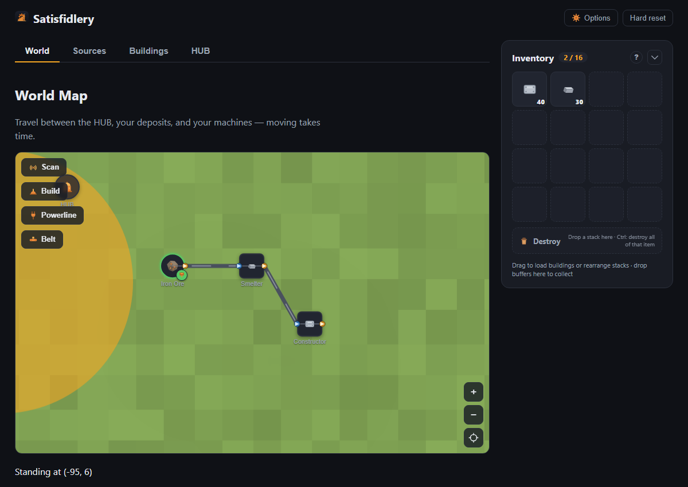

## [0.25.0] — 2026-07-15

### Added

- **Machines show their belt ports — and belts snap onto them.** Every automatable machine now
  draws its conveyor hookups right on the map: a **blue input** nub on its left and an **amber
  output** nub on its right, each a small right-pointing arrow so a node reads as a left→right
  flow at a glance (a Miner Mk1 node shows its single output). When you draw a belt it no longer
  meets the machine at its center — the route **snaps to the ports**: it leaves the source's
  output nub and lands on the destination's input nub, both while you're drawing (the live ghost
  route snaps too) and once it's built. In belt mode the ports you'd wire up next — outputs
  before a source is armed, inputs after — brighten and pulse to guide the click.

  Ports are laid out in world space (`beltPorts`/`beltPortPos` in `belts.ts`) so a nub and a
  belt endpoint always coincide at any zoom, and the overlay paints above the node markers so a
  port is never hidden behind its disc. `planBelt` and the draw preview share the same
  port-snapping, so the ghost you draw is exactly the belt you get.

  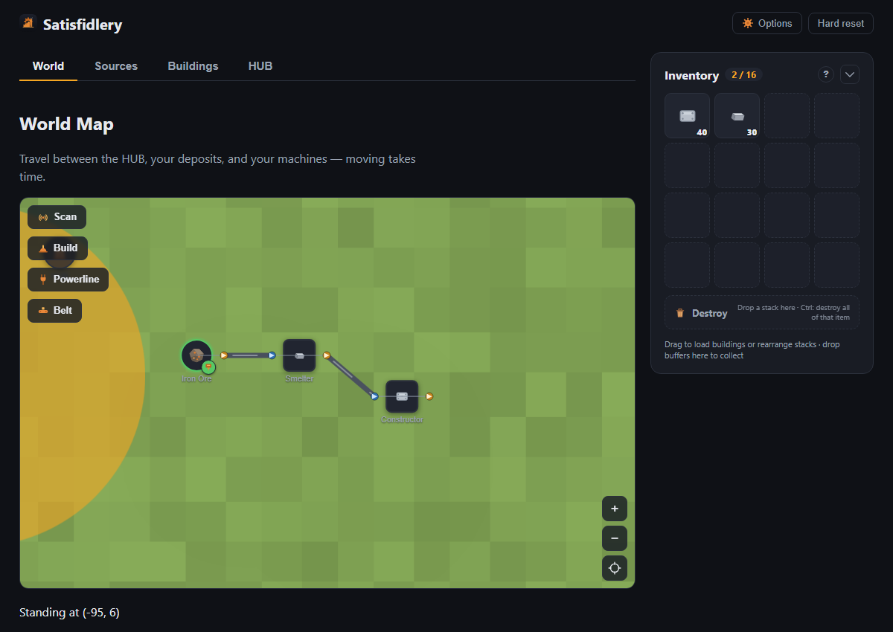

## [0.24.4] — 2026-07-15

### Added

- **Press `R` to cycle the belt path shape — live while you draw.** In belt mode, `R` steps the
  shape Straight → Curved → 90° → Straight without reaching for the picker. Because the shape
  feeds the live route preview, cycling **mid-draw re-shapes the ghost instantly** — arm a
  source, drop a couple of bends, then tap `R` to see the same route as a straight run, a smooth
  curve, or a right-angle L and pick what fits. The coach card gains an `R to cycle` hint under
  the picker. The shortcut is ignored while a belt is actively laying, while typing in a field,
  or with a modifier (so Ctrl/Cmd+R still reloads). Small handler in `MapView.tsx`.

  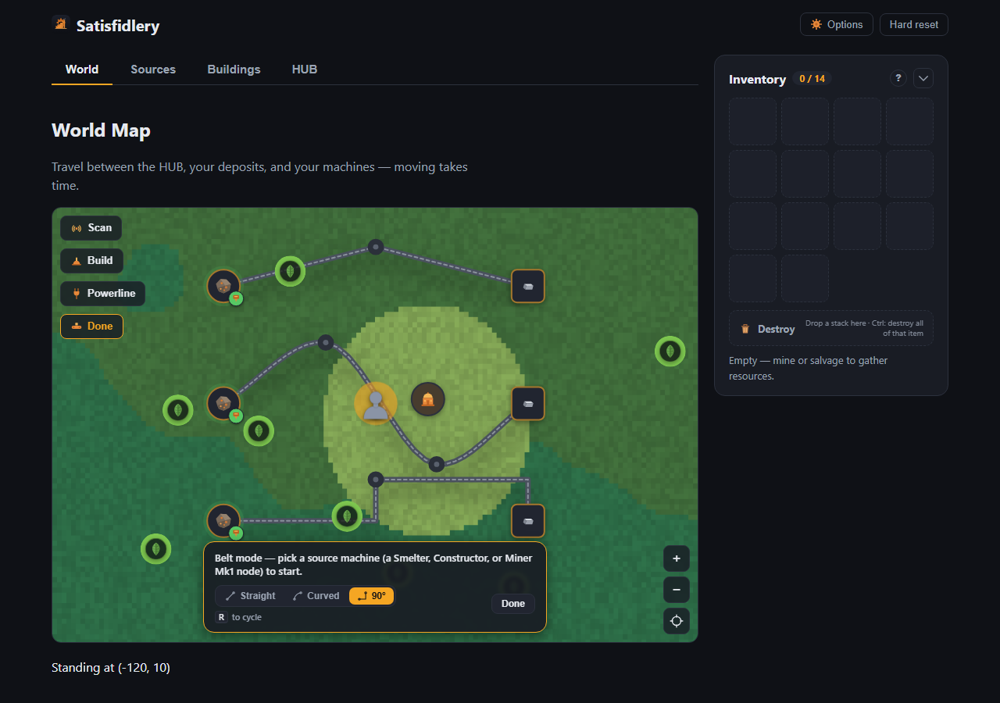

## [0.24.3] — 2026-07-15

### Changed

- **Tidied the belt-mode coach bar.** Adding the shape picker had crammed the long instruction
  text, the three shape buttons, and Done into a single full-radius pill, which squeezed the
  text into a tall narrow column and ballooned into an ugly lozenge. It's now a proper **rounded
  card**: the coach text sits on top (wrapping naturally at a readable width), with a controls
  row beneath — the Straight / Curved / 90° segmented picker on the left and **Done** on the
  right. Layout-only (`map-belt-hint` markup + CSS in `MapView.tsx` / `index.css`); no behaviour
  change.

  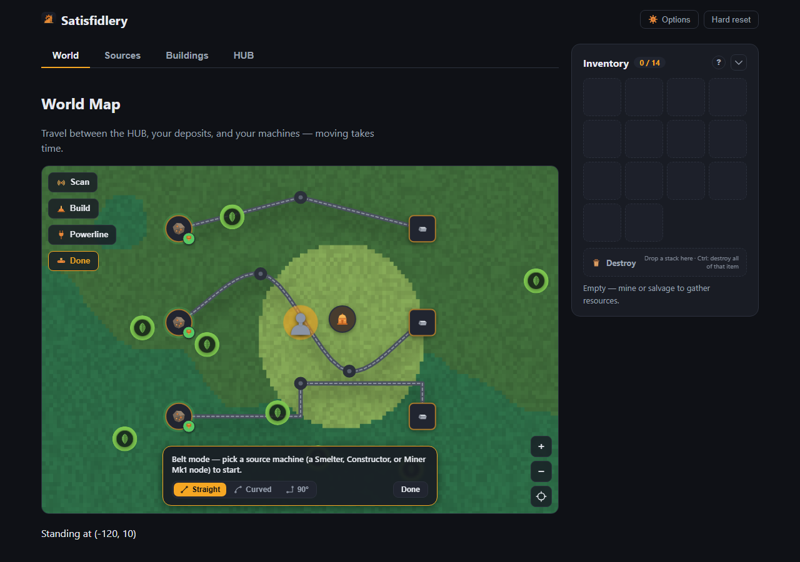

## [0.24.2] — 2026-07-15

### Fixed

- **Curved belts now run through their junction dots, and the routing preview matches the
  finished belt.** Two fixes to the Curved shape:
  - The midpoint spline from 0.24.1 *approximated* the route — it rounded **inside** the
    waypoints, so the junction dots floated off the belt line. The curve is now a **centripetal
    Catmull-Rom spline that passes exactly through every waypoint** (and both endpoints) while
    staying tangent-continuous, so the line rides its junctions. Centripetal (α=0.5) knot spacing
    also prevents the cusps/self-loops uniform splines make at sharp bends.
  - While routing, the draft styled `[source…bends]` and the cursor tail as **two separate**
    splines, so the ghost didn't match the single spline that gets committed. The preview is now
    one styled path through the live cursor as the provisional destination — **exactly what
    builds** when you click the end machine.

  Pure `styleBeltPath` change in `belts.ts` (`curvedPath` → Catmull-Rom) plus the belt-draft
  rework in `MapView.tsx`; no save changes. Straight and 90° are unaffected.

  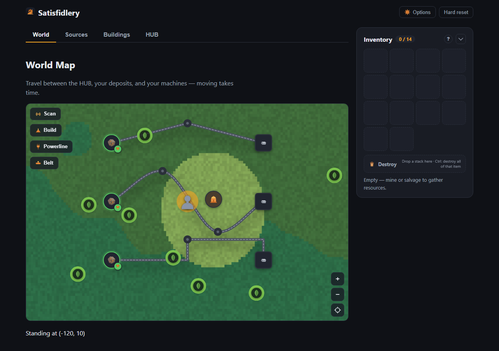

## [0.24.1] — 2026-07-15

### Changed

- **Curved belts now join their bends smoothly.** The Curved shape was a per-leg bow, which
  left a visible kink where two legs met at a waypoint. It's now the classic **quadratic spline
  through the leg midpoints** — each waypoint is a control point and adjacent quads share a
  midpoint with matching tangents, so the whole route is **C1-continuous** (no corner) through
  every bend. The true endpoints A and B stay pinned; a **bend-free A→B still arcs** (its angle
  derived from the endpoint positions, unchanged). Because the spline rounds/shortcuts a sharp
  corner, a curved belt through a hard bend is now a touch **shorter** than the straight
  polyline through that waypoint (so slightly cheaper/faster) rather than longer — still a
  coherent physical route. Pure `styleBeltPath` change in `belts.ts` (`curvedPath` + `sampleQuad`);
  no save/UI changes.

  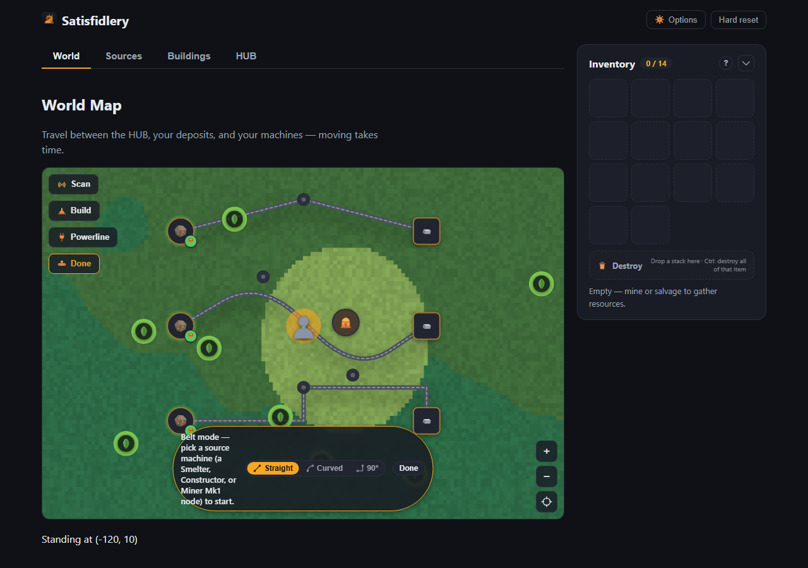

## [0.24.0] — 2026-07-15

### Added

- **Conveyor belts can be routed in three path shapes — Straight, Curved, or 90°.** A new
  segmented **Shape** picker sits in the belt-mode hint bar; the choice previews live on the
  draft route and is baked into the finished belt:
  - **Straight** — direct segments through your bends (the classic route).
  - **Curved** — each leg bows into a smooth arc whose **angle is derived from the endpoint
    positions** (a horizontal run bows differently than a vertical or diagonal one), so even a
    bend-free A→B curves.
  - **90°** — right-angle (Manhattan) routing: every leg turns as an L, travelling the
    longer axis first.

  Because the shape is the belt's *real* geometry, it feeds the existing length-based model:
  an angled belt is physically longer than the straight diagonal, so it **costs more iron
  plates and moves items slower**; a curve sits in between (e.g. for the same two machines here,
  straight ≈ 728 u, curved ≈ 743 u, angled ≈ 900 u). Bend dots still mark only your hand-placed
  waypoints, not the subdivided curve/corner points. New pure `styleBeltPath(anchors, style)`
  in `belts.ts` (threaded through `planBelt` → `connectBelt`); `Belt` gains `style` + `waypoints`
  and the save bumps to **v26** (old belts load as Straight). Three `belt-*` glyphs added to
  `UiIcon` — no emoji, per project rule.

  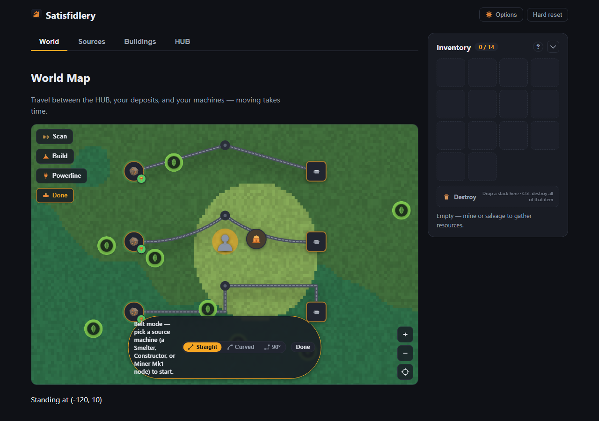

## [0.23.6] — 2026-07-15

### Changed

- **Conveyor Belt MK1 now runs at 60 items/min (was 30).** `BELT_MK1_RATE` doubled to 1 item/s
  (one every 1 s), so a belt exactly keeps up with a normal-quality **Miner Mk1**'s 60/min output
  instead of bottlenecking it at half. Free-flow item spacing halves to ~80 u (`SPEED ÷ 60/min`)
  and the offline entry pacing (`BELT_SIM_STEP` ≤ the now-1 s entry period) still delivers full
  throughput; belt cost, transit speed, and clogging behaviour are unchanged. Milestone/def copy
  and the on-map rate tooltip (driven by `BELT_MK1_RATE`) update to "60/min" automatically.
- **Confirmed the Miner Mk1 already mines at the intended 30 / 60 / 120 per min** on
  poor / normal / pure nodes — `(yield ÷ cycle) × quality × MINER_MK1_YIELD_MULT` = `(1÷2) × {0.5,1,2}
  × 2`. No code change needed; this entry records the verification. (No screenshot: a
  throughput-number tweak that a still frame can't convey — it only surfaces as a belt/tooltip
  rate on a fully-progressed save.)

## [0.23.5] — 2026-07-15

### Fixed

- **A hand-routed powerline now lays over time instead of appearing instantly.** 0.23.4
  committed a routed run (through dropped poles) in a single frame, unlike a direct node→node
  connection which strings segment-by-segment. Now both take the same path: `planPowerRoute`
  folds the waypoint poles and any auto-inserted ones into one connection plan, and confirming
  queues the timed `powerBuild` — the wire strings hop by hop and each pole rises as it reaches
  it, with the "Laying powerline… X/Y segments" progress showing throughout. Same one-at-a-time
  rule as any other connection (the confirm button waits while a build is in flight). (No
  screenshot: it's a build-timing change a still frame can't convey.)

## [0.23.4] — 2026-07-15

### Changed

- **Routing a powerline through hand-placed poles now stays a ghost until you finish it.**
  0.23.3 committed a real pole + wire on every empty-ground tap; now those taps drop **ghost
  route poles** (bends) instead — the whole run previews as a dashed line from the armed node
  through your dropped poles to the cursor, and **nothing is built or paid for** until the
  route reaches a destination node. Picking that node opens the confirm popover with the
  **full route's** cost (all poles + cable, auto-inserting extra poles on any gap longer than
  one segment); accepting lays the entire run at once. Cancelling (or a right-click) discards
  the ghost, and with nothing armed an empty-ground tap still drops a lone standalone pole.
  Mirrors how conveyor belts are routed (drop bends, then pick the destination).

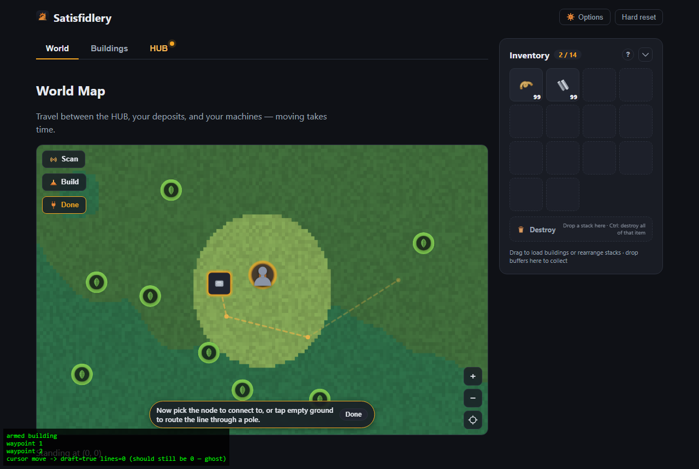

## [0.23.3] — 2026-07-15

### Fixed

- **Dropping a power pole while connecting now actually wires it up.** Previously, after you
  armed a node in powerline mode, tapping empty ground dropped a *standalone* pole — the
  powerline between the armed building and that pole was never created. Now the tap runs the
  line: it places the pole **and** wires the armed endpoint to it in one step (auto-inserting
  intermediate poles if the span is longer than one segment), then re-arms to the new pole so
  you can keep routing the run pole-by-pole across the map. A hand-dropped pole connects
  instantly (like placing the pole itself), rather than laying over time. With nothing armed,
  an empty-ground tap still drops a lone pole as before, and the coach line now spells the
  option out ("…or tap empty ground to run the line to a new pole").

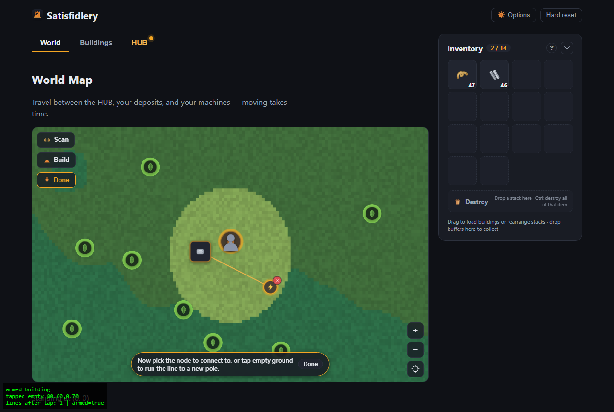

## [0.23.2] — 2026-07-15

### Added

- **A live "ghost" preview while routing a powerline** — the power-mode counterpart of the
  belt ghost (0.21.9). Once you arm the first node, a faint dashed line now trails from it to
  your cursor (gold, with a softly pulsing tip dot), so you can see the connection before you
  pick the second node. It clears the moment the pair is chosen (the cost popover / real laid
  route takes over), and on cancel or exit. Tracked by sampling the pointer in world space on
  `onPointerMove` (skipped while actively panning so the ghost doesn't chase the drag).

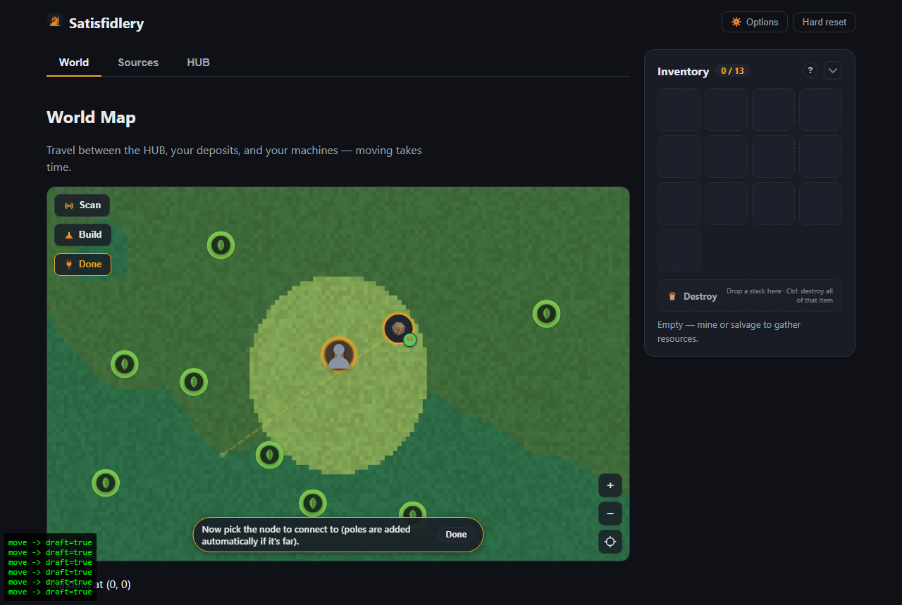

## [0.23.1] — 2026-07-15

### Added

- **Right-click cancels an in-progress powerline too.** Mirroring the belt-mode cancel
  (0.22.1), a **right-click anywhere on the map while in powerline mode** now clears the
  armed endpoint (or a pending pair awaiting the cost popover) and drops you back to "pick a
  node to start" — without leaving powerline mode, so you can restart the connection.
  Left-click behaviour (pan, arm, drop a pole, pick the second node) is unchanged, and
  right-click is still inert when no powerline connection is in progress. (No screenshot:
  it's an interaction a still frame can't show.)

## [0.23.0] — 2026-07-15

### Added

- **"Free fuel" cheat — a testing toggle in Options → Cheats.** Flip it on and
  **every power generator runs at full output without any fuel** — the HUB's biomass
  burner bank and every placeable Biomass Burner alike — so grids stay powered from a
  completely empty fuel store, and generators **stop consuming fuel** entirely (any
  leaves already loaded just sit there, honest to unload). Generators still have to be
  built, switched on, and un-tripped to deliver power — the cheat only waives the
  fuel requirement. It sits below "Infinite resources", persists across reloads
  (separate from your save, like the language and speed settings), and is off by
  default. Handy for exercising power-hungry setups without hauling leaves.

  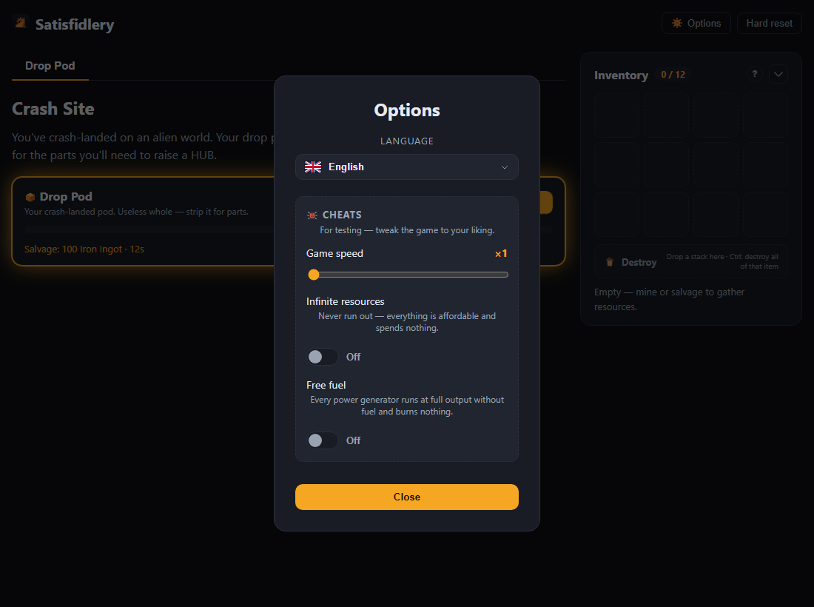

## [0.22.1] — 2026-07-15

### Added

- **Right-click cancels an in-progress belt.** While routing a conveyor belt, once you've
  armed a source (and placed any bends, or picked a pending destination), a **right-click
  anywhere on the map** now clears that selection and drops you back to "pick a source" —
  without leaving belt mode, so you can start the route over. Left-click behaviour (pan,
  arm, bend, pick destination) is unchanged, and right-click still does nothing outside an
  active belt selection. (No screenshot: it's an interaction a still frame can't show.)

## [0.22.0] — 2026-07-15

### Changed

- **Any belt source can now feed any automatable machine — mismatched items clog instead of
  being blocked.** Previously a belt was refused unless the destination had *some* recipe that
  accepted the source's output (e.g. Copper Ore → Constructor was disallowed). Now the link is
  always allowed: the belt carries the items and, if the destination's **currently selected
  recipe** doesn't consume them, they pile up at the far end (Satisfactory-style clogging)
  until you switch the recipe. The confirm popover's blocking "doesn't accept…" error is
  replaced by a non-blocking heads-up ("_…current recipe won't use this — it'll pile up on the
  belt_") and the **Build belt** button is enabled. The engine already clogged on a recipe
  mismatch; this removes the load-time gate so genuinely-unused items ride the belt too.

### Added

- **One belt per output port.** A machine can now run at most one outgoing belt per output
  slot — a single-output machine (or a Miner Mk1, which has one output) is capped at a single
  belt out. Trying to run a second is refused with "_That output already feeds a belt — one
  belt per output._" (Destinations are unchanged — a machine's input can still merge several
  belts.)

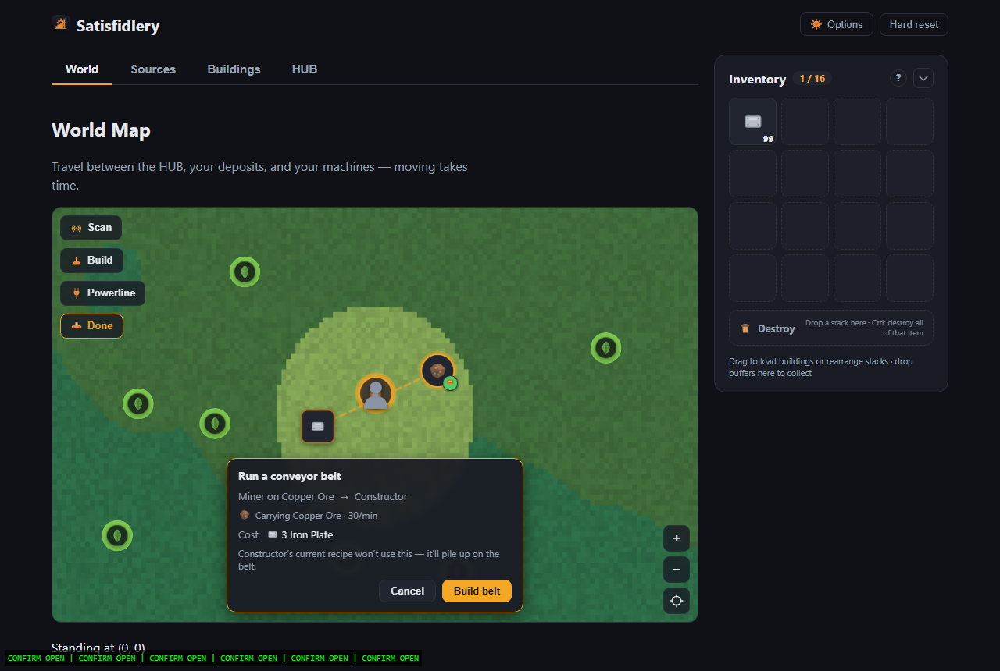

## [0.21.9] — 2026-07-15

### Added

- **A live "ghost" preview while routing a conveyor belt.** Once you arm a belt source, a
  faint dashed segment now trails from the last placed point (the source, or the most recent
  bend) to your cursor, so you can see exactly where the belt will run before you commit the
  destination or drop a bend. It's fainter than the committed route with a softly pulsing tip
  dot, and it disappears the moment you pick a destination (the real route to the machine takes
  over). Implemented by tracking the pointer in world space on `onPointerMove` (skipped while
  actively panning so the ghost doesn't chase the drag) and appending it as the draft's tail.

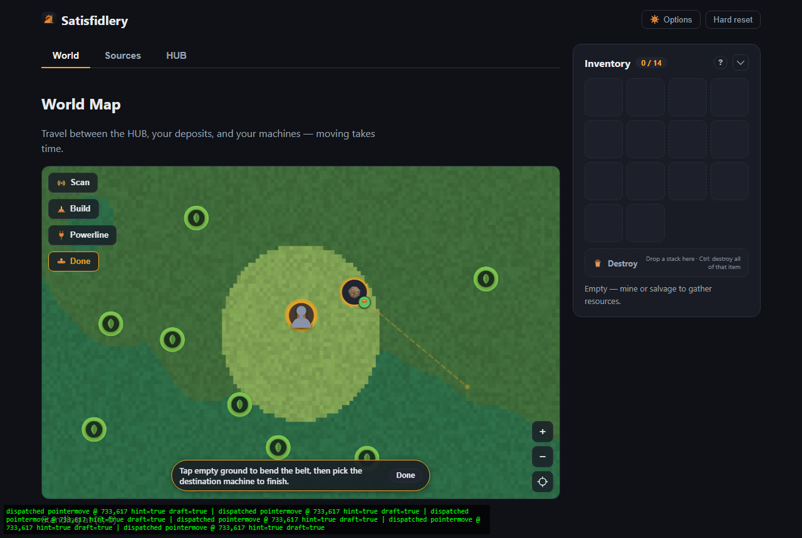

## [0.21.8] — 2026-07-15

### Fixed

- **You can now pan the map while placing powerlines or conveyor belts.** In power/belt mode
  the full-layer overlay SVG (`.map-powerlines` / `.map-belts`) had `pointer-events: auto` on
  its root, so it swallowed every pointer-down across the whole map — and since those classes
  are in the drag-to-pan exclusion list, dragging never started. The overlay root is now inert
  (`pointer-events: none`) and only the thin per-line hit strokes (`.powerline-hit` /
  `.belt-hit`, rendered only in those modes) opt back in, so dragging empty ground pans as
  usual while a line can still be clicked to remove. Empty-ground taps still drop a pole / bend
  a belt route. (No screenshot: it's an interaction change a still frame can't show.)

## [0.21.7] — 2026-07-15

### Changed

- **The browser context menu is now disabled app-wide.** A right-click anywhere in the game
  (map, HUB, inventory, header — everywhere) no longer pops the native menu (Back / Reload /
  Save image / Inspect …); this is a game, not a document. Done with a single document-level
  listener in `main.tsx`, replacing the map-only suppression added in 0.21.6 (the map's
  right-click-doesn't-move-the-player behavior stays). (No screenshot: it's an interaction
  change a still frame can't show.)

## [0.21.6] — 2026-07-15

### Changed

- **Right-click does nothing on the map.** Previously a right-click on empty ground both
  walked the player there *and* popped the browser's context menu. The map now only responds
  to the primary button (left mouse / touch / pen) — right- and middle-clicks start no pan or
  travel — and the browser context menu is suppressed over the map viewport. Left-click
  tap-to-move is unchanged. (No screenshot: it's an interaction change a still frame can't show.)

## [0.21.5] — 2026-07-15

### Changed

- **Player walks 4× faster.** `MOVE_SPEED` went from 20 to 80 world-units/second, so every
  walk across the map — to a deposit, a building, the HUB, a scan result — takes a quarter of
  the time it used to. Travel time scales straight off this one constant (`time = distance /
  MOVE_SPEED`), so nothing else needed tuning. (No screenshot: a still frame can't show motion.)

## [0.21.4] — 2026-07-15

### Added

- **Smelt Copper Ingots by hand at the HUB.** Copper smelting first becomes possible at the
  **Field Fabrication** milestone (it's when copper scanning — and hand-crafting — come online),
  so from that moment Copper Ingots join Iron Ingots as a HUB hand-craft: 1 Copper Ore → 1
  Copper Ingot, 3s per cycle, no Smelter required. Nothing else changes — the Smelter still
  smelts copper too; this just means you're no longer forced to build one before you can turn
  your first copper ore into ingots (and feed the Wire recipe).

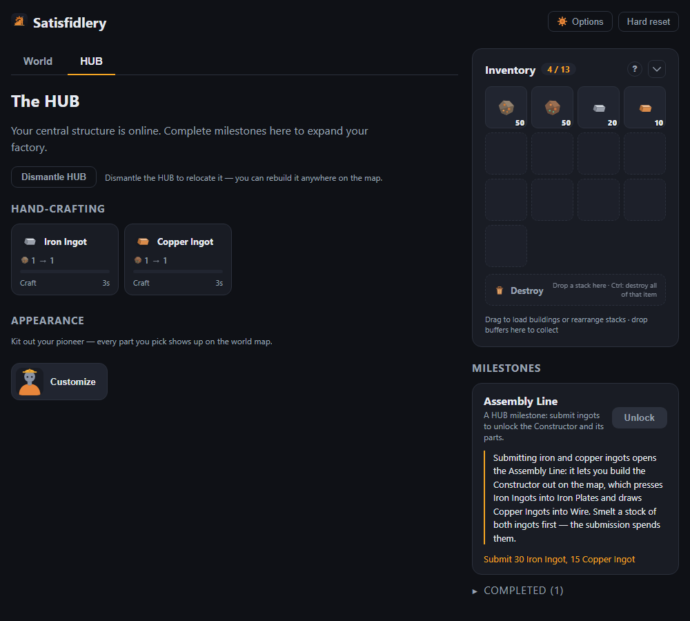

## [0.21.3] — 2026-07-15

### Changed

- **A clogged belt now packs completely full.** Previously stuck items sat at the belt's
  wide throughput spacing (~160 m apart), so a jammed belt only ever held a handful. Items
  now bunch up at their true physical size (~24 m), so a backed-up belt fills **end-to-end**
  with items until there's genuinely no room left — and only then does the source machine
  stop loading onto it. A freely-flowing belt is still sparse and still moves 30 items/min;
  this only changes how densely items pile when they can't get off.

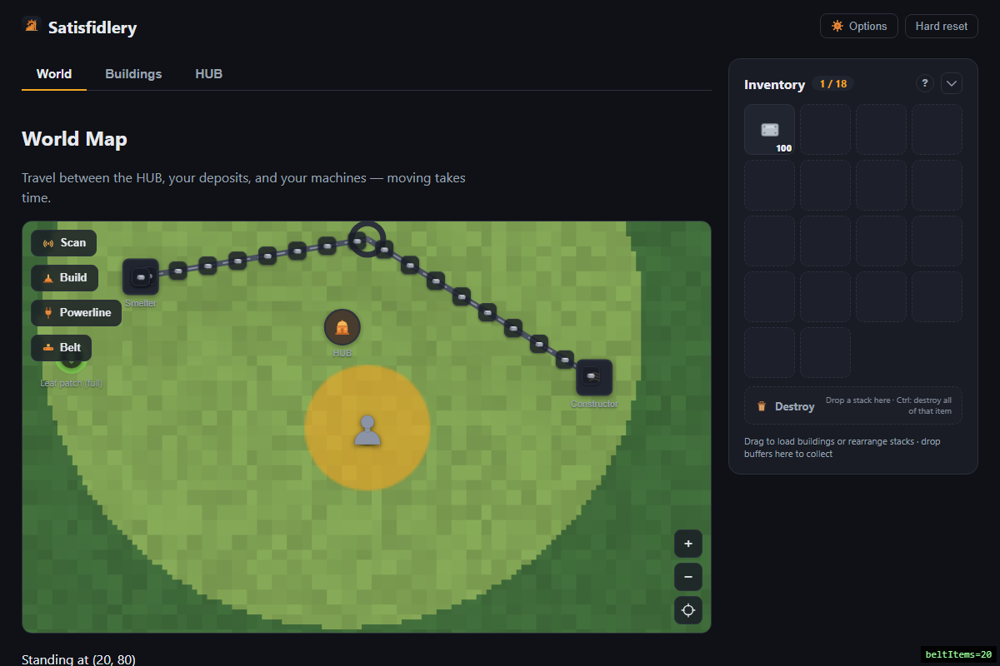

## [0.21.2] — 2026-07-15

### Changed

- **Belts clog like Satisfactory when the item doesn't match the recipe.** An item now
  enters a machine only if the machine's **currently-selected recipe** uses it. Deliver Iron
  Ore to a Smelter set to make Copper Ingots and the ore no longer vanishes into the input —
  it **gets stuck at the end of the belt**, and the items behind advance until they bump into
  it and pile up. Switch the machine's recipe to one that uses the item and the clog clears
  and flows in. (A belt full of stuck items also stops the source machine from loading more
  onto it — backpressure all the way to the source.)
- **Removing a belt gives back its cargo too.** Deleting a conveyor belt now refunds the iron
  plates it cost **and** every item currently riding it — nothing on the belt is lost.
- **Dismantling a machine no longer destroys its belts.** Tearing down a building (or a Miner
  Mk1) on either end of a belt leaves the belt in place; it simply dangles (items still drain
  toward a surviving end, or pile up at a removed one) until you remove it by hand. Building
  ids are now stable so a rebuilt machine never silently inherits a leftover belt.

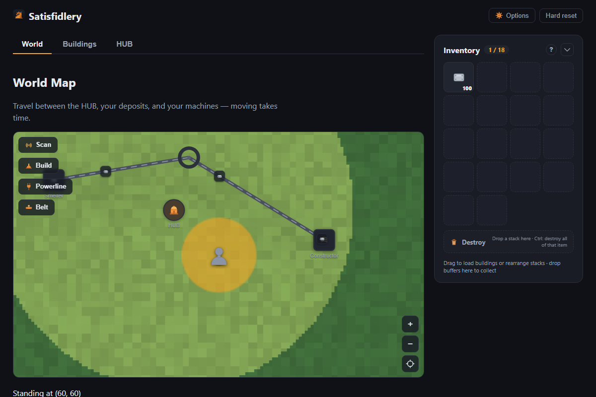

## [0.21.1] — 2026-07-15

### Fixed

- **Belt-delivered items now show in the destination's input.** A building card only ever
  drew input slots for its *currently-selected* recipe, so items a conveyor belt dropped in
  that the current recipe doesn't use (e.g. Iron Ingot arriving at a Constructor set to make
  Wire) landed in the input buffer but were **invisible** — they looked like they "weren't
  added." The card now surfaces a slot for **every** item sitting in the input buffer, so
  belt-fed items are always visible and can be unloaded.

### Changed

- **Building inputs now have a max stack (500), like outputs.** Each input resource caps at
  500 — shown as `X / 500` on the slot — enforced for hand-loading too (Load buttons disable
  when a slot is full). A full input backs its feeding belt up to the source, which then
  idles, mirroring how a full output already backs a machine up.
- **The conveyor surface animation now scrolls at the item travel speed.** The belt's moving
  texture was running at a fixed rate unrelated to how fast items actually travel; it now
  matches the item speed exactly, at every zoom level, so the belt and the items on it move
  together.

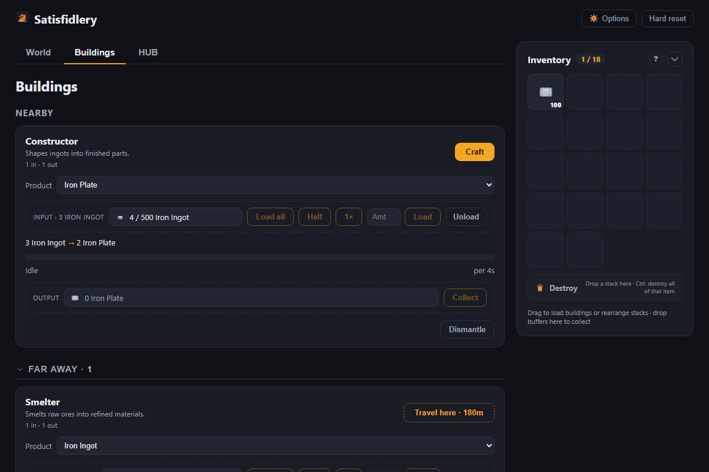

## [0.21.0] — 2026-07-15

### Added

- **Conveyor Belt MK1 — automatic item logistics.** A new HUB milestone, **Conveyor
  Logistics** (unlocked by submitting iron plates, iron rods, wire, cable, and concrete),
  brings the first hands-free way to move items between machines. On the map, a new **Belt**
  mode lets you draw a belt by hand: **click a source** (a Smelter, a Constructor, or a
  Miner Mk1 ore node), **tap empty ground** to bend the route as many times as you like,
  then **click a destination machine** to finish. It costs iron plates by length (≈1 plate
  per 120 m, refunded on teardown) and — like a powerline — **lays itself segment by
  segment** over a few seconds.
- **Items ride the belt.** Once a belt is fully laid it pulls the source's output and
  carries it to the destination's input at **30 items/min**, one whole item at a time. The
  items genuinely **travel** — a longer belt takes longer to cross — and you watch them
  glide along the track on the map. A backed-up destination (input full) makes the belt back
  up all the way to the source, which then idles; draining the destination gets it flowing
  again. Belts run live and offline, and dismantling a machine (or a Miner Mk1) pulls the
  belts attached to it, refunding their plates. The Equipment Workshop is not belt-connectable.

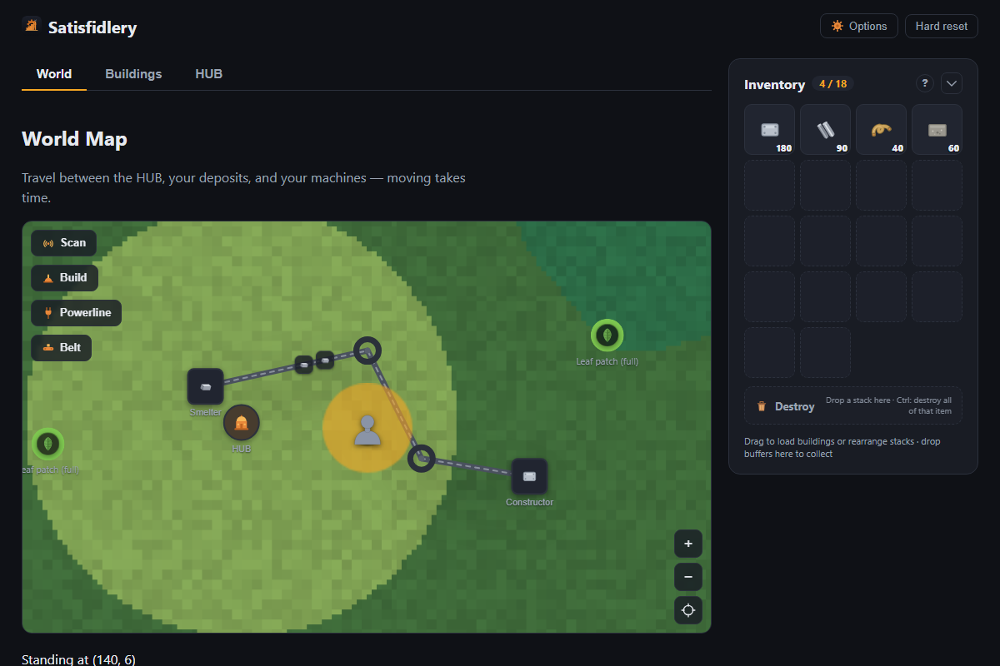

## [0.20.4] — 2026-07-15

### Fixed

- **Unload buttons are disabled when the inventory is full too.** Extending the previous
  fix to every "move items back to the grid" action: a building input's **Unload**, a
  generator's (Biomass Burner) leaf-fuel **Unload**, and the HUB burner bank's fuel
  **Unload** now disable when the grid has no room for what they'd return — same
  "Inventory full — free up space to collect" tooltip. Previously these clicked through to
  a silent no-op on a full grid. Room is per-item, so freeing a single slot re-enables them.

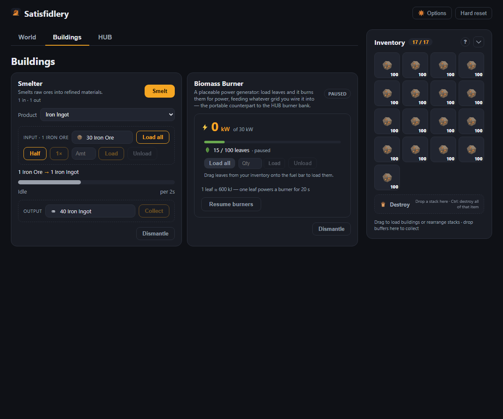

## [0.20.3] — 2026-07-15

### Fixed

- **Collect buttons are disabled when the inventory is full.** A source's **Collect**
  (and a building's output **Collect**) button stayed clickable even with no room in the
  grid — clicking just did nothing (the transfer is a lossless partial-fill, so a full
  grid moves zero). The buttons are now **disabled** whenever the grid has no room for
  what they'd collect, with an "Inventory full — free up space to collect" tooltip, so the
  dead click is impossible. Room is per-item: as soon as a single unit fits again (a stack
  freed or partially collected elsewhere), the button re-enables.

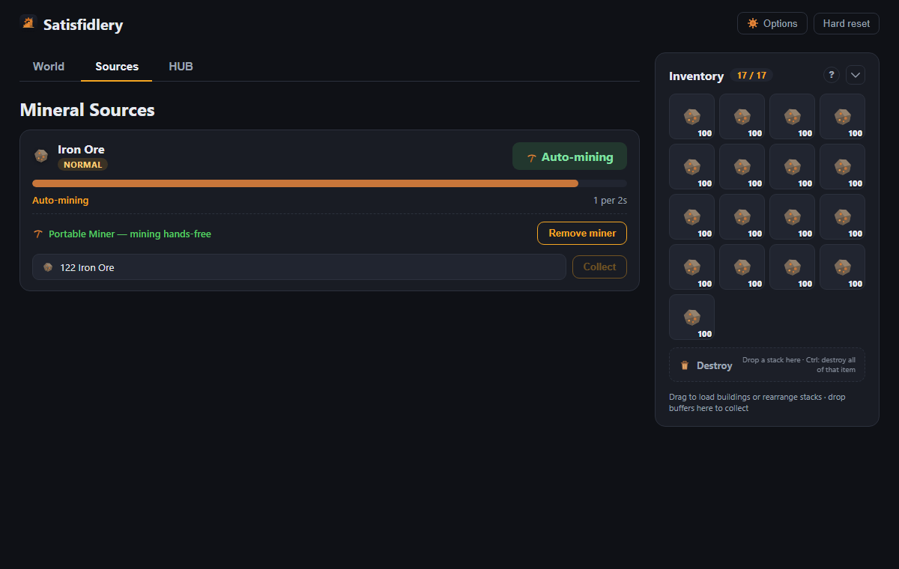

## [0.20.2] — 2026-07-15

### Fixed

- **Miners never deliver a partial ore.** A **poor** deposit yields ×0.5, so a mining
  cycle produced **half an ore** — which accumulated into the buffer (and then the
  inventory on collect) as fractional counts like `9.5 Iron Ore`. Mining now works like
  the burner's whole-leaf burn: a source's progress bar counts toward the next **whole
  ore**, advancing at the deposit's quality-scaled rate (yield ÷ cycle time, boosted for
  a Miner Mk1), and only whole ore is ever added to the buffer. A poor node simply takes
  twice as long to hand over each ore — the bar completing now **always** means exactly
  one ore. Rich (pure ×2) and normal nodes are unchanged in rate. The source's rate label
  reflects this too: a poor node reads **"1 per 4s"** instead of a fractional "0.5 per 2s".
  Same average throughput as before, but a collected stack can never be fractional.

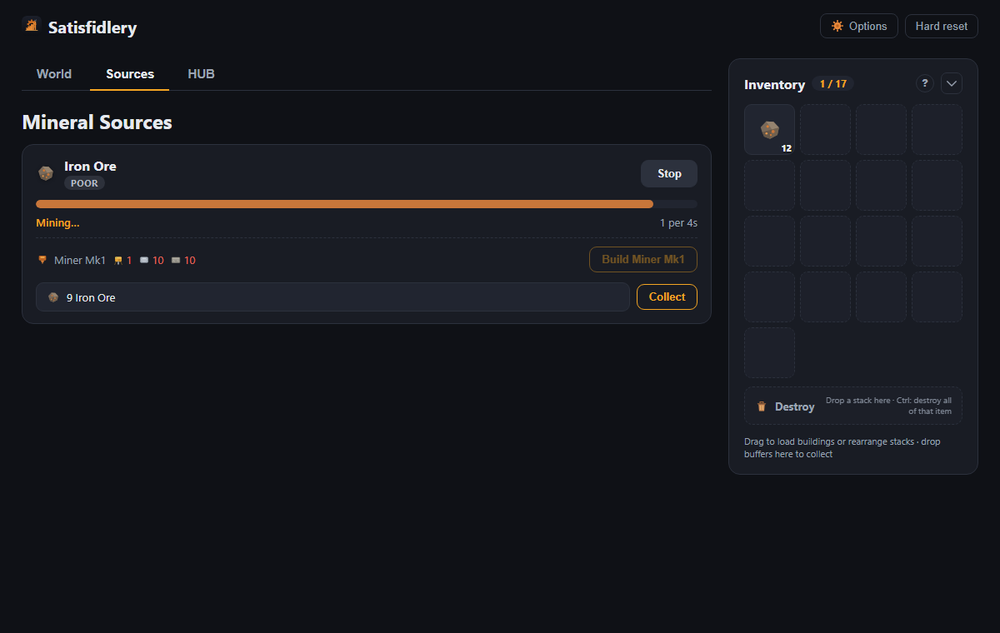

## [0.20.1] — 2026-07-15

### Fixed

- **Leaves are burned as whole items — no more fractional leaf counts.** A running
  Biomass Burner (and the HUB burner bank) drained its leaf fuel *continuously*, so its
  fuel store sat at values like `97.86`. Loading more leaves into a partly-burnt store
  then computed a fractional `room` (`cap − fuel`) and moved a fractional quantity out
  of the inventory — leaving a floating stack behind (e.g. **2.14 leaves**). Fuel is now
  a **discrete whole-leaf count**: the burn advances a `burnProgress` toward the next
  leaf (mirroring how mining and smelting accumulate toward the next unit) and deducts a
  **whole leaf** each time one completes, so a leaf in a generator is either fully present
  or fully spent — never half-consumed. Loading only ever moves whole leaves, so the
  inventory can never hold a fraction. The fuel countdown ("empties in …") accounts for
  the leaf mid-burn. Loading a save cleans up any legacy fractional fuel *and* any
  floating item stack left by the old behavior (both are floored to whole units).

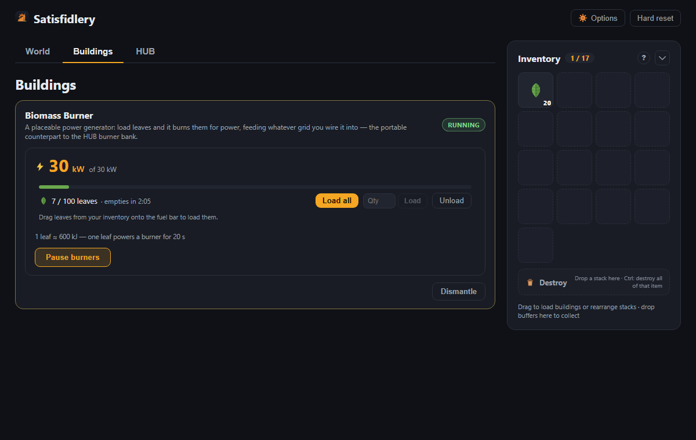

## [0.20.0] — 2026-07-15

### Added

- **Buildings back up when their output is full — and stop drawing power.** A placed
  machine's output buffer now caps at **500** units of a product (`BUILDING_MAX_BUFFER`).
  Once there's no room for another cycle, the machine idles: it stops producing and, if
  it's wired to the grid, drops out of the grid's demand entirely — so it draws **no
  power** and a generator feeding it stops spending its capacity on it (exactly how a
  full **Miner Mk1** already idles and stops drawing). Collect the backlog and it resumes.
  The building card shows an **"Output full — collect to resume"** status, and the cap is
  respected live and offline (a long offline stretch can't overshoot it). Previously a
  building ran and drew power forever while it had inputs, hoarding output without bound.

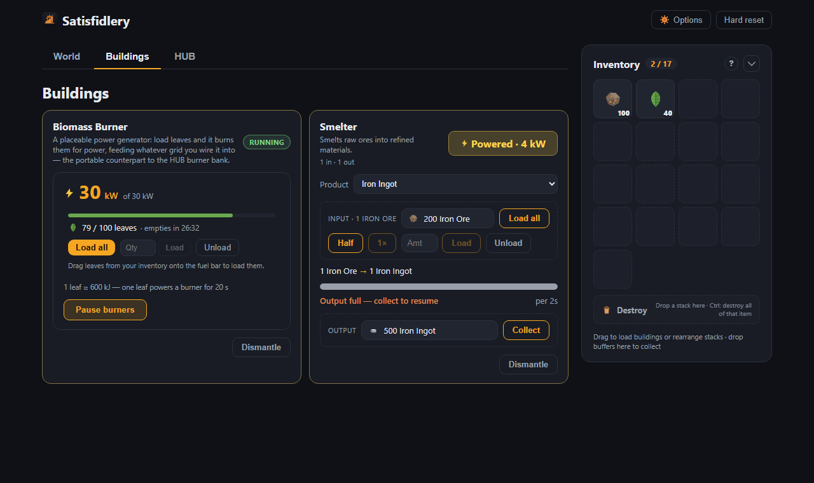

## [0.19.2] — 2026-07-15

### Fixed

- **Build radial nodes drifted off the ring.** Each option was positioned by its whole
  box (disc **+** label **+** cost), so a node with more cost lines — the Biomass Burner
  carries three — pushed its disc higher than its neighbours, and the four-building menu
  looked lopsided. Each node is now anchored by its **disc**, with the label and cost
  floating below it, so all discs sit exactly on the ring (a clean, symmetric cross);
  bumped the ring radius a touch for breathing room.

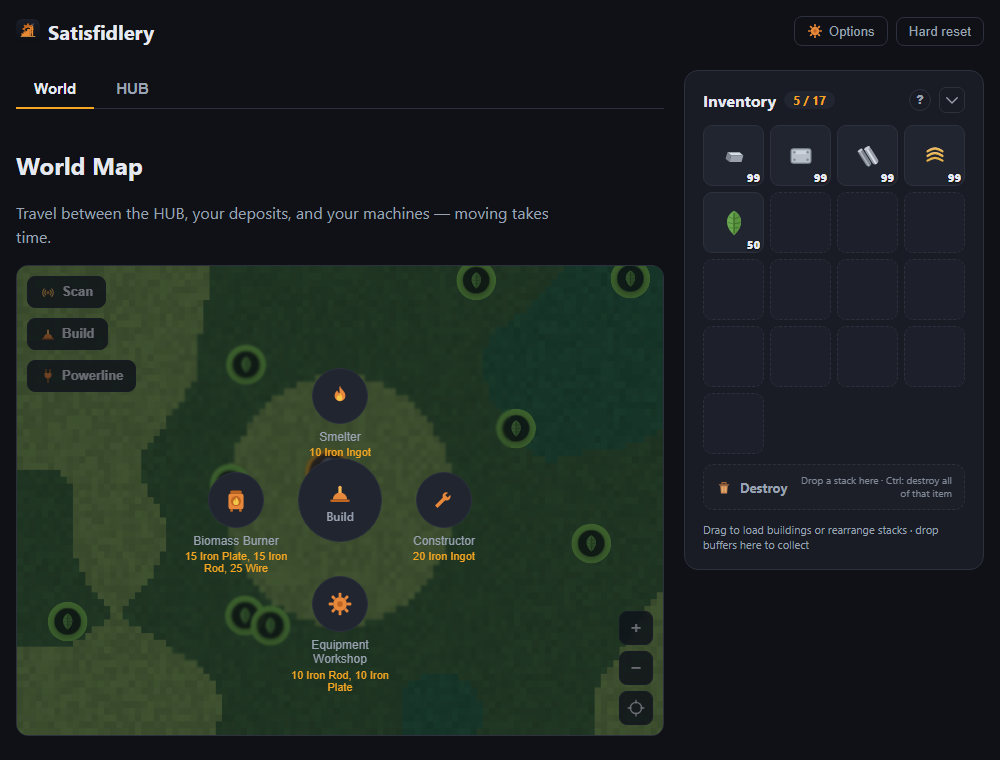

## [0.19.1] — 2026-07-15

### Fixed

- **Biomass Burner shared the Smelter's flame icon.** In the build radial and on the
  map, the new Biomass Burner rendered the generic `flame` glyph — which is nearly
  identical to the Smelter's own small-flame glyph, so the two build options were hard
  to tell apart. Gave the burner its own `burner` glyph: a furnace housing with a lit
  stoke window and stubby feet, clearly distinct from the Smelter's bare flame.

## [0.19.0] — 2026-07-15

### Added

- **Biomass Burner — a placeable power generator.** Unlocked by the **Mining Automation**
  milestone, the Biomass Burner is the portable counterpart to the HUB burner bank: build one
  anywhere for **15 iron plates · 15 iron rods · 25 wires**, wire it into your grid, and load
  leaves to run your machines hands-free. It works exactly like the HUB burners — its own leaf
  fuel store (drag leaves onto the bar or use Load / Unload while standing at it), a master
  pause/resume, a live **30 kW** output, and a breaker that trips on overload. Each burner is a
  real generator on the network: `powerNetwork` now sums generation from the HUB **and** every
  burner building on a grid, so a smelter wired to a burner auto-runs (live and offline) off the
  30 kW it supplies.
- **Grid-wide breaker reset.** When an overloaded grid trips, resetting the breaker from **any**
  generator on it — a burner building or the HUB bank — relaunches the whole network at once
  (every generator on that grid un-trips together), instead of resetting one at a time.

Save bumped to **v23** (buildings now persist generator fuel / running / tripped state;
older saves load forward-tolerantly).

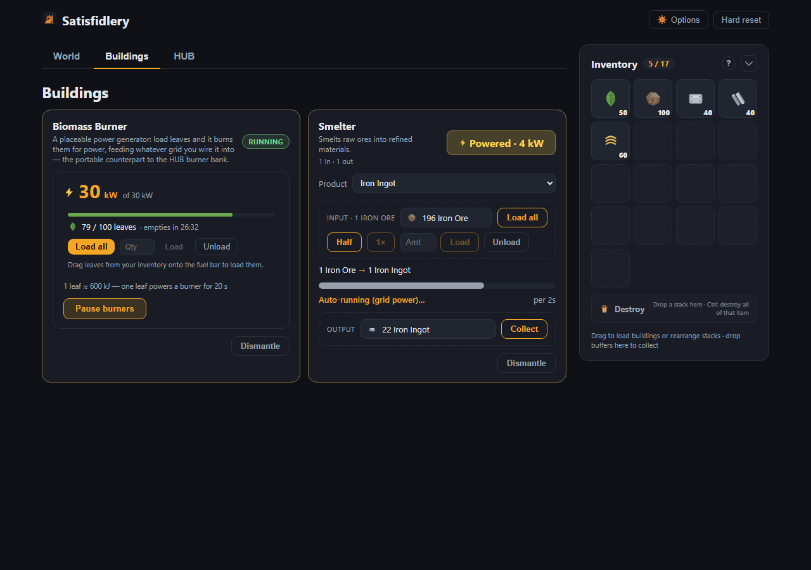

## [0.18.1] — 2026-07-15

### Fixed

- **Mining Automation milestone card showed raw string keys.** The card rendered
  the literal `hub.automation.stakes` and `hub.automation.doneHint` instead of
  text, because those i18n strings were never authored. Added them (EN + FR), and
  filled the French `hub.power.stakes` / `hub.power.doneHint` strings that were
  missing the same way — so both the Power Grid and Mining Automation milestones
  now read correctly in both languages.

## [0.18.0] — 2026-07-15

### Added

- **Inventory slots now grow with your progress.** A fresh grid starts at **12** stack slots
  (down from the old flat 24), and every **HUB milestone** you complete (Field Fabrication,
  Assembly Line, Equipment Workshop, Power Grid, Mining Automation) permanently unlocks **one
  more slot** — so building out the factory is also what expands your carrying capacity. The
  live capacity is `12 + milestones built`; the count in the Inventory header (`used / max`)
  reflects it, and the grid resizes the moment a milestone is built. Older saves are migrated
  losslessly: the grid is resized to the capacity your milestones earn, and any items that sat
  in the old larger grid are folded back into stacks rather than dropped (save bumped to v22).

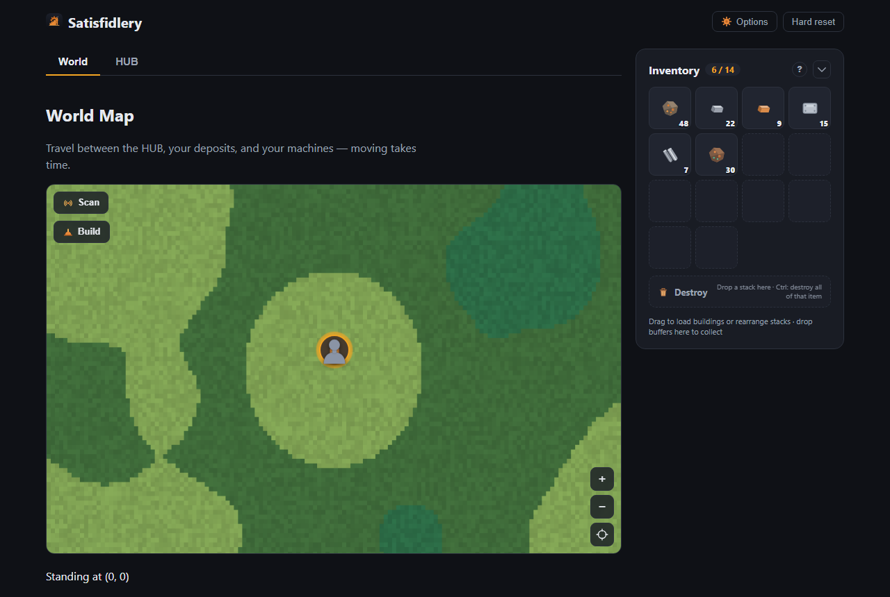

## [0.17.0] — 2026-07-15

### Added

- **In-game changelog viewer in the demo.** The DEV BUILD banner now has a button (next to
  the version) that opens a **Changelog** panel, styled like the game's own dialogs, listing
  every version's changes right inside the game — no need to leave for GitHub. It reads the
  same `CHANGELOG.md` that ships with the demo, rendered by a small built-in Markdown reader
  (bold, `code`, and links; screenshots are omitted). Like the banner, the button and its
  changelog are **demo-only** — the changelog text is lazy-loaded on open and isn't bundled
  into the Steam/Electron build at all.

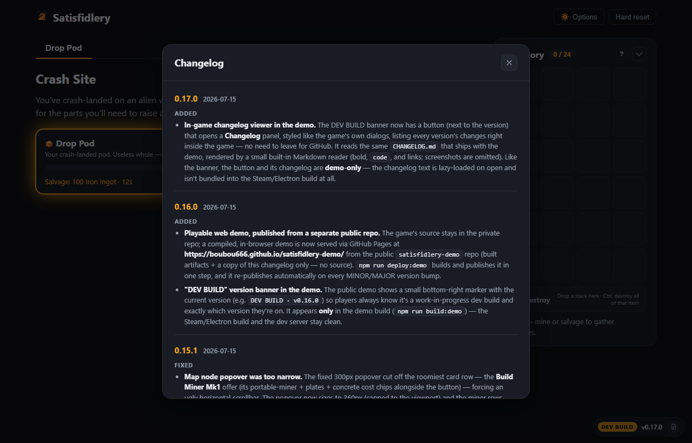

## [0.16.0] — 2026-07-15

### Added

- **Playable web demo, published from a separate public repo.** The game's source stays in
  the private repo; a compiled, in-browser demo is now served via GitHub Pages at
  **https://boubou666.github.io/satisfidlery-demo/** from the public
  `satisfidlery-demo` repo (built artifacts + a copy of this changelog only — no source).
  `npm run deploy:demo` builds and publishes it in one step, and it re-publishes automatically
  on every MINOR/MAJOR version bump.
- **"DEV BUILD" version banner in the demo.** The public demo shows a small bottom-right
  marker with the current version (e.g. `DEV BUILD · v0.16.0`) so players always know it's a
  work-in-progress dev build and exactly which version they're on. It appears **only** in the
  demo build (`npm run build:demo`) — the Steam/Electron build and the dev server stay clean.

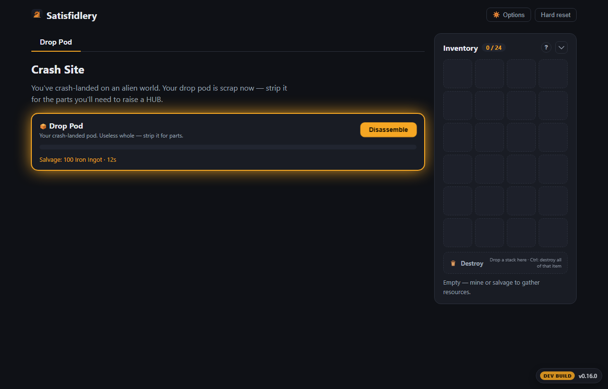

## [0.15.1] — 2026-07-15

### Fixed

- **Map node popover was too narrow.** The fixed 300px popover cut off the roomiest card
  row — the **Build Miner Mk1** offer (its portable-miner + plates + concrete cost chips
  alongside the button) — forcing an ugly horizontal scrollbar. The popover now sizes to
  360px (capped to the viewport) and the miner rows wrap their button if space is ever
  still tight, so nothing scrolls sideways.

## [0.15.0] — 2026-07-15

### Added

- **Tap a nearby node on the map to act on it — no tab-switching.** When you're standing
  within reach of a **deposit**, **building**, or the **HUB**, tapping its map icon now
  opens an **action popover anchored to that node**, holding **everything you can do
  there** — the exact same card the Sources / Buildings tabs show. From a deposit: Mine,
  Collect its buffer, Install/remove a Portable Miner, build/dismantle a Miner Mk1. From a
  building: run/stop, pick the recipe, Load / ½ / 1× / Load N / Unload inputs, Collect the
  output, Dismantle. The HUB popover shows its live generation and an **Open HUB panel**
  shortcut. So the map becomes the one place you play from.

  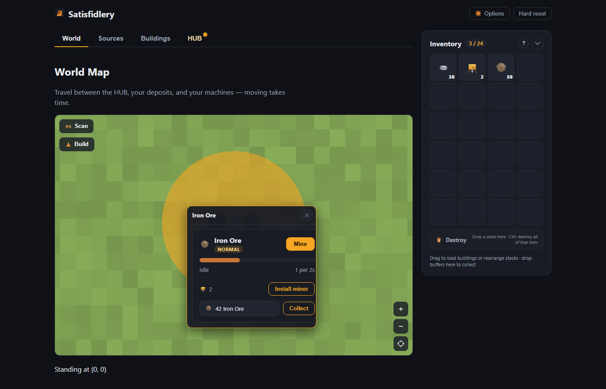

  - **In-range only** — tapping a _distant_ node still walks you toward it (as before); the
    popover appears once you're in proximity. The card is positioned in screen space, so it
    tracks the node as you pan and zoom, and is flipped/clamped to stay fully on-screen.
  - Close it with the ✕, the `Esc` key, an outside click, or by re-tapping the node.
  - Under the hood the deposit and building cards are now shared components (`SourceCard`,
    `BuildingCard`) reused by both the list tabs and the map — one source of truth, no
    duplicated logic.

## [0.14.0] — 2026-07-15

### Added

- **One-tap "Claim" button when you're standing by a revealed deposit.** The moment the
  player walks within reach of a scanned-but-unclaimed deposit, a prominent accent
  **Claim _<ore>_** button appears at the bottom-center of the map — so you no longer
  have to find the small on-node button or fan open a cluster to claim the node. It
  targets the **nearest** in-range deposit; if several are reachable it shows a
  **+N more** badge and claiming one promotes the next. Hidden while laying powerlines
  (which owns that bottom-center coach line).

  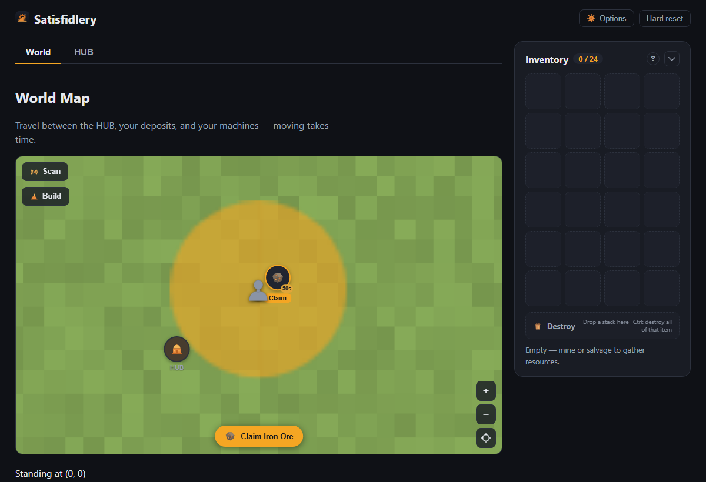

## [0.13.0] — 2026-07-15

### Added

- **Mining Automation milestone — Limestone, Concrete, and the Miner Mk1.** A new HUB
  milestone (unlocked after the Power Grid) that you complete mainly with **5 Portable
  Miners** plus plates and cable. It opens up a whole automation tier:

  - **Limestone** — a new ore. Once the milestone's built you can **scan for it**, and
    it joins the procedural deposit field so nodes turn up as you prospect. An authored
    limestone deposit sits near spawn to get you started.
  - **Concrete** — a new material pressed from limestone (**3 limestone → 1 concrete**),
    craftable both in the **Constructor** and by hand at the **HUB**.
  - **Miner Mk1** — a powered auto-miner you **build directly onto an ore node** (from
    the Sources tab) for **1 Portable Miner + 10 Iron Plates + 10 Concrete**. Wire it
    into the power grid from the map — the node becomes a grid endpoint — and while
    powered it **mines the node hands-free** (and offline), drawing **5 kW**. Output
    scales with the node's purity (poor/normal/pure) and it mines faster than a hand or
    Portable Miner. It **stops and draws nothing once the node's buffer fills**, and
    like a Portable Miner it disables manual mining while installed. **Dismantle it
    straight from the node** — you get the parts back and any wire is pulled.

  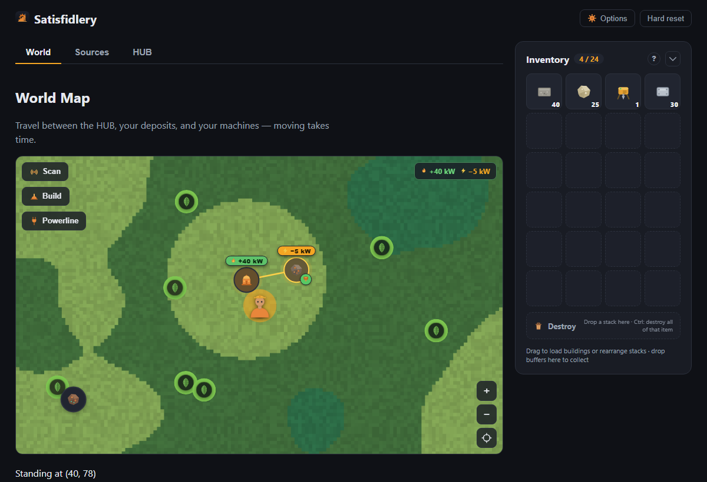

  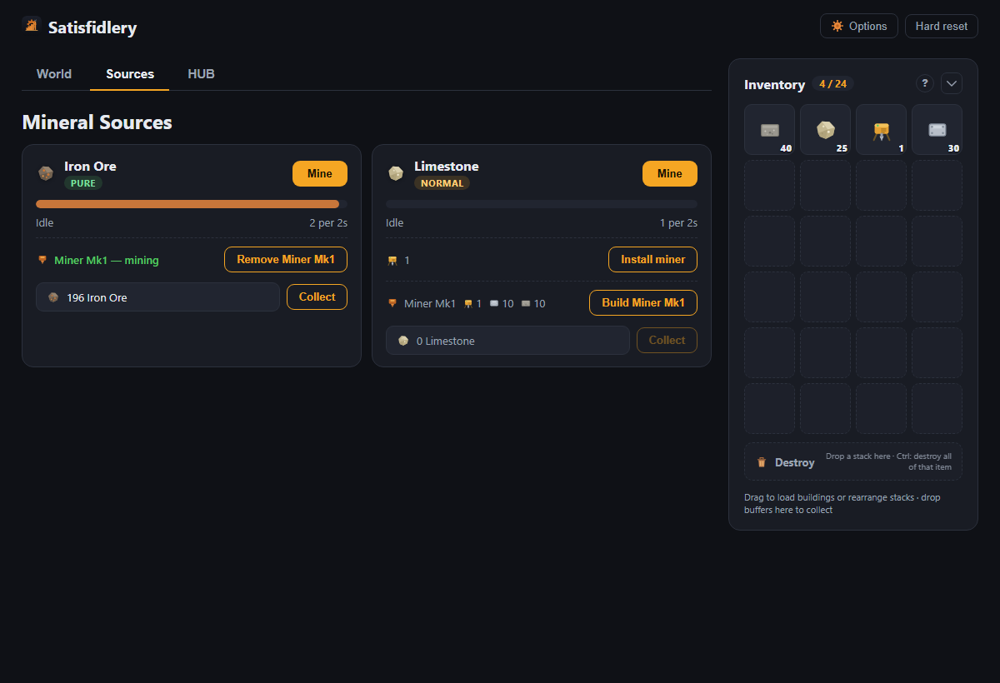

## [0.12.1] — 2026-07-15

### Fixed

- **"Infinite resources" no longer lets you duplicate materials.** The first cut of
  the cheat faked your stock (reading every item as ~1T) and skipped debits, which
  meant loading a machine while the cheat was on stuffed a phantom pile into its
  **input buffer** — so you could toggle the cheat off, **unload the machine (or a
  burner), and walk away with materials you never actually had.** The cheat is
  reworked so it can never fabricate materials into a reclaimable place: it now only
  **waives affordability** (everything is buildable/craftable regardless of what you
  hold), and **machines and hand-crafts simply run without consuming their inputs**.
  Every real transfer — loading, unloading, collecting, refunds — moves only
  materials you genuinely hold, so nothing can be laundered back into the grid.
  Bonus: the inventory and load buttons now show your true counts again (no more
  phantom "1.00T"), and you can still build the whole factory and run production
  chains from an empty inventory.

## [0.12.0] — 2026-07-15

### Added

- **"Infinite resources" cheat — a testing toggle in Options → Cheats.** Flip it on
  and the inventory behaves as bottomless: **every cost is affordable and spends
  nothing**, so you can build machines, raise milestones, run powerlines, and
  hand-craft freely — even from a completely empty inventory — without gathering a
  single ore first. It sits right below the existing Game-speed slider, persists
  across reloads (separate from your save, like the language and speed settings), and
  is off by default. Handy for exercising later systems without grinding up to them.

  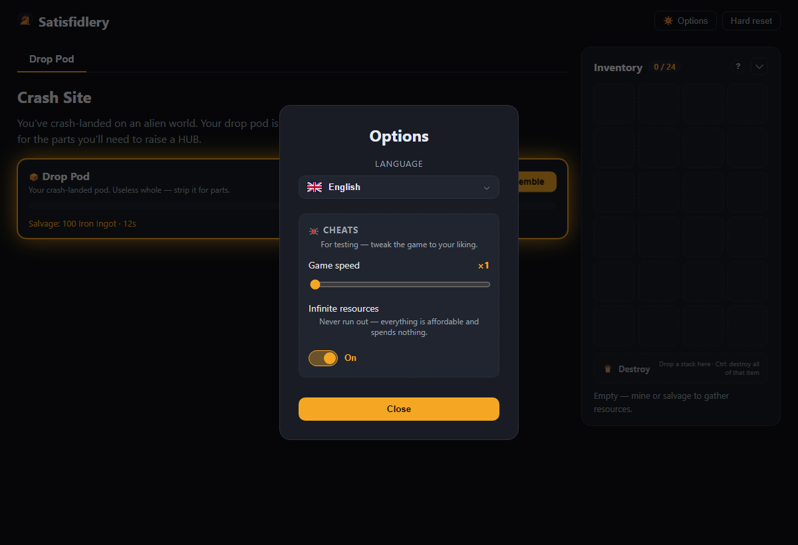

## [0.11.0] — 2026-07-15

### Added

- **Laying a powerline now takes time — watch it get built from A to B.** Connecting
  two nodes no longer snaps the whole run into existence. You pay the full cost up
  front (as before), then the connection is **strung segment-by-segment from the first
  node to the second**: the wire visibly grows along the route, and each auto-placed
  **Power Pole pops up as the wire reaches it**. Longer runs take longer to lay (each
  segment's time scales with its length), and the map shows the part still ahead as a
  faint dashed **blueprint** with ghost discs where poles will rise, plus a spark
  riding the growing tip. A live **"Laying powerline… 2/3 segments"** readout tracks
  progress. The build advances live and offline (like walking), so a long line keeps
  laying itself while you're away — and only one connection lays at a time.

  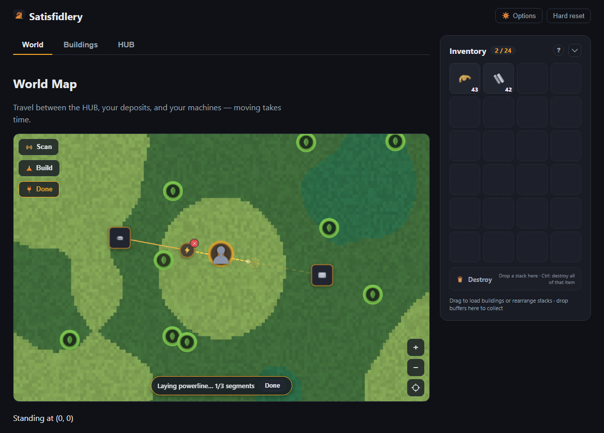

## [0.10.0] — 2026-07-15

### Added

- **Idle machines draw no power.** A wired building only consumes power while it's
  actually working (it has the inputs to run a cycle). An idle machine — out of
  inputs — draws nothing and no longer counts toward its grid's demand. On the map an
  idle-but-connected machine still lights up (it's on a live grid) but shows no draw
  pill; in the Buildings tab it reads **"Powered — waiting for input."**

- **Overloaded grids trip, and stay down until you reset them.** If the buildings
  working on a grid draw more than it can generate, the breaker **trips**: power cuts
  out across that grid, the buildings stop, and **the generators shut down too** (they
  stop burning fuel). It's latched — power does **not** come back on its own. The map's
  balance readout turns red with a **Reset** button (and the HUB burner panel shows a
  **Reset breaker** control); resetting only holds once you've shed enough load (unwire
  a machine, or let one run dry), otherwise it trips straight back.

- **Grids are evaluated independently, per network.** Power is now computed per
  connected component rather than assuming a single HUB grid — groundwork for multiple
  separate power grids. Each grid weighs its own generation against its own working
  demand; only a grid with a generator (the HUB burner bank, for now) can carry power.

### Fixed

- **The HUB power graph no longer resets when you switch tabs.** Its sample history
  moved out of the graph component (which unmounts when you leave the HUB) into a
  module-level sampler that keeps running, so the trace stays continuous across tab
  changes instead of rebuilding from empty each time you return.

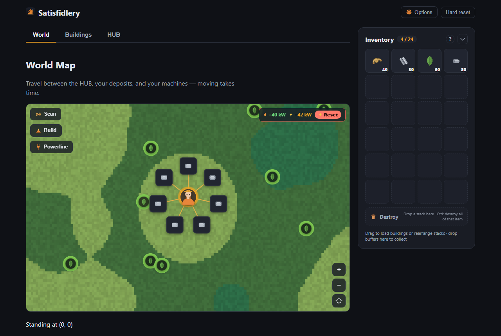

### Changed

- **The map now tells generation from consumption at a glance.** The kW pills used to
  all look the same warm gold, so you couldn't tell what was *feeding* the grid from
  what was *pulling* off it. Now **generation** (the HUB burners) shows a **green
  `+40 kW`** pill with a flame, and each wired machine shows an **amber `−4 kW` /
  `−6 kW`** draw pill with a bolt. A new **grid-balance readout** in the map's
  top-right corner sums it up — total **`+gen`** (green) vs. total **`−draw`** (amber)
  across the HUB network — and turns red with an **"Overloaded"** tag when demand
  exceeds supply (the network trips).

  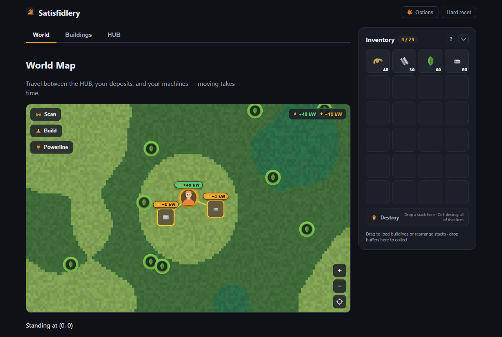

## [0.9.0] — 2026-07-14

### Added

- **Power now flows — wired buildings run themselves.** The power grid stops being
  purely structural: a **Smelter** (draws **4 kW**) or a **Constructor** (draws
  **6 kW**) can be wired into a network, and when that network carries running power
  it **runs automatically** — hands-off, and while you're offline — instead of being
  operated by hand. Only these two building types are connectable; a hand-only bench
  (the Equipment Workshop) has no power intake and stays inert in Powerline mode.

  Power flows out from the **HUB's biomass burners** (the sole generator for now).
  The HUB component energizes when its generation covers the **summed draw** of every
  building wired onto it; if demand ever exceeds supply the whole network trips and
  nothing on it runs (a Satisfactory-style blackout), and it comes back the moment
  supply recovers (e.g. you load more fuel).

  **On the map**, a live network reads at a glance: energized **wires glow gold and
  pulse**, powered **poles and building discs light up**, and each running machine
  shows its **kW draw** in a pill (beside the HUB's kW generation readout). **In the
  Buildings tab**, a powered machine swaps its manual Run control for a **"⚡ Powered ·
  N kW"** badge and reads **"Auto-running (grid power)…"** — you still load its inputs
  and collect its outputs by hand, but it can't be hand-started while it's on the grid.

  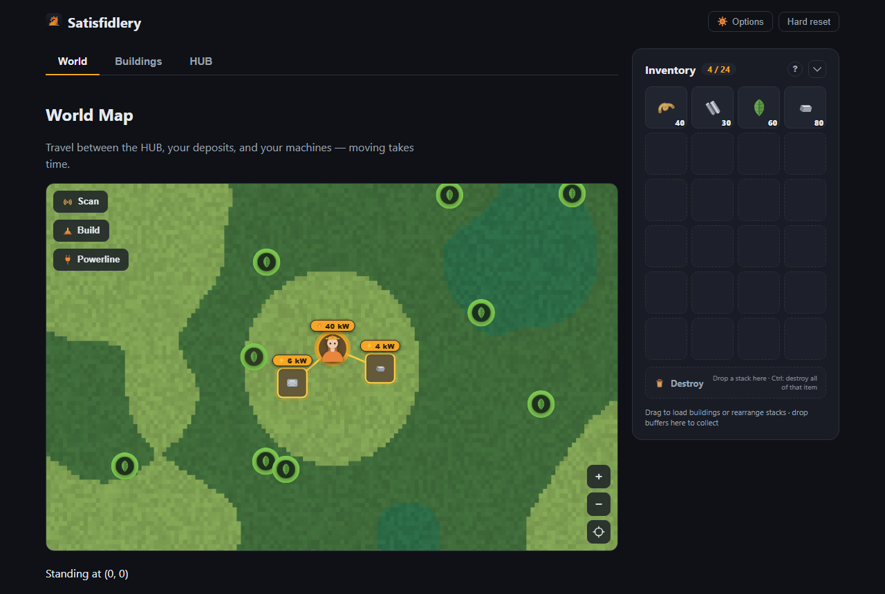

## [0.8.3] — 2026-07-14

### Changed

- **The burner fuel bar now shows a live "empties in X" countdown.** Beside the fuel
  count it reads **"40 / 100 leaves · empties in 10:00"** — the time until the loaded fuel
  runs out at the current draw, ticking down as it burns. It's derived from the amount
  loaded and the **fuel type's energy** (a leaf holds 600 kJ → 30 s in one burner, so
  40 leaves across the 2-burner bank last 10 min), so when other fuels arrive the estimate
  will reflect whatever is loaded. Shows **· paused** when the bank is paused (the bar
  isn't draining) and **· empty** when it's out. Replaces the static "30s per leaf" text.

  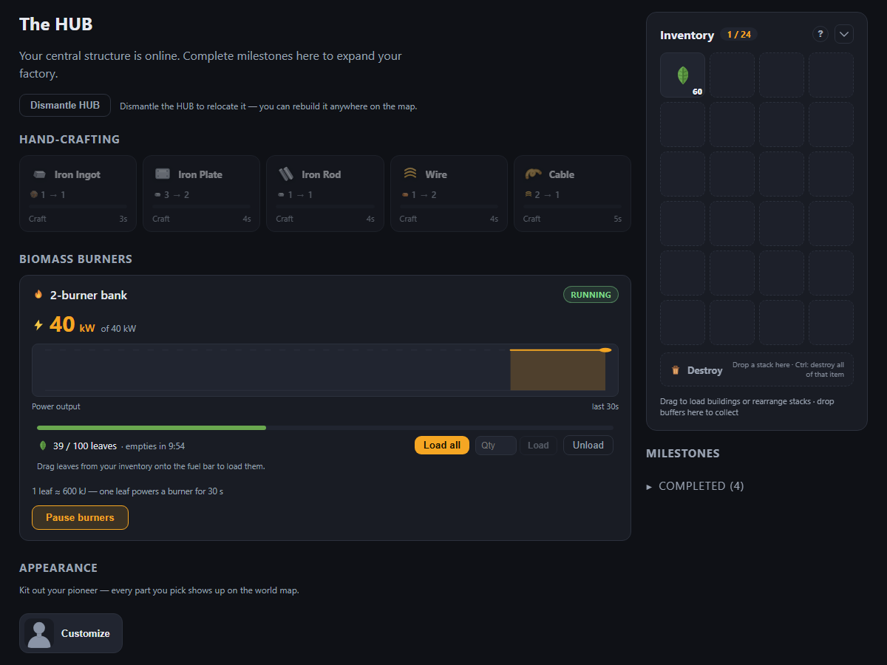

## [0.8.2] — 2026-07-14

### Changed

- **The burner fuel readout now shows how long ONE leaf lasts, not a whole-store figure.**
  Next to the fuel count it reads **"39 / 100 leaves · 30s per leaf"**, and the info line
  is now **"1 leaf ≈ 600 kJ — one leaf powers a burner for 30 s"** (previously phrased as a
  consumption cadence, "burns a leaf every 30s", which read as the whole store). The number
  is unchanged — a single leaf powers one burner for 30 s — just stated per-leaf and put
  where you look while loading fuel.

  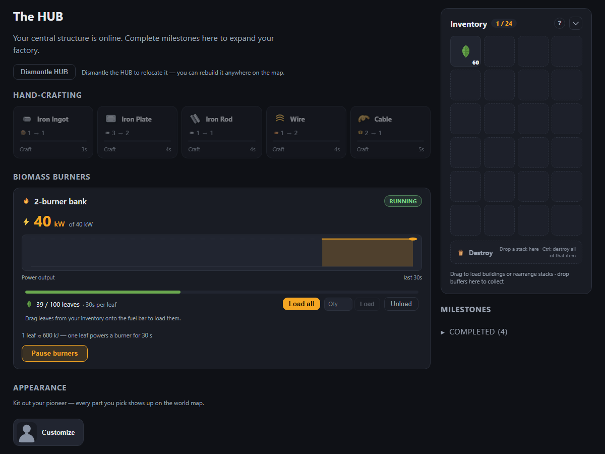

## [0.8.1] — 2026-07-14

### Changed

- **Biomass Burners burn leaves far slower, and loading them is easier.** A leaf now
  holds **600 kJ** (was 300), so a single leaf powers a burner for **30 s** instead of
  15 — a full bank of two burns one leaf every 15 s. Leaves last long enough that a
  forage run actually keeps the burners fed. Loading fuel gained two conveniences on the
  HUB panel: **drag a leaf stack straight from your inventory onto the fuel bar** to load
  it, and a **Qty field + Load** to load an exact number of leaves (alongside the existing
  **Load all** / **Unload**).

  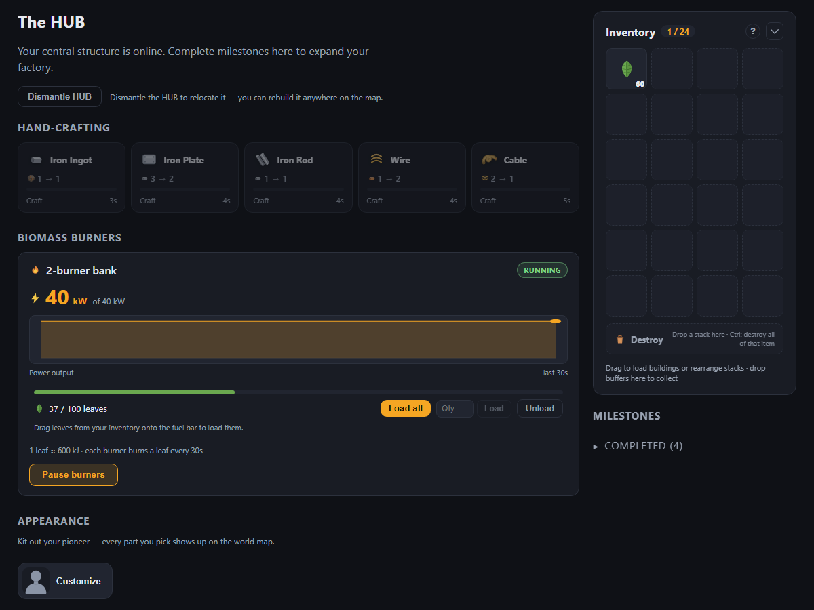

## [0.8.0] — 2026-07-14

### Added

- **Biomass Burners — the first power generation.** Completing the **Power Grid**
  milestone now also brings **two Biomass Burners online directly in the HUB** (they'll
  become placeable buildings in a later feature). Each burner generates **20 kW** while
  running and fueled — **40 kW** for the pair. For now the only fuel is **leaves**: a leaf
  carries **300 kJ**, and that energy sets the burn speed — a burner draws 20 kW, so it
  eats one leaf every **15 s** (the bank of two burns one every 7.5 s). Load leaves into
  the bank's shared fuel store at the HUB and it burns down over time — live and while
  you're away (like a Portable Miner).

  A new **HUB panel** shows the bank: its live **kW output**, a rolling **graph of power
  generated over the last 30 s**, the leaf fuel store with **Load / Unload**, a master
  **pause/resume** switch (pausing stops both burning and generation), and the joules
  explainer. While the burners are running, the **HUB node on the world map** wears a
  glowing **⚡ kW badge** so you can see it's generating at a glance.

  Power isn't consumed by anything yet — this is the generation groundwork (and the graph
  payoff). Existing saves that already built the Power Grid get their two burners on load.

  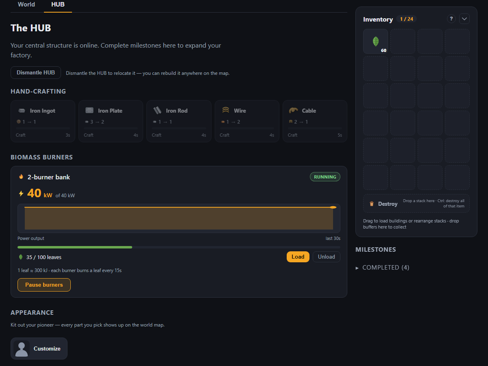

  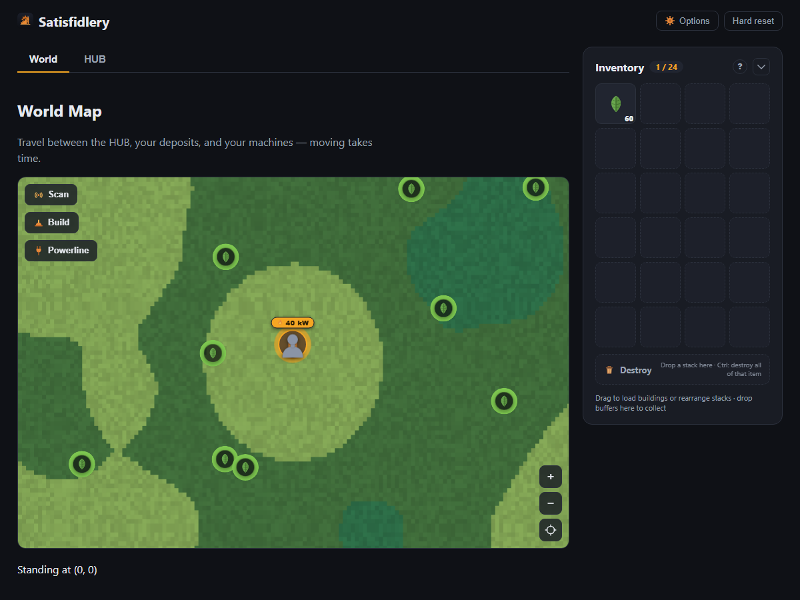

## [0.7.8] — 2026-07-14

### Fixed

- **Power poles now sit exactly on their wire at every zoom.** Auto-inserted poles
  (the ones dropped along a too-long powerline) looked slightly off their line when
  zoomed in — the disc drifted a pixel or two off the wire it belonged to. Cause: map
  markers were anchored with CSS `left`/`top`, which the browser **pixel-snaps** inside
  the scaled world layer; the wires are SVG coordinates and keep full float precision,
  so the tiny snap gap between them got magnified by the zoom (invisible zoomed out,
  ~1px+ zoomed all the way in, more on a large/hi-DPI display). Markers are now anchored
  with a CSS `translate()` (transforms aren't snapped) instead of `left`/`top`, so the
  disc lands on its wire endpoint to the sub-pixel at any zoom — measured **0.98px →
  0.00px** offset at max zoom. Applies to every map marker, not just poles.

  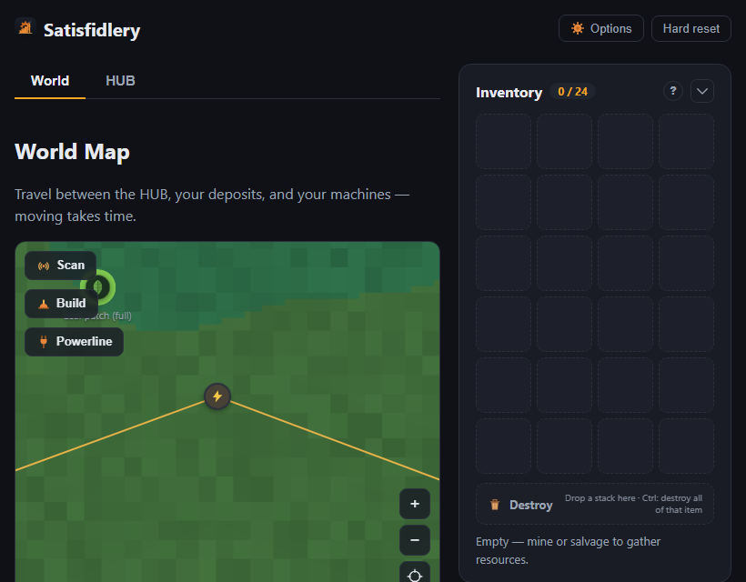

## [0.7.7] — 2026-07-14

### Changed

- **Disassembling the drop pod now takes time — it's a timed manual action, not a
  click.** Stripping the crash-landed pod for its salvage used to grant the 100 iron
  ingots instantly. It's now the game's opening **12-second timed action**, in the
  same idiom as mining, smelting, hand-crafting, foraging, and scanning: a progress
  bar runs to completion (`DROP_POD.disassembleSeconds`), the salvage lands only when
  the bar fills, and the button reads **Disassembling…** meanwhile. Like every other
  manual action it's **exclusive** — starting anything else stops it, and starting it
  stops everything else (one action at a time). It advances live and offline through
  a new `simulatePod()` (which — like `simulateCraft`/`simulateForage` — owns the
  inventory write the salvage needs), so leaving mid-strip resumes on return. If the
  grid can't hold the full salvage the bar holds full rather than voiding anything.
  Save shape bumped to **v17** (the in-progress disassembly persists); older saves
  load idle.

  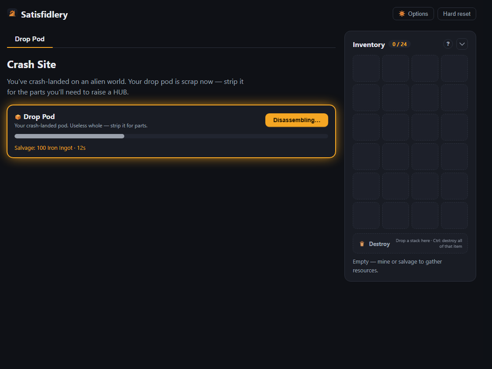

## [0.7.6] — 2026-07-14

### Fixed

- **Power poles now always sit on their powerline (no more poles floating beside
  the wire).** Poles were treated like any other map marker and folded into the
  on-screen **clustering**: when several poles landed close together (a long line
  zoomed out), they collapsed into a count bubble, and tapping it **fanned the
  discs out into a ring** — up to 66px away from where their wires actually connect.
  So a *connected* pole would render well off its straight powerline (measured
  47–65px off after a fan). Poles are now excluded from clustering entirely and
  render at their true position, so each disc sits exactly on its wire (verified
  0.0–0.2px) at every zoom. Only the big selectable nodes (HUB, deposits, buildings)
  still cluster/fan — they have no wires to detach from.

  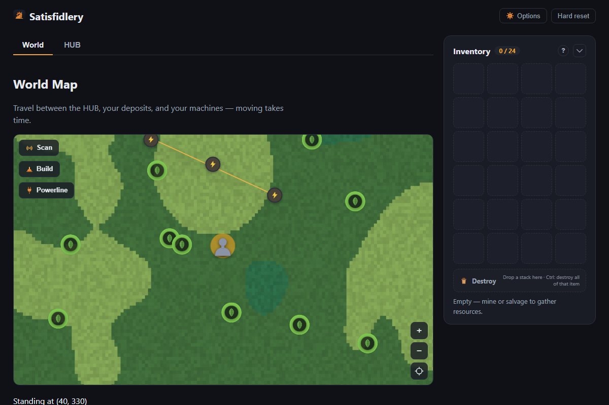

## [0.7.5] — 2026-07-14

### Fixed

- **Map disc glyphs (and the pole's ✕ remove button) are now truly centered.** The
  round map buttons — power poles, node discs, and the pole's remove button — center
  their icon with `display: grid; place-items: center`, but kept the browser's
  native button box (`appearance: auto` + UA `padding: 1px 6px`), which shoved the
  grid-centered glyph to the right. Measured: the ✕ sat **4.5px** right of center in
  its 18px button (clearly lopsided), and the ⚡ bolt **1px** right in its disc —
  just enough that a pole looked slightly off the powerline it actually sits dead-on.
  Reset those buttons with `appearance: none; padding: 0`, so the glyph is now
  centered to the sub-pixel (verified: offset 0.0 on both axes). The pole disc was
  always geometrically on the line; now it *looks* it too.

  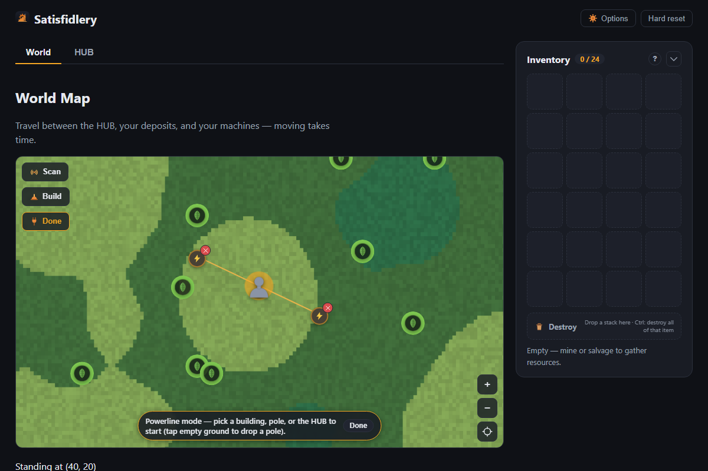

## [0.7.4] — 2026-07-14

### Changed

- **The HUB finally looks like a HUB.** On the map (and in the build radial) the
  HUB reused the generic `factory` glyph — a smokestack, indistinguishable from an
  actual factory. Gave it a dedicated **domed-headquarters** icon: a rounded dome
  cap over a base structure with a central doorway and lit windows, so the player's
  central base reads at a glance as a command HQ rather than just another building.
  New `hub` pictograph in `UiIcon.tsx`; `factory` stays put as the generic building
  fallback.

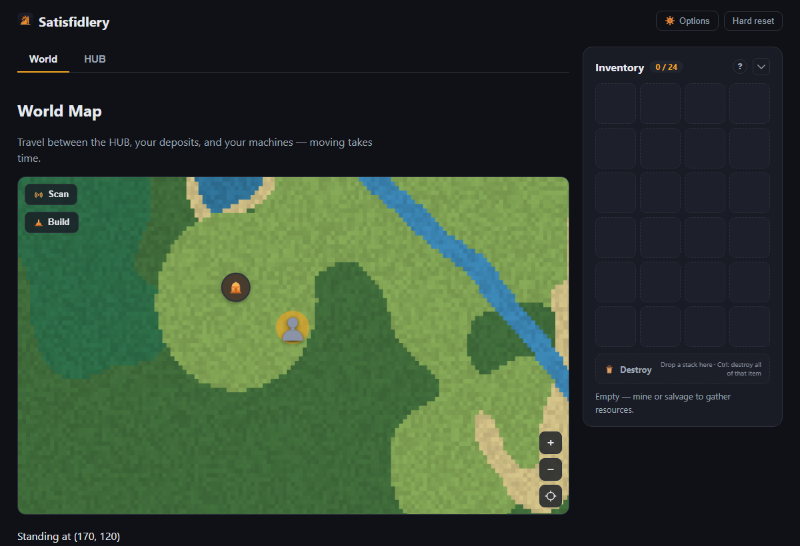

## [0.7.3] — 2026-07-14

### Fixed

- **Smooth walk, take three — hand the interpolation to the browser's compositor.**
  The `requestAnimationFrame` loops from 0.7.1/0.7.2 never reliably repainted the
  avatar (an instrumented walk showed its position frozen at ~2 distinct values over
  3+ seconds — the rAF simply wasn't driving the element in practice). Replaced the
  whole JS-prediction scheme with a CSS approach that can't misfire: the avatar and
  reach ring are positioned with a GPU-compositable `translate3d(...)` that the sim
  updates to the new position each 100ms tick, and a short `transition: transform
  0.12s linear` lets the compositor tween between those tick positions at the
  display's native frame rate. Position and scale are split across two elements
  (outer = transitioned translate, inner = `scale(1/zoom)`) so walking is smooth
  while zooming stays crisp. Tick positions are still sampled along the exact planned
  polyline (`playerPos` → `travelPos`), so the glide hugs the pathfinding route.
- **`PlayerMarker` now subscribes to just the player's x/y**, re-rendering once per
  tick during a walk (to update the transform target) and not at all while idle; the
  avatar SVG is memoized so it isn't rebuilt each tick. `MapView` keeps its ~1×/s
  countdown subscription, so the heavy map tree no longer reconciles 10×/s.

  

## [0.7.2] — 2026-07-14

### Fixed

- **The smooth walk from 0.7.1 was still stepping — now it genuinely glides at
  60 fps.** 0.7.1 added a `requestAnimationFrame` interpolation, but it lived
  inside `MapView`, which re-renders on **every** 100ms sim tick (it subscribed to
  the whole `player` object). Each of those 10×/s re-renders re-applied the
  avatar's `left`/`top` from the stepped, tick-quantized `playerPos(state)` —
  clobbering the smoothing — and the constant reconciliation starved the animation
  frames. Two changes fix it for real:
  - **The avatar + interaction ring moved into a memoized `PlayerMarker` component**
    that subscribes to nothing per-tick, so React never re-renders (and never
    repositions) it during a walk. Its own rAF reads the store directly each frame
    and interpolates along the exact planned polyline (`travelPos` over
    `travel.path` — the same line the dashed route draws), predicting forward by
    wall-clock time between the 10 fps sim updates. Each tick's fresh `travel`
    object re-anchors the prediction, so it never drifts or overshoots the goal.
  - **`MapView` no longer re-renders 10×/s during a walk.** It now subscribes to the
    whole-second travel countdown instead of the full `player` object, so it
    re-renders about once per second (for the "Traveling… Ns" readout) rather than
    on every tick — leaving the main thread free for the 60 fps avatar animation.

  

## [0.7.1] — 2026-07-14

### Changed

- **The player now glides smoothly along the planned route instead of shuffling
  in steps.** The simulation only advances a walk on the game tick (`TICK_MS` =
  100ms → 10 fps), so the avatar visibly jumped ~2 world units at a time and read
  as a stepped, gridlike hop. The avatar and its interaction ring are now
  interpolated every animation frame: a `requestAnimationFrame` loop in `MapView`
  reads the store's authoritative `travel` and predicts the position forward by
  wall-clock time between ticks (respecting the game-speed cheat), positioning the
  two elements imperatively so React re-renders aren't needed per frame. It follows
  the exact same smoothed/curved polyline (`travelPos` over `travel.path`) that the
  dashed route preview draws — so the walk now traces the pathfinding line rather
  than snapping across a grid. The store stays the single source of truth: each
  tick re-anchors the prediction, so it can never drift or overshoot the goal.

  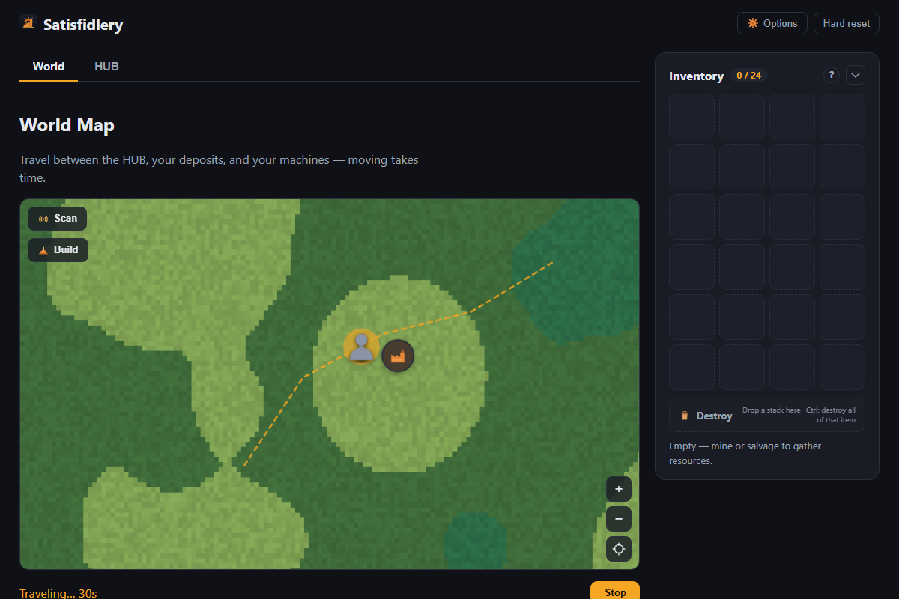

## [0.7.0] — 2026-07-14

### Changed

- **Foraging is now a timed manual action — you strip a patch leaf-by-leaf, not
  all at once.** Standing at a leaf patch and foraging arms it as an exclusive
  manual action (like mining/crafting): `simulateForage()` pulls one leaf into the
  inventory every `LEAF_FORAGE_SECONDS` (1.2s), so a full patch fills your grid
  "petit à petit" over ~18s rather than in a single click. It obeys the one-action-
  at-a-time rule (starting a mine/craft/scan/walk stops the forage, and vice
  versa), resumes across a reload, and runs the same offline — but offline harvest
  is still capped at what has actually grown, so it can't be exploited by waiting.
  The old instant `forageLeafPatch` action is replaced by a `toggleForage` toggle;
  in range, one click on the patch (or its button) starts or stops it.
- **Leaf patches show an outer regrow ring so a depleted patch reads at a glance.**
  Previously an empty patch differed from a full one only by a faint opacity shift,
  which was hard to see. Each patch now draws a progress ring around the leaf icon
  whose filled arc tracks how regrown it is (empty → full): a freshly-stripped
  patch is a near-empty ring that visibly fills back up as it regrows, and the
  patch you're actively foraging pulses. Leaf regrow moved from `simulate()` into
  `simulateForage()` so a single function owns all leaf-patch state.

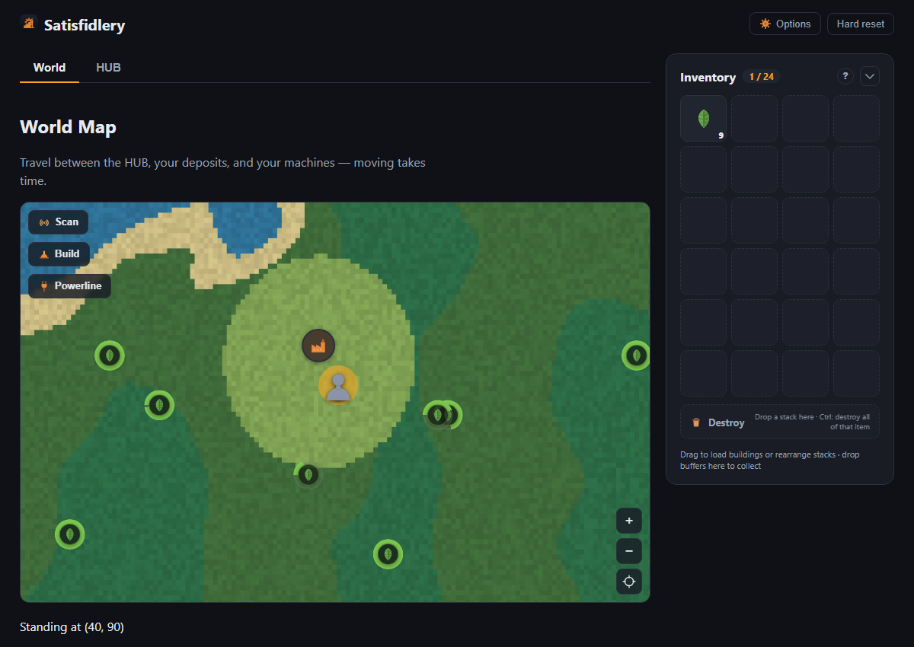

## [0.6.3] — 2026-07-14

### Changed

- **`npm run window` (Edge app-mode) is again the default launch; the Electron
  shell is opt-in.** Reverted `scripts/window.mjs` to the simple original launcher
  — dropped the dedicated Edge profile that had been added while chasing a browser
  taskbar icon (which is instead handled by the Electron shell). The native
  Electron path (`npm run electron:dev`, with its WSLg GPU fix and window/taskbar
  icon) stays available but is only launched when native/WSL2 is explicitly
  requested.

## [0.6.2] — 2026-07-14

### Fixed

- **Smooth scrolling in the Electron shell under WSLg.** Chromium's default GL
  backend fails to initialize against WSLg's virtual GPU (`/dev/dxg`, Mesa's
  `d3d12` driver) and silently falls back to CPU/software rendering, which makes
  scrolling and compositing janky. `electron/main.cjs` now detects WSL and routes
  GL through **ANGLE→GL** (`--use-gl=angle --use-angle=gl --ignore-gpu-blocklist`),
  which uses the vGPU and restores hardware-accelerated rendering — so
  `npm run electron:dev` no longer needs `--disable-gpu`. The switch is gated to
  WSL only, so native Linux, Windows, and macOS builds keep their default
  (optimal) GPU path.

## [0.6.1] — 2026-07-14

### Changed

- **The UI icons are now colored, and better centered.** The pictographic
  `UiIcon`s (crate, factory, smelter, gear, sensor, build, plug, bolt, trash,
  lock, bug, hourglass, pickaxe, wrench) are redrawn as two-tone shapes on the
  game's warm palette — a 3D orange crate, a yellow power bolt, a red ladybug for
  cheats, etc. — instead of flat single-color line marks. Control glyphs
  (chevrons, check, close, crosshair) stay subtle and inherit `currentColor`. The
  gear was also rebuilt from symmetric rotated teeth (the old hand-drawn one was
  lopsided), and the Options button now flex-centers its icon so it sits square
  with the label.

  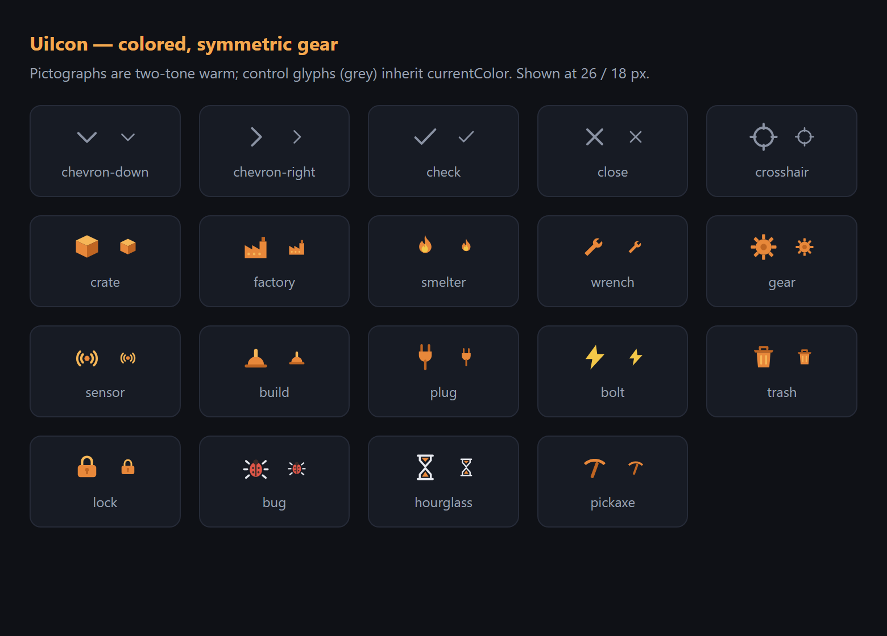

## [0.6.0] — 2026-07-14

### Added

- **A generated UI icon set — no more emoji anywhere.** Every emoji/dingbat used
  as a UI glyph (📦 drop pod, 🏭 factory, 🔥 smelter, 📡 sensor, 🏗️ build, 🔌
  powerline, ⚡ power, 🗑 destroy, 🔒 locked, 🐞 cheats, ⏳ saving, ⛏ mining, plus
  the ⚙ gear, ⌖ recenter, ▾▸ chevrons, ✓ checks and ✕ closes) is now a hand-drawn
  inline SVG in a new `src/components/UiIcon.tsx` (`<UiIcon name="…" />`). Icons use
  `currentColor`, so each inherits its surrounding text color. **Why it matters:**
  the shipped Electron build targets Windows *and* Linux, and the Linux runtime has
  no color-emoji font — so emoji rendered as tofu boxes (e.g. the Drop Pod). SVGs
  are font-independent and render identically on every platform. Added a project
  rule (CLAUDE.md) to always generate icons and never use emoji.

  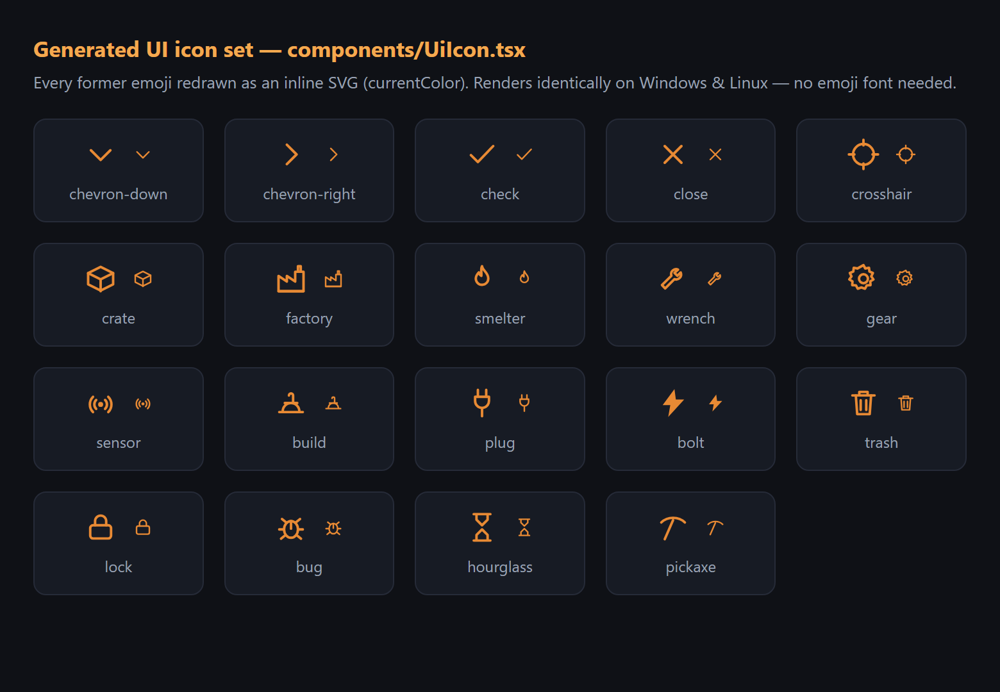

### Changed

- **The Electron shell is now the icon-bearing, cross-platform desktop app.** The
  `BrowserWindow` picks a per-OS window icon (`favicon.ico` on Windows,
  `icon-512.png` on Linux/WSLg) and sets an explicit Windows AppUserModelID, so the
  game shows its own taskbar icon rather than a generic host icon. Added an
  `electron-builder` `build` config (`package.json`) with per-OS packaging icons
  for future Windows/Linux distributables. (Running the native shell needs the
  Linux GUI libs — `libnss3 libnspr4 libasound2t64` — installed once.)

## [0.5.3] — 2026-07-14

### Fixed

- **The app icon now shows on the Windows taskbar, not just in the header.** A
  Chromium `--app` window takes its taskbar icon from a raster `favicon.ico` and
  from having its own app identity — neither of which existed, so the taskbar
  showed the generic browser icon. Added a real multi-resolution
  `public/favicon.ico` (16/32/48/64/256 px, rendered from the icon SVG), a web
  app manifest (`public/manifest.webmanifest`) with 192/256/512 px icons, and
  the matching `<link>` tags. `npm run window` now also launches the browser
  with a **persistent, app-dedicated profile** (`--user-data-dir` under
  `%LOCALAPPDATA%\Satisfidlery`), so the window is treated as its own app and
  adopts the factory icon on the taskbar instead of grouping under Edge.

## [0.5.2] — 2026-07-14

### Added

- **A dedicated app icon — a factory & gear mark.** Satisfidlery now ships its
  own icon (`src/assets/icon.svg`): an orange factory silhouette with twin
  smokestacks and a gear, on the game's dark-industrial rounded-square
  background. It appears both in the **window header** brand (replacing the bare
  🏭 emoji) and, via a `<link rel="icon">` favicon (SVG + a 256×256 PNG
  fallback), in the **OS taskbar** when the game is launched with `npm run
  window`. The Electron shell also points its `BrowserWindow` `icon` at the same
  PNG for the future Steam build.

  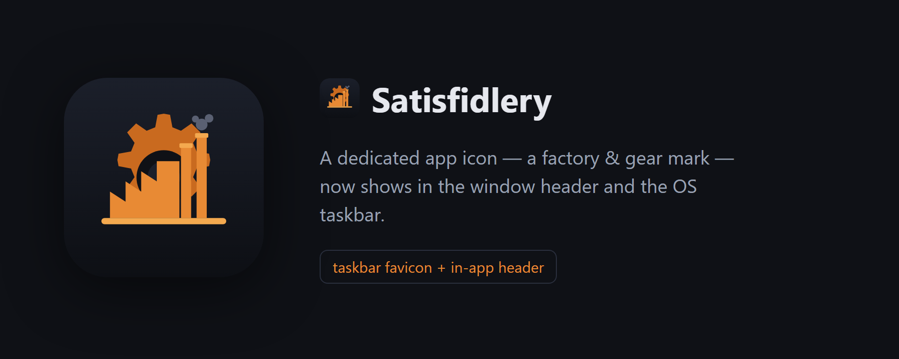

## [0.5.1] — 2026-07-14

### Changed

- **Tearing down power infrastructure now shows the refund flying home — and
  never gets blocked.** Removing a powerline, a power pole, or a whole connection
  sends the refunded materials (cable, and a pole's cost) **flying to the
  inventory** as flying-item feedback, the same way collecting does. Previously,
  if the grid was full the teardown was silently refused to avoid destroying the
  refund; now it always goes through, and any overflow that doesn't fit a full
  grid is simply dropped.

  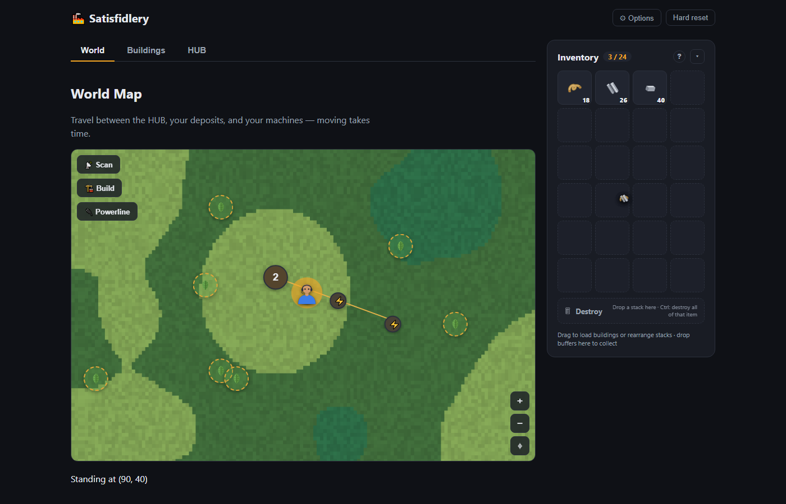

## [0.5.0] — 2026-07-14

### Added

- **Leaf foraging — a perishable, regenerating wild resource.** The Power Grid
  milestone now also opens up **leaf foraging**. Leaf patches are scattered across
  the map, **biome-weighted**: thick in forest and jungle, a light scattering on
  plains, a rare few on sand, and **none on mountains, snow, or water**. Walk to a
  patch and **Forage** it to harvest its grown leaves into your inventory; the
  patch then **regrows over time** back to full. Grown leaves **cap** at the
  patch's yield, so an un-foraged patch never hoards past full — waiting past ripe
  is wasted growth. A patch's disc fades on the map to show how much has regrown.

  Under the hood, patches are generated deterministically from the world seed
  (like ore deposits) and only *regrowing* patches are stored in the save, so the
  vast field costs nothing until you actually forage. Regrowth runs in `simulate()`
  (live and offline) without touching the inventory; foraging is the explicit
  action that moves leaves in.

  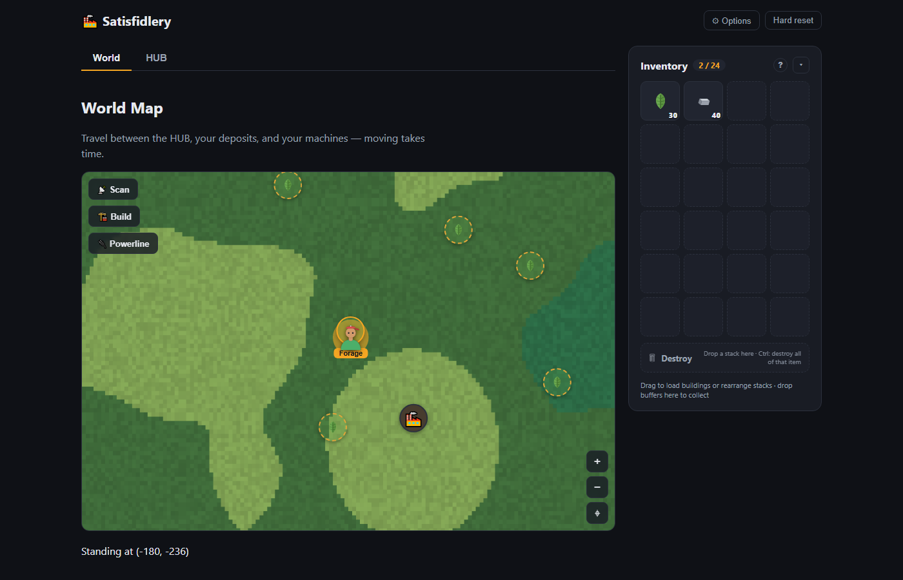

### Notes

- Save format bumped to **v15** (adds `leafPatches`); older saves load
  forward-tolerantly with an empty (all-full) field.

## [0.4.3] — 2026-07-14

### Added

- **A cost confirmation popover when running a powerline.** Picking the two ends
  of a connection no longer builds it immediately — a popover now shows the exact
  cost (cable per segment plus any auto-placed poles) and a note of how many Power
  Poles the route will insert, with **Connect** / **Cancel**. Connect is disabled
  (with a reason) when a node has no free intake or you can't afford the run.

  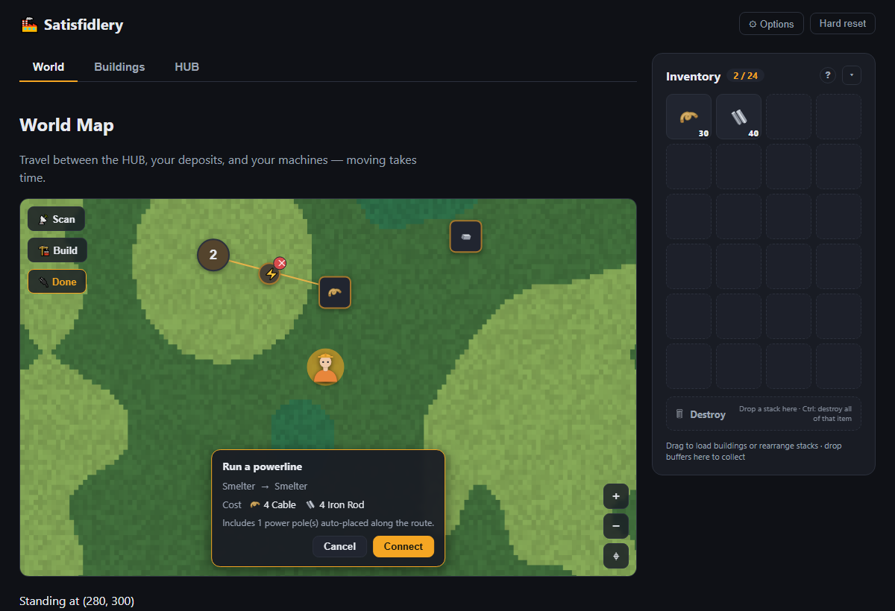

- **Remove a whole connection between two nodes.** In Powerline mode, picking two
  nodes that are *already* connected offers to **Disconnect** them instead: the
  entire chain of segments linking them is torn down in one go, along with any
  intermediate poles it orphans (a pole that also feeds elsewhere is kept), and
  everything is refunded. Single-segment removal (click a line) and pole teardown
  (a pole's ✕, which also drops its powerlines) remain.

### Fixed

- **Powerlines now meet each node dead-center.** Labeled map markers (buildings,
  the HUB, deposits) sized their box to include the name label below the disc, so
  a powerline — which attaches at the marker's world point — met the disc slightly
  below its center. The label is now positioned without growing the marker box, so
  the disc sits exactly on its world point and cables connect to disc centers.

## [0.4.2] — 2026-07-14

### Changed

- **Bigger inventory stacks — now matching Satisfactory's real sizes.** The old
  product cap of 50 filled the 24-slot grid far too fast. Stacks now follow the
  base game: **Iron/Copper Ingot 100**, **Iron Plate / Iron Rod / Cable 200**,
  and **Wire 500** (ores and leaves stay at 100; the Portable Miner still takes a
  whole slot). A full wire run that used to sprawl across ten slots now fits in
  one. Existing saves keep their stacks — partial slots simply have more headroom.

  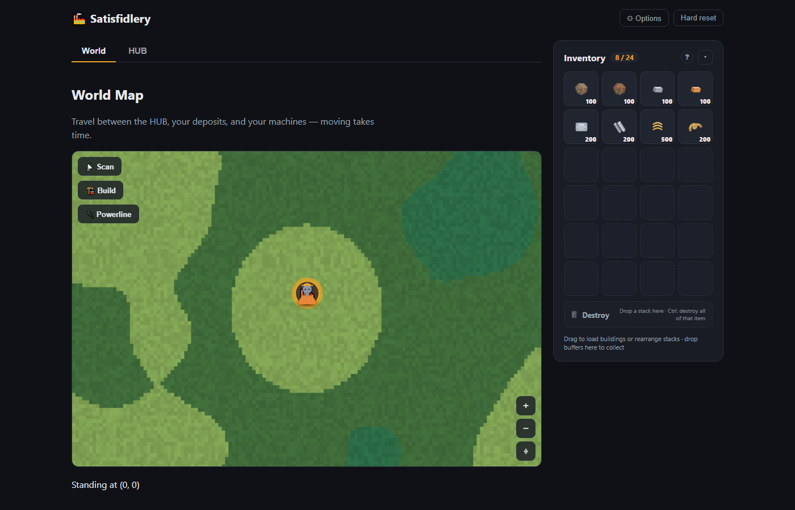

## [0.4.1] — 2026-07-14

### Changed

- **HUB milestones moved to the sidebar, under the inventory.** They used to sit
  in a right-hand rail inside the HUB tab; now the milestone chain (Field
  Fabrication → Assembly Line → …) renders directly beneath the inventory card,
  so a milestone's submission cost sits next to the stacks you pay it with. The
  HUB tab's main column is now just hand-crafting and the appearance bench, giving
  the craft grid the full width. The panel only shows while you're on the HUB tab.

  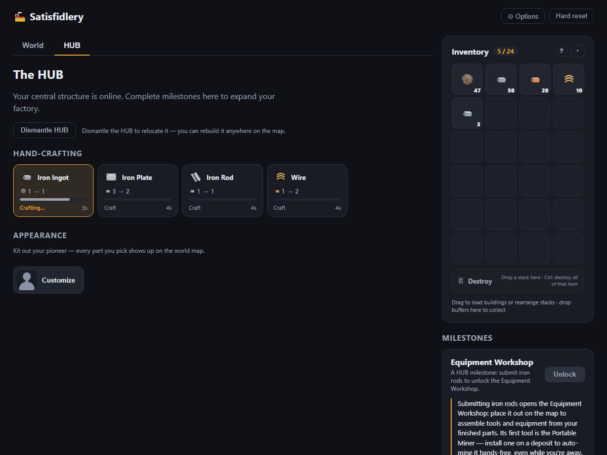

## [0.4.0] — 2026-07-14

### Added

- **New milestone: the Power Grid.** After the Equipment Workshop, submit iron
  rods and plates at the HUB to unlock **Cable** and the power-grid infrastructure.
  Cable (`2 Wire → 1 Cable`) is craftable both in the **Constructor** and by hand
  at the **HUB** — and the HUB now also hand-crafts the earlier Assembly-Line parts
  (Iron Plate, Iron Rod, Wire), so you can make them without a Constructor.
- **Powerlines on the map.** A new **Powerline** map tool (alongside Build/Scan):
  enter it, click two grid nodes — buildings, the HUB, or power poles — to run a
  powerline between them. A run longer than the max segment length auto-inserts
  **Power Pole MK1**s along the shortest terrain-avoiding path (reusing the A\*
  router), so every hop stays within reach. Tap empty ground to drop a pole by
  hand; tap a line, or a pole's ✕, to remove it (with a refund). Buildings and the
  HUB host two powerlines each; poles host four, so the grid can daisy-chain.
  Powerlines and poles are drawn on the world map. This is structural for now —
  the electricity that flows through the grid comes in a later milestone. See
  `docs/images/changelog/v0.4.0-power-grid.png`.

### Notes

- Save format bumped to **v14** (adds `powerPoles`/`powerLines`); older saves load
  forward-tolerantly with empty power grids.

## [0.3.3] — 2026-07-14

### Changed

- **Hand-crafting in the HUB is now a compact tile grid.** The bench was a stack
  of full-width recipe cards that would clutter fast as recipes pile up; it's now
  a dense grid of small tiles (icon + name, a mini icon-based recipe line, a slim
  progress bar, and a status/cycle-time footer). Each tile is itself the control —
  click to start or stop crafting (or to travel to the HUB when you're away) — so
  five recipes now sit in the space the old layout gave two.

  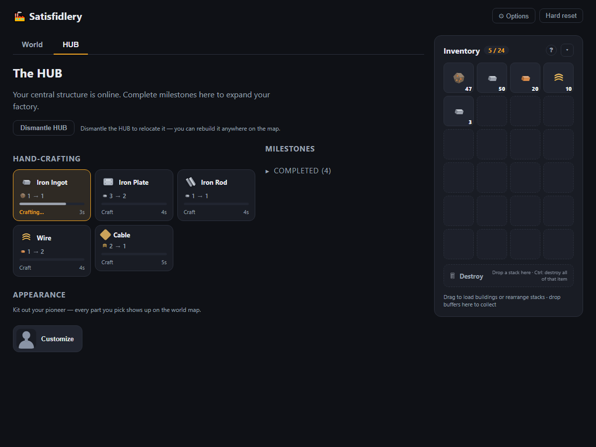

## [0.3.2] — 2026-07-14

### Added

- **Ctrl+drop on the bin destroys every stack of an item.** Hold **Ctrl** while
  dropping a stack onto the Destroy bin and it clears _all_ slots holding that
  item at once, not just the one you dragged — a fast way to dump a resource you
  no longer want. Drop without Ctrl to trash only the single stack as before.

- **An inventory help "?" with the rules.** A **?** button in the inventory header
  raises a popover on hover listing how the inventory works — stacking and
  overflow, the capacity limit, dragging to load / rearrange, the Destroy bin and
  its Ctrl shortcut, and item hover descriptions.

  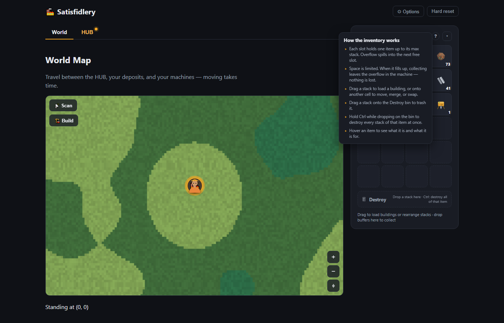

## [0.3.1] — 2026-07-14

### Added

- **Destroy items with the new bin.** A **🗑 Destroy** drop target now sits below
  the inventory grid — drag any stack onto it to throw it away and free the slot.
  The bin arms with a red warning tint while a stack hovers over it. There's no
  undo, so it's a deliberate drag.

- **Hover an item for a quick description.** Pointing at any filled slot raises a
  popover with the item's name, its category, a one-line blurb of what it is and
  what it's for, and the current stack against its max (e.g. `Stack · 50 / 50`).
  Every item ships with its own description, authored alongside the item in
  `content.ts`.

  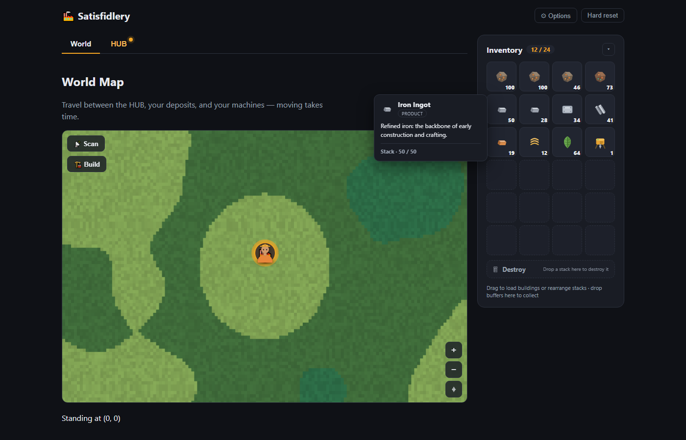

## [0.3.0] — 2026-07-14

### Added

- **The inventory is now a Satisfactory-style grid.** Your holdings live in a
  fixed set of **24 stack slots** instead of an unbounded tally. Each slot holds a
  stack of one item up to that item's **maximum stack size** — ores and leaves
  stack to **100**, refined products (ingots, plates, rods, wire) to **50**, and a
  **Portable Miner** takes a whole slot on its own (equipment doesn't stack). Mine
  past a stack's cap and it spills into the next slot; the header shows how many
  slots are in use (e.g. `12 / 24`).

- **Capacity actually bites, and nothing is ever lost.** When the grid is full,
  collecting from a source or a building takes only what fits and leaves the rest
  sitting in that machine's buffer, and hand-crafting pauses rather than voiding
  its output. Refund paths with nowhere to spill back to (dismantling a machine or
  the HUB, pod salvage) simply won't complete unless the whole refund fits — so
  capacity pressure never destroys your materials.

- **Rearrange stacks by dragging.** Drag a stack onto another cell to move it,
  merge it into a matching stack (up to the cap, with any overflow staying put),
  or swap two stacks — on top of the existing drag-to-load / drop-buffers-to-
  collect flow. Old saves migrate automatically: your former totals are packed
  into the grid on first load.

  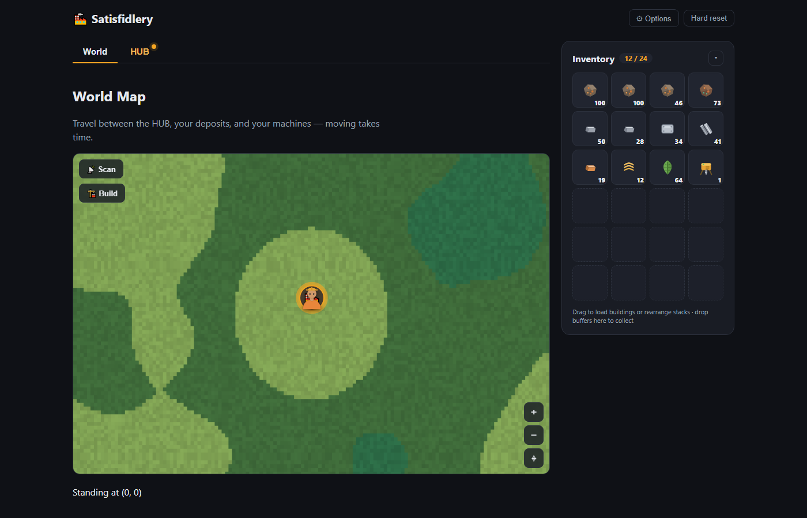

## [0.2.3] — 2026-07-14

### Added

- **"1×" load button on every building input.** Alongside _Load all_ and _Half_,
  each input slot now has a **1×** button that tops that slot up to exactly one
  cycle's requirement — just enough to craft a single item, with nothing left
  over. On a multi-input bench (the Equipment Workshop) each slot's 1× fills its
  own share, so one click per slot loads precisely one item's worth. The button
  is disabled once the buffer already holds enough for one, and (like the others)
  is capped by what's in your inventory and by being in reach of the building.

  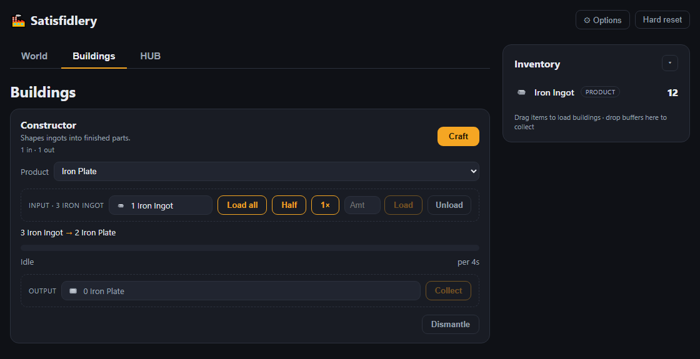

## [0.2.2] — 2026-07-14

### Changed

- **Portable Miners now have a 500-ore buffer cap.** A deployed miner fills its
  node's buffer hands-free (live and offline), but stops once the buffer reaches
  **500** — its onboard hopper is full. This bounds passive/offline hoarding: the
  miner idles until you walk over and collect, which frees room and resumes it
  automatically. Hand-mining is player-attended and stays uncapped.

- **The map reacts when a miner fills up.** A full miner's node swaps its calm
  green ring for an insistent amber pulse and pops a bouncing **MAX** bubble
  above it, so you can spot at a glance which deposits need emptying. The Sources
  tab shows the same "miner full" status in amber.

  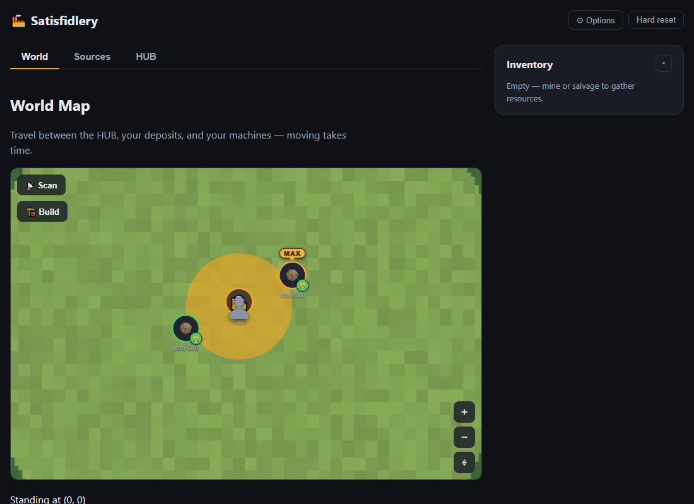

## [0.2.1] — 2026-07-14

### Improved

- **Map markers declutter when zoomed out.** Overlapping markers (deposits,
  buildings, the HUB) now merge into a single count bubble instead of piling up
  into a mess of discs and labels. Click the bubble to fan the members out and
  pick any one — this also separates markers that share a coordinate, like the
  buildings granted at the HUB. Labels hide when zoomed far out and return on
  hover / when zoomed in.

  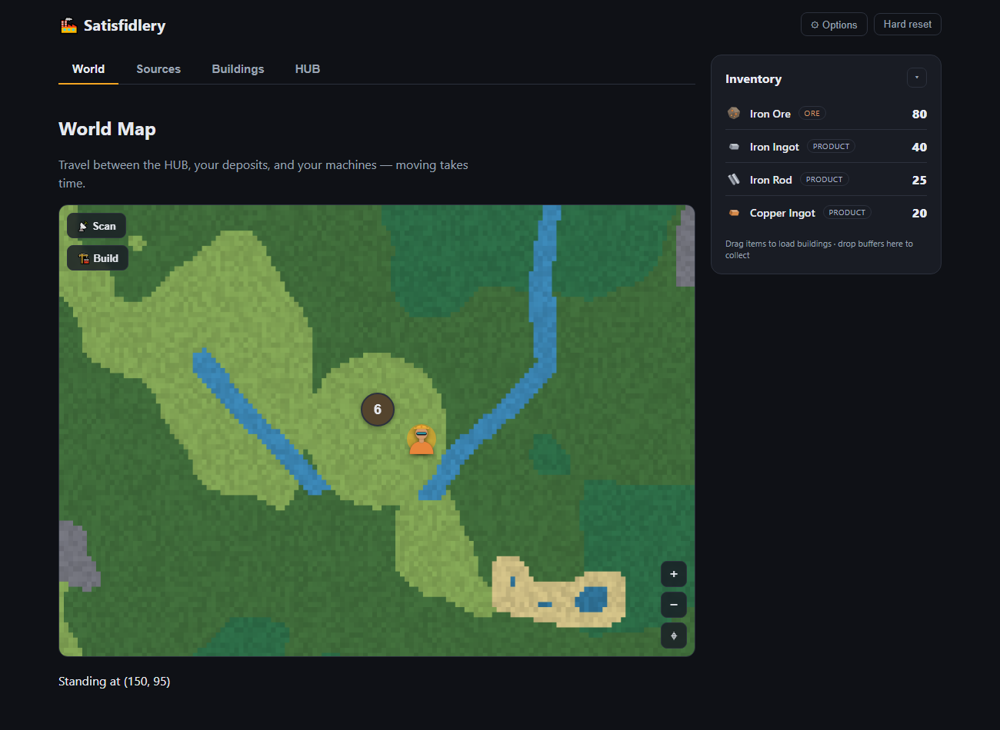

  _Clicking the bubble fans every member out, each individually selectable:_

  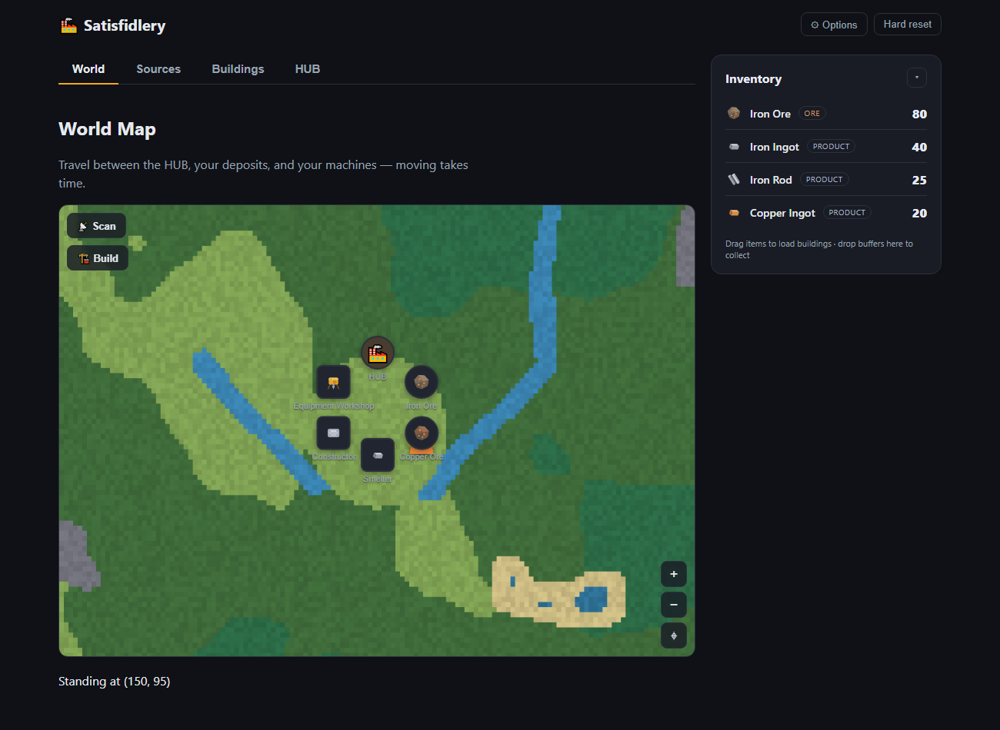

## [0.2.0] — 2026-07-14

### Added

- **Player avatar customization.** Customize your pioneer at the HUB's new
  **Appearance** bench — head shape, skin, eyes, headgear, and suit color, each
  with a live preview. Your choices show up as the player marker on the world
  map. New pioneers start as a neutral grey silhouette.

  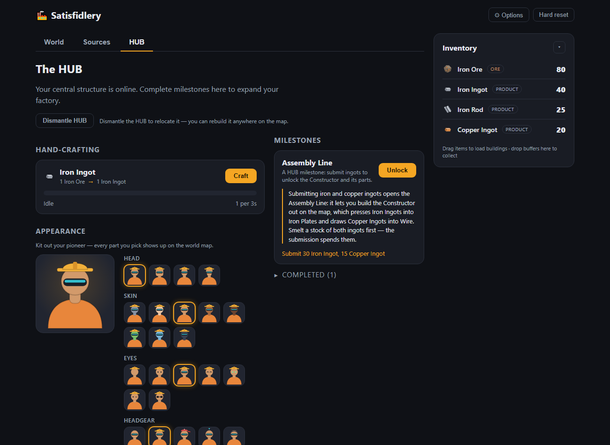

  _The customized avatar represents the player on the world map:_

  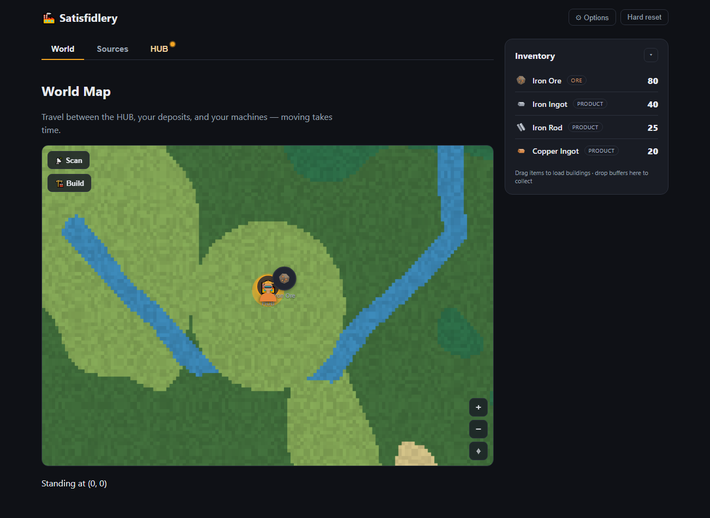
